# 计算机操作系统 1

## 第一章 操作系统引论

### 1.1.0 操作系统的基本概念

首先，我们来谈谈什么是操作系统（Operating System, OS）。

简单来说，操作系统是计算机系统中最核心的系统软件。它是一系列程序和数据的集合，其主要作用是管理和控制计算机的硬件和软件资源，并为用户和其他软件提供一个简单、一致的交互接口。

你可以把操作系统想象成一个“管家”，它负责：

+ 管理硬件：比如 CPU 的调度、内存的分配、磁盘文件的存取、以及键盘、鼠标等输入输出设备的控制。如果没有操作系统，每个应用程序都需要自己去编写直接驱动这些硬件的代码，这将是极其繁杂且低效的。
+ 提供服务：它为应用程序（如 Word、浏览器、游戏等）提供服务。例如，当你想保存一个文件时，是操作系统帮助你完成了具体的硬盘写入操作。
+ 提供用户接口：它提供了用户与计算机交互的方式。这可以是图形用户界面（GUI），比如你熟悉的 Windows 或 macOS 桌面；也可以是命令行界面（CLI），比如 Linux 的终端。

操作系统的四大基本功能是：处理机管理、存储器管理、设备管理和文件管理。

### 1.2.0 操作系统的发展

操作系统的发展历程，实际上就是计算机科学家们为了不断提升计算机效率和易用性而努力的过程。

1. 无操作系统阶段（电子管/晶体管时代）：最早的计算机没有操作系统，程序员需要手动操作开关、插拔线缆来装入程序，效率极低，计算机一次只能专注做一件事。
2. 批处理系统（Batch Processing Systems）：为了提高效率，出现了批处理系统。操作员将一批用户的作业（程序、数据、命令）用穿孔卡片等方式收集起来，由操作系统依次、成批地读入内存并执行。这个阶段实现了作业的自动转接，但用户无法与程序实时交互。
3. 分时操作系统（Time-Sharing Systems）：为了解决人机交互问题，分时系统应运而生。系统将 CPU 的运行时间分割成很短的“时间片”，轮流分配给各个在线的用户程序。由于切换速度极快，每个用户都感觉自己独占了整个计算机。这是现代多任务操作系统的雏形。
4. 实时操作系统（Real-Time Systems）：在某些领域（如工业控制、航空航天），系统需要在严格限定的时间内对外部事件做出响应。实时操作系统就为此而生，其核心特点是高可靠性和及时性。
5. 通用操作系统：现代的操作系统，如 Windows, macOS, Linux, iOS, Android 等，都是通用的操作系统，它们融合了批处理、分时和实时等多种技术，支持多用户、多任务，并提供丰富的网络功能和友好的用户界面。

### 1.3.0 操作系统的运行环境

要理解操作系统是如何管理计算机的，就必须了解它的运行环境。

CPU 运行模式：内核模式和用户模式

为了保护操作系统自身和系统资源不被应用程序肆意破坏，现代 CPU 都实现了至少两种运行模式（或称状态、级别）：

+ 内核模式（Kernel Mode）：也称为核心态、特权态。当 CPU 处于内核模式时，它可以执行计算机硬件的所有指令，并可以访问内存的所有地址空间。操作系统内核的代码就运行在这个模式下。
+ 用户模式（User Mode）：也称为用户态、普通态。应用程序运行在这个模式下。在用户模式下，CPU 能执行的指令和能访问的内存区域都受到严格限制。如果一个应用程序试图执行一条特权指令（如清空内存、修改时钟），CPU 会阻止它并产生一个“陷阱（Trap）”。

这两种模式的切换是操作系统实现保护的关键。当计算机启动时，它处于内核模式，加载操作系统内核。加载完成后，它会启动一个用户程序（如桌面环境），并切换到用户模式。

中断和异常处理

中断和异常是迫使 CPU 从用户模式切换到内核模式，转而执行操作系统代码的主要机制。

+ 中断（Interrupt）：来自于硬件的信号，是异步的（即与当前 CPU 执行的指令无关）。例如，当你敲击键盘、点击鼠标，或者一个网络包到达网卡时，对应的硬件会向 CPU 发送一个中断信号。CPU 接收到信号后，会暂停当前正在执行的用户程序，跳转到操作系统预设好的中断服务程序去处理这个事件，处理完毕后再返回用户程序继续执行。
+ 异常（Exception）：也称为陷阱（Trap），是来自于 CPU 内部，由正在执行的指令本身引起的，是同步的。例如，程序执行了除以零的操作、访问了非法的内存地址，或者试图执行一条特权指令。这些都会导致 CPU 产生一个异常，迫使控制权转移给操作系统内核进行处理。

系统调用（System Call）

既然应用程序运行在受限的用户模式，那么当它需要执行一些特权操作时（如读写文件、创建新的进程、请求网络连接），该怎么办呢？

答案就是系统调用。

系统调用是操作系统提供给应用程序的接口（API）。应用程序通过主动请求（通常是执行一条特殊的“陷入”指令，如 INT 或 SYSCALL），自愿地将 CPU 控制权交给操作系统内核，并请求内核为其提供特定的服务。这个过程也伴随着从用户模式到内核模式的切换。内核完成服务后，再将结果返回给应用程序，并切换回用户模式。

所以，中断/异常和系统调用是连接用户程序和操作系统内核的桥梁。

程序的链接和装入

一个我们编写的源代码（如 C 语言代码）要能在计算机上运行，需要经过几个步骤：

1. 编译（Compilation）：编译器将源代码文件（.c）翻译成包含机器指令的目标文件（.o 或 .obj）。
2. 链接（Linking）：一个大型程序通常由多个目标文件组成，并且会用到一些库函数（如 printf）。链接器（Linker）的作用就是将这些目标文件和库文件“链接”在一起，解决模块间的相互引用，最终形成一个单一的、完整的可执行文件（如 Windows 的 .exe，Linux 的 ELF 文件）。
3. 装入（Loading）：当用户要运行这个程序时，加载器（Loader）——操作系统的一部分——负责将这个可执行文件从硬盘读入到内存中，并进行必要的设置（如分配地址空间），然后将 CPU 的控制权交给这个程序的入口点，程序开始执行。

 程序运行时内存映像和地址空间

当一个程序被装入内存运行时，操作系统会为它创建一个虚拟的地址空间（Address Space）。这个地址空间是操作系统为每个进程描绘的一个“假象”，让每个进程都以为自己独占了整个内存。

一个典型的进程地址空间通常包含以下几个部分：

+ 文本段（Text Segment）：存放程序的机器代码。
+ 数据段（Data Segment）：存放已初始化的全局变量和静态变量。
+ BSS 段（BSS Segment）：存放未初始化的全局变量和静态变量。
+ 堆（Heap）：用于动态内存分配（如 C 语言的 malloc）。堆地址从低向高增长。
+ 栈（Stack）：用于存放函数调用的参数、局部变量和返回地址。栈地址从高向低增长。

这种内存布局被称为程序的运行时内存映像。

### 1.4.0 操作系统结构

随着操作系统功能越来越复杂，如何设计其内部结构也成了一个重要问题。

+ 分层结构（Layered Approach）：将操作系统的功能划分成若干个层次。底层提供最基本的功能（如硬件交互），高层基于低层提供的服务实现更复杂的功能。优点是结构清晰，易于调试和验证。缺点是层与层之间的通信效率可能不高。

+ 模块化结构（Modular Approach）：将操作系统内核看作是一系列独立模块的组合。每个模块实现一部分特定功能（如文件系统模块、调度器模块），模块之间通过明确的接口进行通信。现代操作系统大多采用这种结构，它兼具灵活性和可扩展性，允许在运行时动态加载或卸载模块（如 Linux 的内核模块 .ko）。

+ 宏内核（Monolithic Kernel）：也称单体内核。操作系统所有核心功能（进程调度、内存管理、文件系统、设备驱动等）都作为一个庞大的单一程序运行在内核模式下。优点是模块间通信效率高，因为它们都在同一个地址空间内。缺点是结构庞杂，一个模块的 Bug 可能导致整个系统崩溃，不易维护。Linux、Unix、Windows 早期版本都属于宏内核。

+ 微内核（Microkernel）：为了提高系统的可靠性和灵活性，微内核结构将绝大多数的操作系统服务（如文件系统、设备驱动）都移出内核，作为独立的用户态进程来运行。内核本身只保留最最基本的功能（如进程间通信、基本的调度和内存管理）。优点是稳定性和安全性高，一个服务进程崩溃不会影响内核和其他服务。缺点是服务之间的通信需要频繁地在用户态和内核态之间切换，效率相对较低。典型的例子有 MINIX 3、QNX。

  >[!NOTE]
  >
  >需要注意的是，微内核由于需要频繁在内核态和用户态直接转化，往往没有更好的性能

+ 外核（Exokernel）：一种更激进的结构。外核的目标是尽可能少地对硬件进行抽象，它几乎把所有的硬件资源管理决策都交给上层的应用程序库来做。内核只负责安全地复用硬件。这种结构给予了应用程序最大的灵活性，但编程难度也极大。这主要是一种研究性的结构。

### 1.5.0 操作系统引导

计算机加电后，是如何启动操作系统的呢？这个过程称为引导（Booting） 或 自举（Bootstrapping）。

1. 计算机主板上的 BIOS (Basic Input/Output System) 或 UEFI (Unified Extensible Firmware Interface) 固件首先开始运行。它会进行开机自检（POST），检查硬件是否正常。
2. 自检通过后，BIOS/UEFI 会根据预设的启动顺序，在硬盘、U 盘等存储设备上寻找一个特殊的程序——引导加载程序（Boot Loader），比如 GRUB（用于 Linux）或 Windows Boot Manager。
3. BIOS/UEFI 将找到的 Boot Loader 加载到内存的特定位置，并将 CPU 的控制权交给它。
4. Boot Loader 开始执行。它的主要任务是找到硬盘上的操作系统内核文件（如 Linux 的 vmlinuz），将其加载到内存中。
5. 内核被加载到内存后，Boot Loader 将控制权完全交给操作系统内核。
6. 操作系统内核开始执行，进行一系列的初始化工作：初始化各种硬件设备、建立内存管理结构、创建第一个用户进程（通常是 init 或 systemd 进程），最终启动系统服务和用户界面，等待用户登录。至此，整个启动过程完成。

## 第二章 进程与线程

### 2.1 进程与线程

#### 进程概念与特征

进程（Process）是操作系统中​程序的一次执行过程​，是资源分配和调度的基本单位。它和“程序”的区别很重要：程序是静态的代码文件（比如你写的 `hello.c` 编译后的 `hello.exe`），而进程是程序“活着”的状态——从启动到结束的动态过程。

进程的 4 大特征：

1. 动态性：进程有“生命周期”（创建 → 运行 → 结束），是程序执行的动态活动。
2. 并发性：多个进程可以在同一时间段内“同时”运行（实际是 CPU 快速切换）。
3. 独立性：每个进程有独立的资源空间（如内存、文件句柄），互不干扰（除非主动通信）。
4. 异步性：进程的执行顺序不确定（受调度、I/O 等因素影响），像“各自跑马拉松，没人规定谁先到终点”。

#### 进程的组成

进程的核心是​​进程控制块（PCB，Process Control Block）​​，加上​​程序段​​和​​数据段​​，三者共同构成进程的完整实体。

1 进程控制块（PCB）

PCB 是操作系统管理进程的“档案”，记录了进程的所有关键信息。常见内容包括：

+ 标识符：进程的唯一“身份证号”（如 PID，进程 ID）。
+ 状态：当前处于就绪、运行还是阻塞（后面会讲状态转换）。
+ 优先级：进程的“紧急程度”（数值越高越优先被 CPU 执行）。
+ 程序计数器（PC）：记录下一条要执行的指令地址（相当于“书签”，进程被暂停后恢复时从这里继续）。
+ 寄存器状态：保存进程运行时 CPU 寄存器的值（比如运算中的中间结果）。
+ 内存指针：指向进程的程序段和数据段在内存中的位置。

2 程序段

进程要执行的可执行代码（比如你写的 C 程序编译后的机器指令）。

3 数据段

进程运行时需要的 **全局变量、静态变量、堆数据** 等（比如程序中定义的 `int a = 10;` 就存放在这里）。

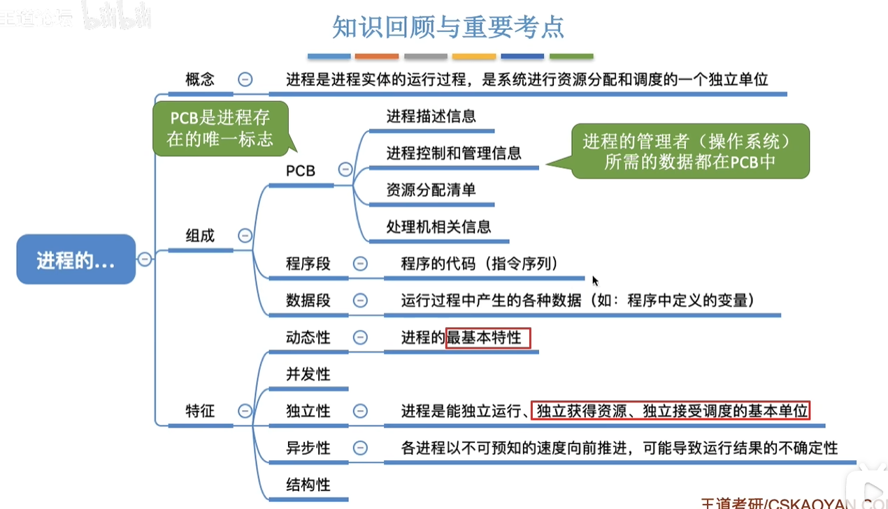

#### 进程的状态与转化

进程的状态反映了它当前“在做什么”。最经典的状态模型有 3 种基本状态：

3 种基本状态：

+ 就绪状态（Ready）：进程已获得除 CPU 外的所有资源，等待被 CPU 调度执行（像“学生坐在教室，等老师点名回答问题”）。
+ 运行状态（Running）：进程正在 CPU 上执行指令（像“学生被老师点名，正在回答问题”）。
+ 阻塞状态（Blocked，也叫等待状态）：进程因等待某个事件（如 I/O 完成、信号）而暂停执行（像“学生举手提问，但老师还没点到他，暂时不能说话”）。

状态转换流程：

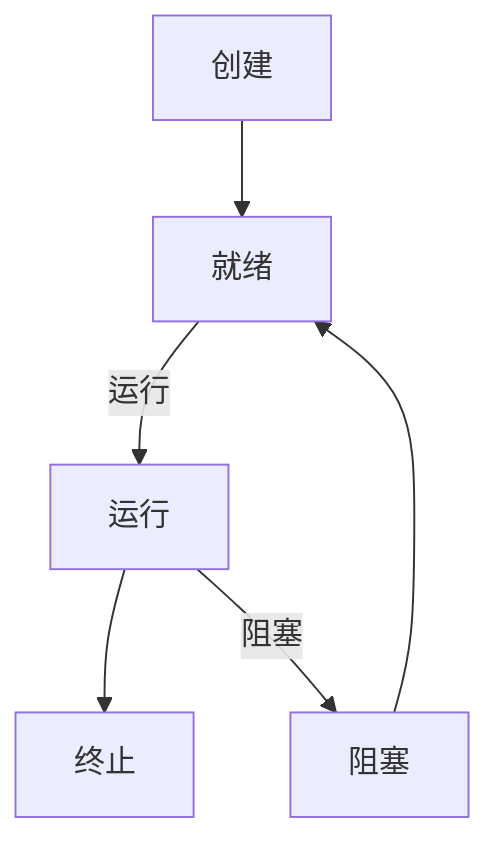
```mermaid
graph TD;
    创建 --> 就绪;
    就绪 -->|运行| 运行;
    运行 --> 终止;
    阻塞 --> 就绪;
    运行 -->|阻塞| 阻塞;
```

+ 创建 → 就绪：新进程被创建后，进入就绪队列等待调度（比如你打开一个软件，系统为其创建进程并加入就绪队列）。
+ 就绪 → 运行：CPU 调度器选中该进程，分配 CPU 时间片，进程开始执行。
+ 运行 → 就绪：进程的时间片用完，或被更高优先级的进程抢占 CPU，回到就绪队列等待下次调度。
+ 运行 → 阻塞：进程需要等待 I/O（如读取文件、网络数据）或收到信号（如用户按下“暂停”键），暂时放弃 CPU。
+ 阻塞 → 就绪：等待的事件完成（如文件读取完毕），进程重新进入就绪队列，等待 CPU 调度。
+ 运行 → 终止：进程完成任务（正常退出）或出错（如崩溃），被操作系统回收资源。

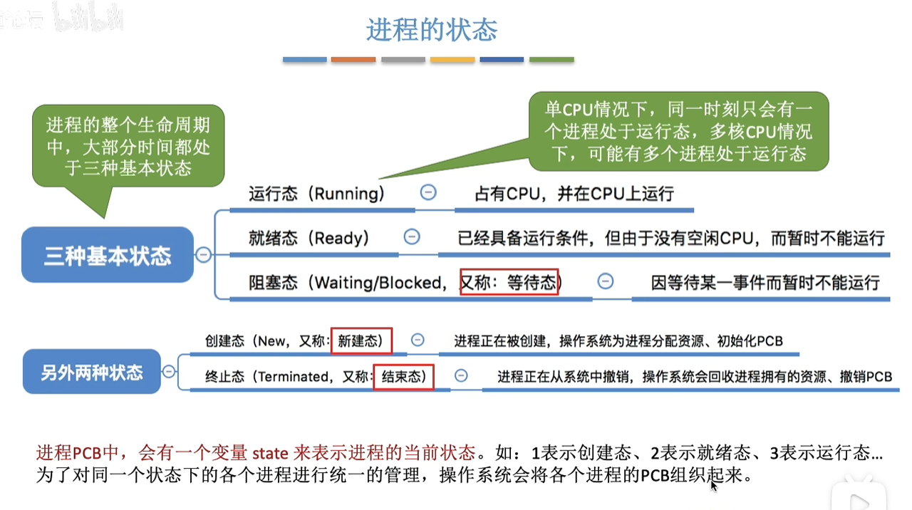

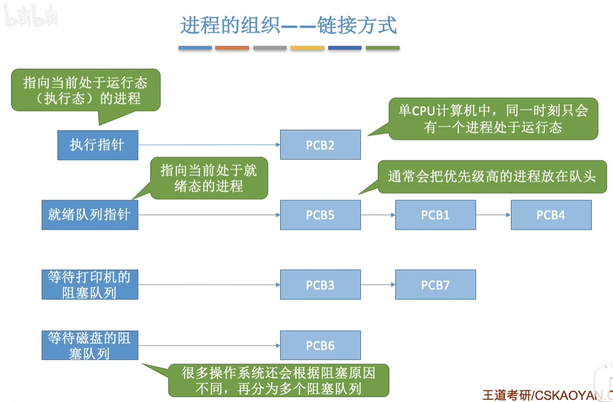

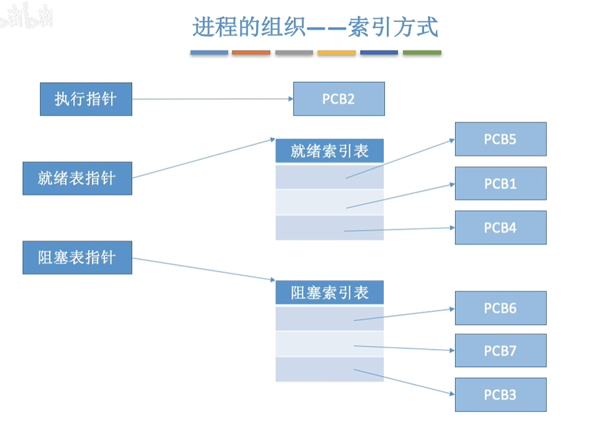

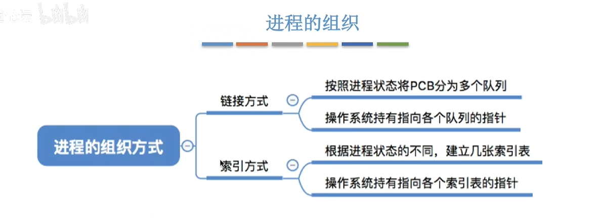

#### 进程的控制

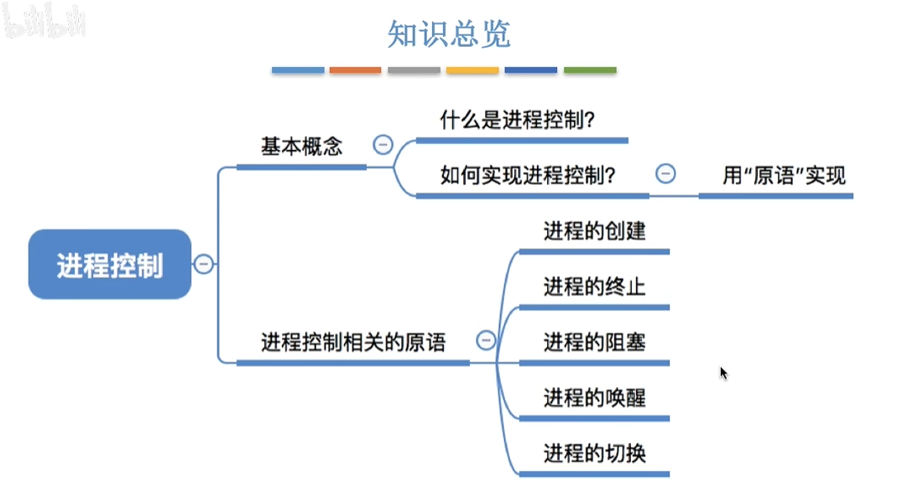

进程控制是操作系统管理进程的核心功能，主要操作包括​​创建、终止、阻塞、唤醒​​，这些操作需要通过“原语”（不可中断的原子操作）实现，确保进程状态转换的安全性。

关键控制操作：

1. 创建进程：
   + 父进程通过系统调用（如 Linux 的 `fork()`）创建子进程。
   + 子进程会创建一个全新的 PCB（进程控制块），但会从父进程的 PCB 中复制大部分信息（如进程优先级、打开的文件描述符表等），仅修改必要的部分（如进程 ID、父进程 ID、进程状态等）。
2. 终止进程：
   + 进程完成任务后主动调用 `exit()` 退出。
   + 父进程通过 `wait()` 或 `waitpid()` 等待子进程结束并回收其资源（避免“僵尸进程”——子进程结束但父进程不回收资源，占用 PCB）。
3. 阻塞与唤醒：
   + 当进程需要等待事件（如 I/O）时，主动调用 `pause()` 或系统调用（如 `read()` 阻塞等待输入）进入阻塞状态。
   + 当等待的事件完成（如 I/O 数据到达），操作系统调用 `wakeup()` 将进程从阻塞状态唤醒，转为就绪状态。

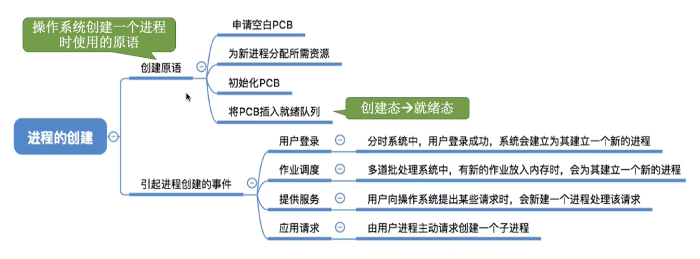

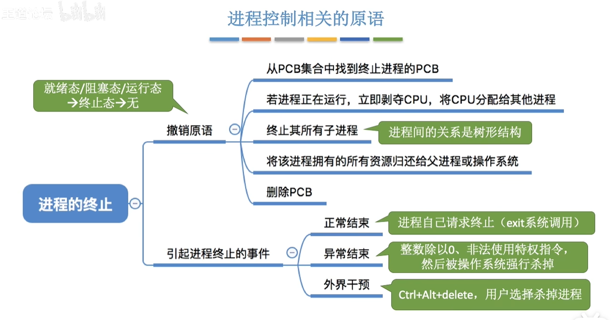

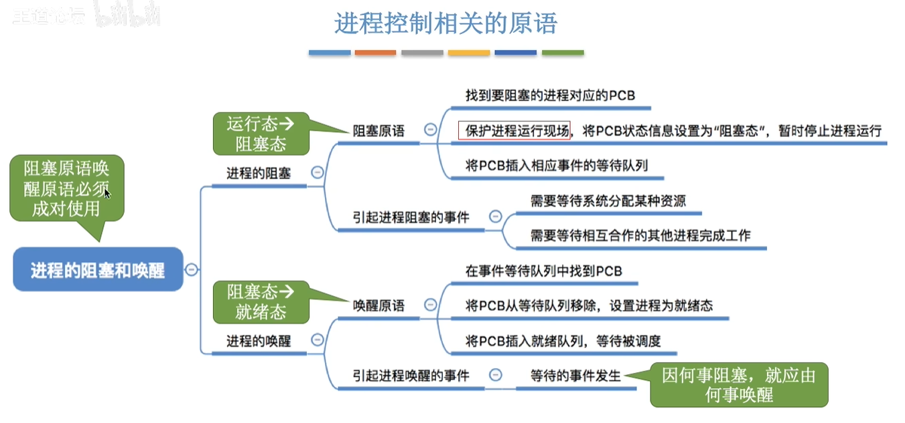

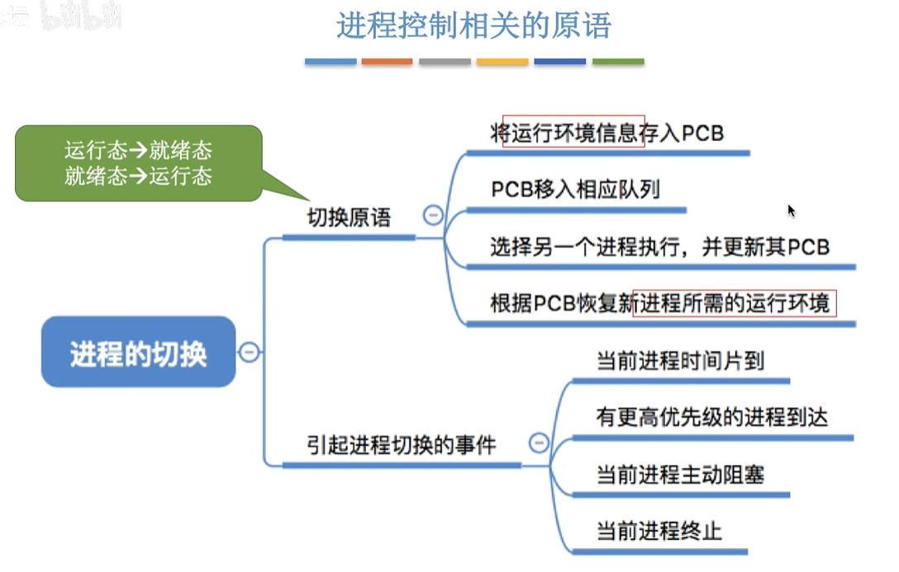

#### 进程的通信

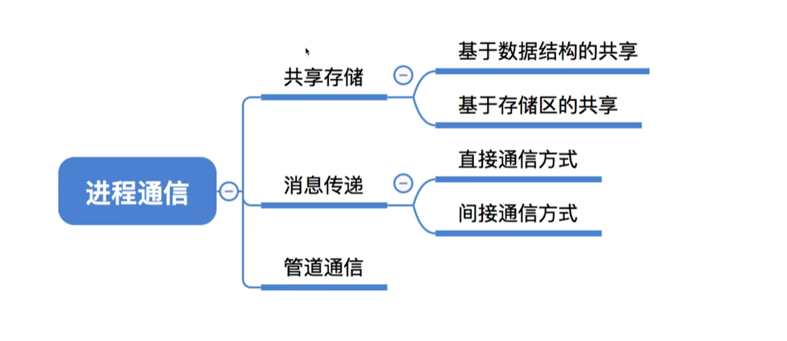

不同进程间需要交换数据或协调操作，操作系统提供了多种通信方式，核心目标是​​安全、高效​​。

常见通信方式：

1. 共享内存：
   + 多个进程共享同一块内存区域（操作系统分配），直接读写共享内存交换数据。
   + 优点：速度最快（无需拷贝数据），适合大量数据交换（如数据库系统）。
   + 缺点：需要同步机制（如信号量），否则可能出现“脏读”（两个进程同时修改同一数据）。

2. 消息传递：
   + 进程通过操作系统提供的“信箱”或“队列”发送/接收消息。
   + 直接通信：进程 A 直接向进程 B 发送消息（如 Linux 的 `msgsnd()`/`msgrcv()`），需知道对方标识符。
   + 间接通信：通过“邮箱”（如 POSIX 的消息队列）中转消息，进程只需知道邮箱地址（适合匿名通信）。

3. 管道通信：
   + 一种特殊的文件，分为“匿名管道”和“命名管道”，半双工（单向传输）。
   + 匿名管道：仅用于有亲缘关系的进程（如父子进程），半双工（单向传输）。
   + 命名管道：无亲缘关系的进程也可使用，通过文件系统中的路径名标识。

   同样的，如果需要双向传输数据（全双工），就需要两个管道

还有一种通信方式，就是信号

>[!NOTE]
>
>这里的信号不同于信号量，请注意区分

信号是操作系统实现进程间通信的一种异步通知机制，用于进程间传递事件信息。当特定事件发生时（如错误、用户输入或外部指令），发送方（内核或其他进程）向目标进程发送信号，目标进程根据信号类型执行预设或自定义的处理逻辑。

核心特点

+ **异步性**：信号可能在进程执行的任意时刻到达（如用户按下 Ctrl+C 时），打断当前操作。
+ **事件驱动**：信号本质是对事件的响应（如硬件异常、进程终止请求）。

常见信号类型（部分）

+ 标准信号（1-31 号）：
  + SIGINT（2）：中断进程（如 Ctrl+C 触发）。
  + SIGTERM（15）：请求进程优雅终止（可被捕获或忽略）。
  + SIGKILL（9）：强制终止进程（不可被捕获/忽略，用于强制结束无响应进程）。
  + SIGSEGV（11）：段错误（进程访问非法内存）。
  + SIGUSR1/SIGUSR2（10/12）：用户自定义信号（供应用程序扩展使用）。
+ **实时信号（34-64 号，POSIX 标准）**：如 SIGRTMIN（34）、SIGRTMAX（64），支持排队传递，解决早期信号丢失问题。

发送方式

+ **内核主动发送**：硬件异常（如除零错误）、系统调用失败（如内存分配不足）、进程状态变更（如父进程终止触发子进程 SIGHUP）。
+ **进程间发送**：通过 `kill(pid, sig)` 系统调用，由一个进程向另一个进程发送信号（需权限）。
+ **终端驱动**：用户输入特殊字符（如 Ctrl+C→SIGINT，Ctrl+Z→SIGTSTP 暂停）触发终端关联进程的信号。

处理机制

进程对信号的处理策略由信号处理函数决定，一旦处理某个信号就会把 `pending` 位重置为 1，如果重复收到多个同类信号，会进行简单的丢弃，如果是不同类的，那么通常会优先处理更小的信号，默认有三种方式：

1. 忽略（Ignore）：进程不响应信号（部分信号不可忽略，如 SIGKILL/SIGSTOP）。
2. 执行自定义处理：进程注册自定义处理函数（通过 `signal()` 或 `sigaction()` 系统调用），收到信号时执行该函数（需注意函数的可重入性，避免竞态条件）。
3. 默认（Default）：执行内核预设行为（如 SIGTERM→ 终止进程，SIGSEGV→ 终止并转储核心）。

如何判断一个信号需不需要进行处理：

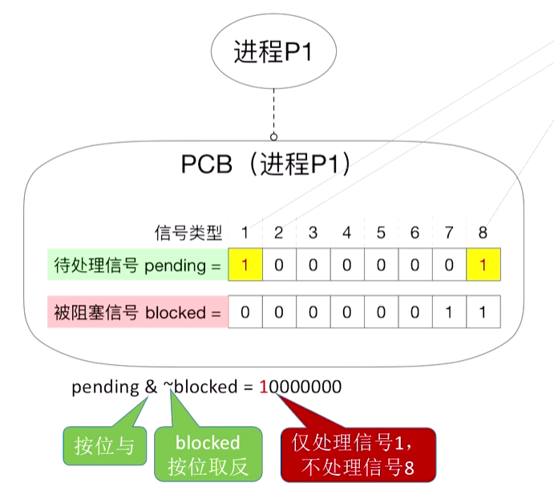

执行流程

1. **信号产生**：事件触发信号生成（如用户输入、硬件错误）。
2. **信号记录**：内核在目标进程的 PCB（进程控制块）中标记未处理的信号（位图或队列存储）。
3. 信号处理：当进程从内核态返回用户态时，检查未处理信号：
   + 若选择忽略，清除该信号标记；
   + 若选择捕获，暂停当前执行流，跳转到处理函数（处理完成后返回原执行点）；
   + 若选择默认，执行内核预设动作（如终止进程会释放资源、关闭文件描述符）。

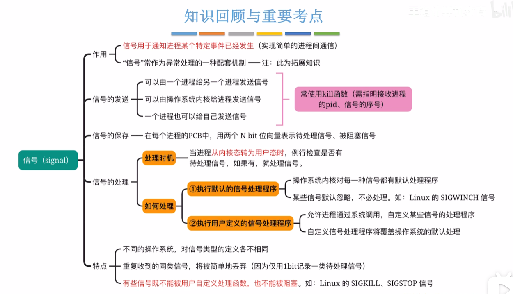

#### 线程和多线程模型

 线程（Thread）是进程内的“微型执行单元”，是 CPU 调度的基本单位。一个进程可以包含多个线程，它们​​共享进程的资源​​（如内存、文件句柄），但有自己的“执行上下文”（如程序计数器、寄存器）。

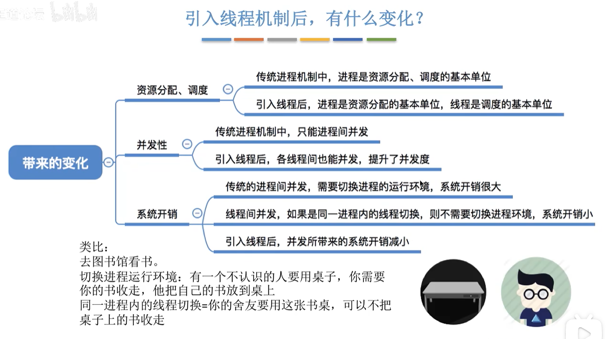

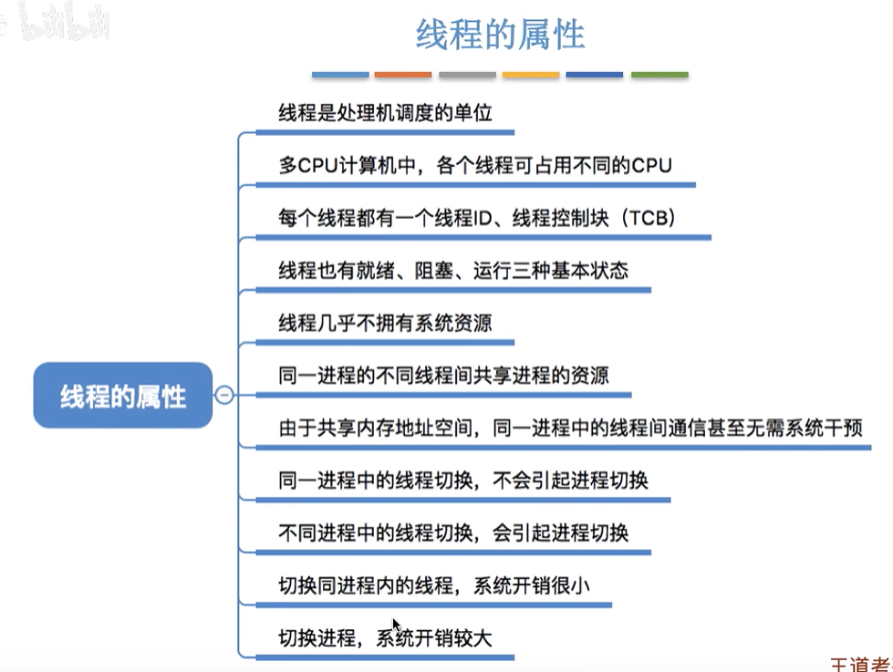

进程 vs 线程：

| **对比项** | 进程                          | 线程                          |
| ---------- | ----------------------------- | ----------------------------- |
| 资源分配   | 独立资源（内存、文件等）      | 共享进程资源                  |
| 调度单位   | CPU 调度的基本单位（较重量级） | CPU 调度的基本单位（更轻量级） |
| 切换开销   | 高（需保存/恢复所有资源）     | 低（仅保存线程上下文）        |
| 通信方式   | 需通过 IPC（较复杂）           | 直接共享内存（更简单）        |

线程的实现方式：

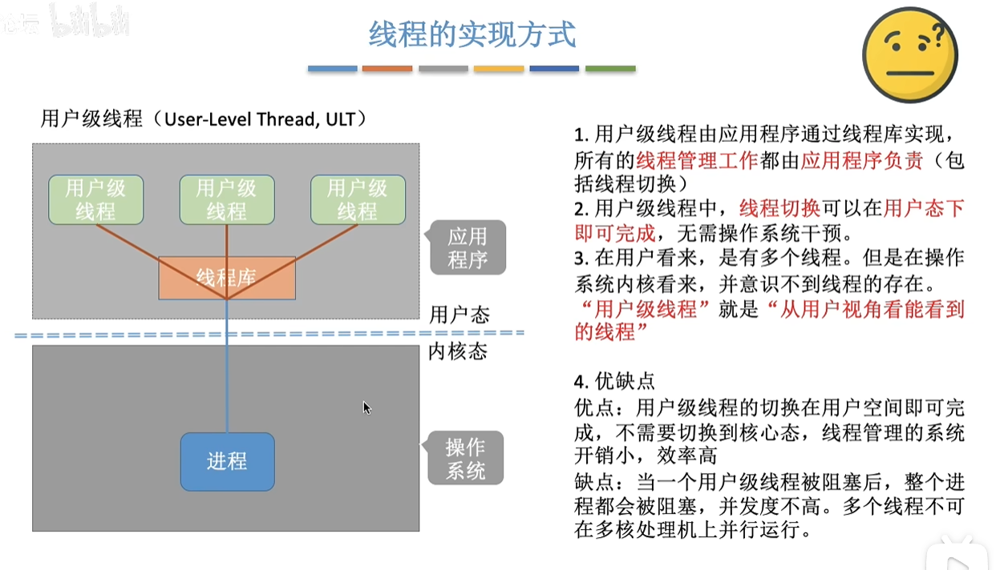

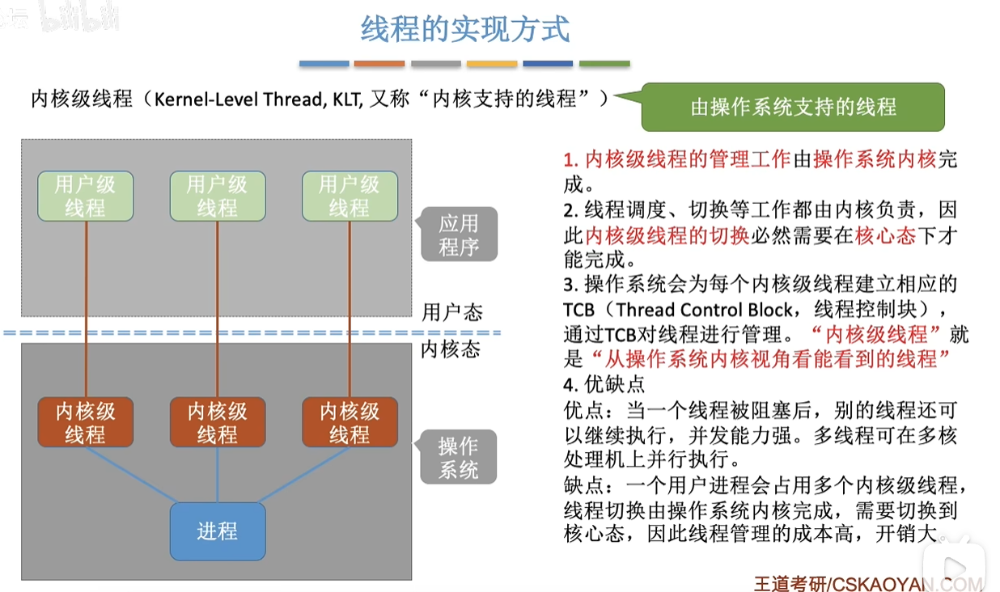

>[!NOTE]
>
>关于系统开销，说他开销小是跟进程切换相比，说他开销大是跟用户级线程相比

多线程模型的类型：

1. 一对一模型：每个用户线程对应一个内核线程（操作系统直接管理）。
   + 优点：线程切换快，支持真正并行（多核 CPU）。
   + 缺点：创建线程数量受限于内核线程数（如 Linux 默认限制），成本高。
2. 多对一模型：多个用户线程映射到一个内核线程。
   + 优点：线程切换极快（用户空间完成），资源开销小。
   + 缺点：一个线程阻塞会导致整个进程阻塞（无法利用多核）。
3. 多对多模型：多个用户线程映射到多个内核线程（主流方案）。
   + 优点：兼顾性能与并行性（如 Java 的线程、Windows 的线程）。

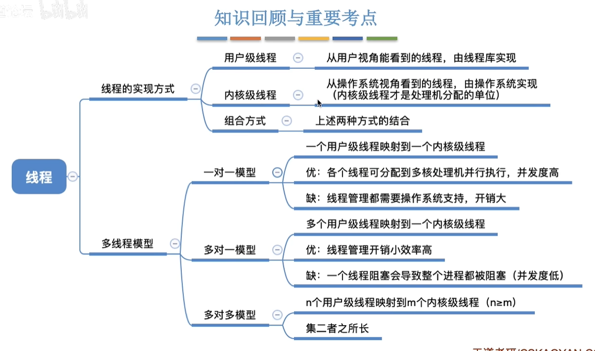

线程的状态与转化：

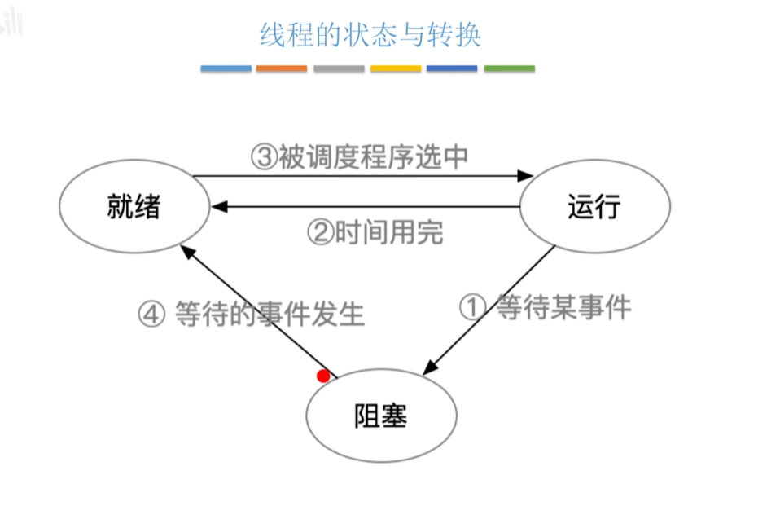

### 2.2 CPU 调度

#### 调度的概念

**调度的基本概念** 在多道程序系统中，内存中同时存放着多个进程，它们都处于就绪状态并共享处理机资源。**CPU 调度**（或称进程调度）就是指按照某种算法从就绪队列中选择一个进程，将 CPU 的使用权分配给它。

调度的三个层次

+ **高级调度（作业调度）**：又称长程调度。其主要功能是根据某种算法，从外存上处于后备状态的作业中选择一个或多个，为它们分配内存等必要资源，并建立相应的进程，使它们获得竞争 CPU 的权利。高级调度主要用于批处理系统，控制着进入系统的作业数量，即多道程序的“道数”。
+ **中级调度（内存调度）**：又称中程调度。其主要功能是按照某种策略决定将哪个处于挂起状态的进程重新调入内存。目的是提高内存利用率和系统吞吐量。当内存紧张时，可将某些进程的数据暂时换出到外存，等待以后换入。这个过程称为“交换”（Swapping）。
+ **低级调度（进程调度）**：又称短程调度。其主要功能是根据某种算法，从就 "绪队列" 中选取一个进程，将 CPU 分配给它。进程调度是操作系统中最基本的一种调度，其执行频率非常高（通常在几十毫秒级别）。

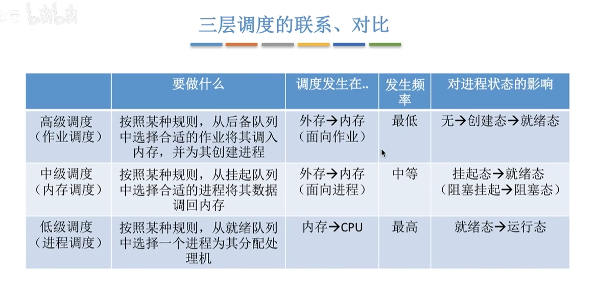

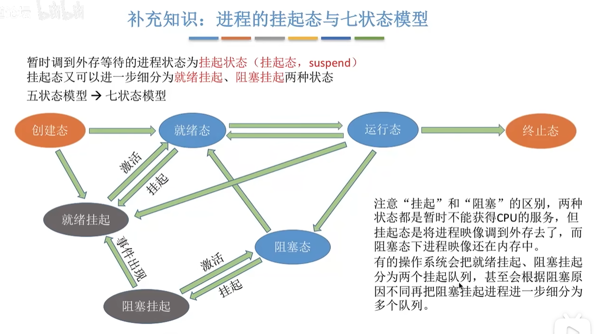

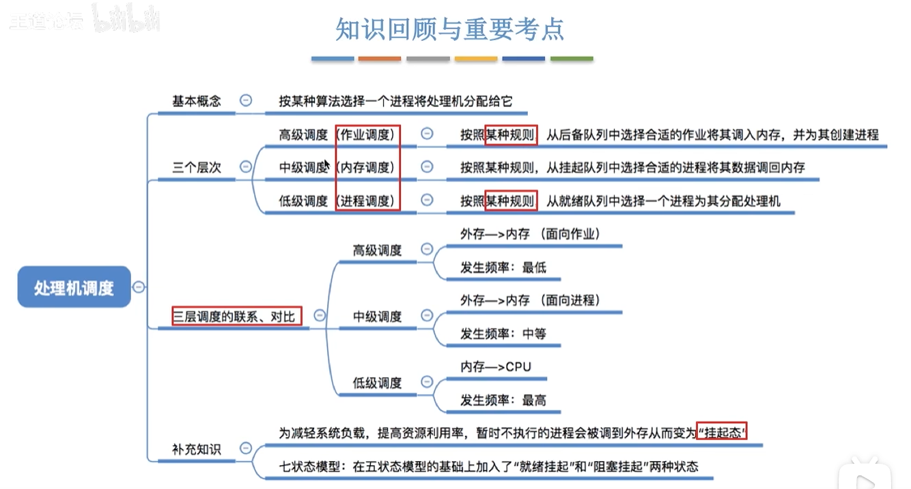

#### 调度的实现与进程的切换

==时机==

什么时候需要进程调度？

+ 主动放弃（进程正常终止、运行过程中发生异常而终止、进程主动请求阻塞）
+ 被动放弃（分给进程的时间片用完、有更紧急的事需要处理、有更高优先级的进程进入就绪队列）

什么时候不能进行进程调度？

+ 在处理中断的过程中
+ 在操作系统内核程序临界区中
+ 临界资源：一个时段段内各进程互斥地访问临界资源
+ 临界区：访问临界资源的那段代码
+ 内核程序临界区会访问就绪队列，导致其上锁
+ 在原子操作过程中（原语）

==切换与过程==

“狭义的调度”与“进程切换”的区别

+ 狭义：选择一个进程
+ 广义：狭义+进程切换

进程切换的过程需要做什么？

+ 对原来运行进程各种数据的保存
+ 对新的进程各种数据的恢复

==方式==

非剥夺调度方式（非抢占式）

+ 只允许进程主动放弃处理机

剥夺调度方式（抢占式）

+ 进程被动放弃，可以优先处理紧急任务，适合分时操作系统、实时操作系统

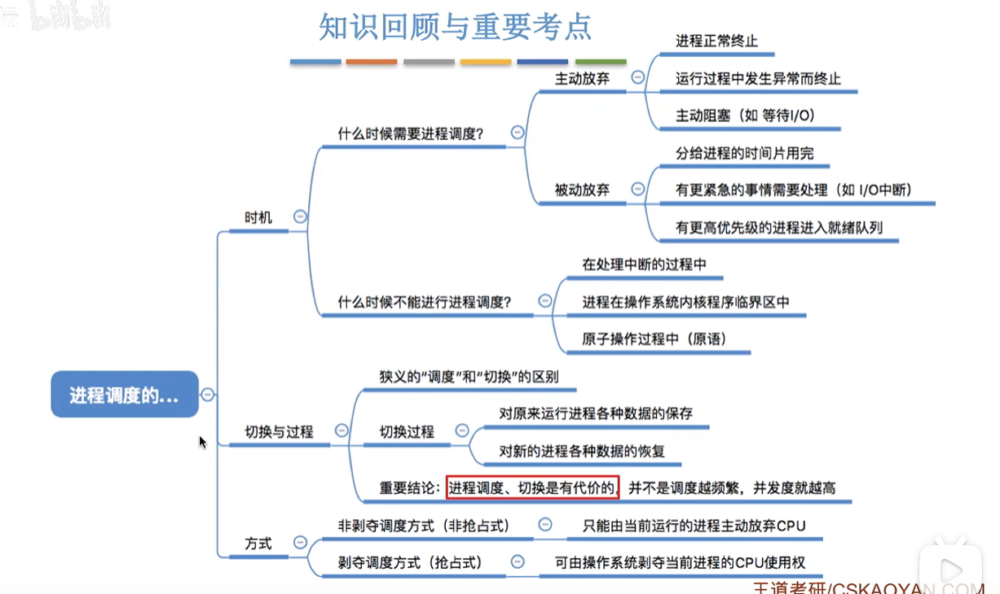

==调度器和闲逛进程==

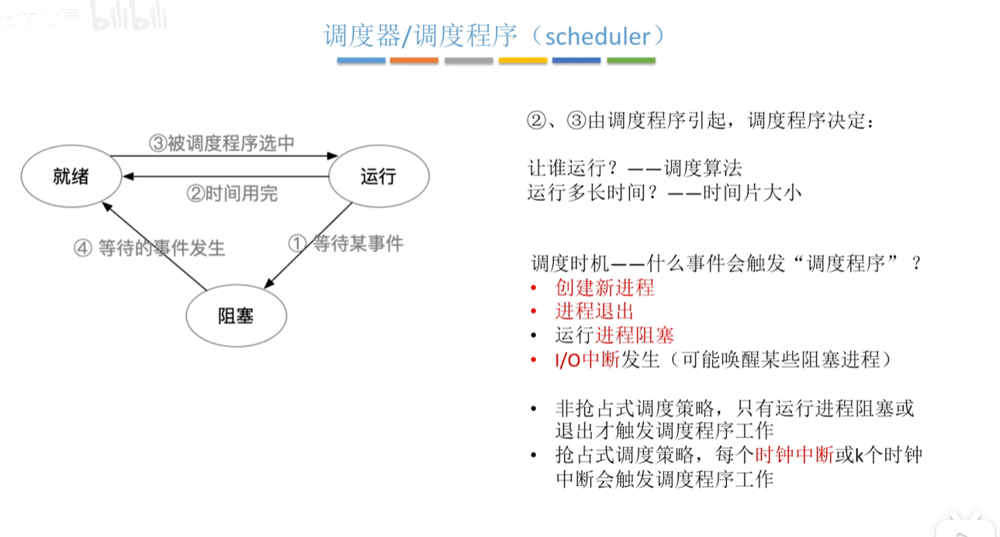


#### CPU 调度算法

==评价指标==

**CPU 利用率**：CPU 处于“忙碌”状态的时间百分比。

$$
利用率 =\frac{忙碌的时间}{总时间}
$$

**系统吞吐量**：单位时间内完成的进程数量。

$$
吞吐量 =\frac{总共完成了多少道作业}{总共花了多长时间}
$$

**周转时间**：从进程提交到进程完成所花费的时间。

$$
周转时间 = 完成时间 - 提交时间\\
平均周转时间 =\frac{各周转时间之和}{作业数}
$$

**带权周转时间**：周转时间与进程实际运行时间的比值，能更好地衡量长短作业的等待情况。（越小越好）

$$
带权周转时间 = \frac{作业周转时间}{作业实际运行时间}=\frac{作业完成时间-作业提交时间}{作业实际运行时间}\\
平均带权周转时间 =\frac{各个作业带权周转时间之和}{作业数}
$$

**等待时间**：进程在就绪队列中等待所花费的时间总和。


**响应时间**：从用户提交请求到系统首次产生响应所花费的时间。

==典型调度算法==

==先来先服务（First-Come, First-Served, FCFS）==

+ **思想**：按照进程到达就绪队列的先后顺序进行调度。
+ **规则**：选择最先进入就绪队列的进程。
+ **方式**：非抢占式。
+ **优点**：实现简单，公平，没有饥饿，有利于 CPU 繁忙型任务。
+ **缺点**：效率较低。对短进程不利，容易产生“护航效应”（Convoy Effect），即一个长进程占用 CPU 时，后面许多短进程不得不长时间等待。

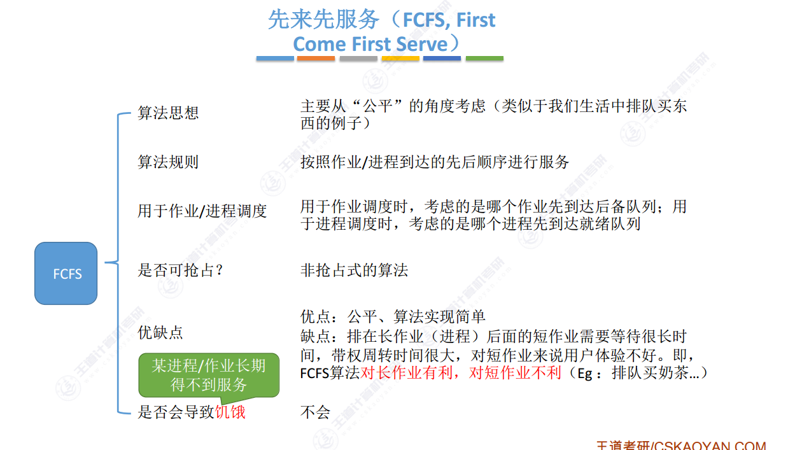

==短作业优先（Shortest Job First, SJF）==

+ **思想**：选择预计运行时间最短的进程进行调度。
+ **规则**：从就绪队列中选择 `运行时间` 最短的进程。
+ **方式**：
  + **非抢占式 SJF**：一旦一个进程获得 CPU，它会一直运行直到完成。
  + **抢占式 SJF（最短剩余时间优先，Shortest Remaining Time Next, SRTN）**：当一个新进程到达就绪队列，如果其运行时间比当前正在执行的进程的 `剩余运行时间` 还短，则会抢占 CPU。
+ **优点**：平均等待时间和平均周转时间最短，被证明是“最优”的。
+ **缺点**：
  + 难以准确预估进程的运行时间。
  + 对长进程非常不利，可能导致长进程“饥饿”（Starvation）。

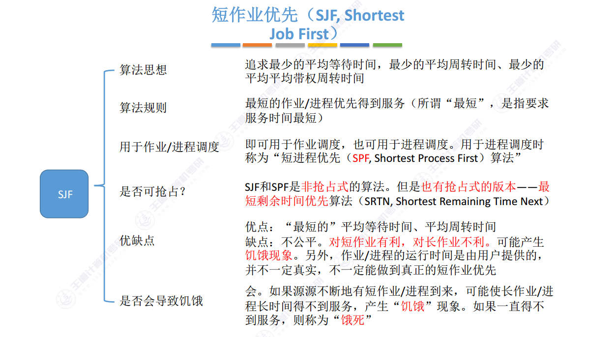

==高响应比优先（Highest Response Ratio Next, HRRN）==

+ **思想**：是 FCFS 和 SJF 的折中，既考虑等待时间也考虑运行时间。
+ **规则**：计算每个进程的响应比，选择 `响应比最高` 的进程。
  + 响应比 = (等待时间 + 要求服务时间) / 要求服务时间
+ **方式**：非抢占式。
+ **优点**：
  + 不会导致饥饿
  + 短进程的响应比较高，可以像 SJF 一样获得优先处理。
  + 长进程等待时间越长，其响应比也会越高，最终能获得 CPU，避免了“饥饿”问题。

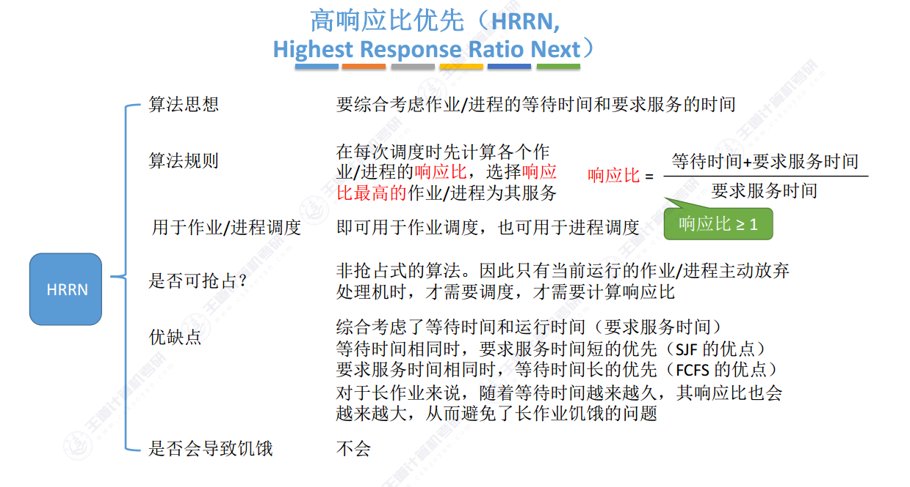

==时间片轮转（Round-Robin, RR）==

+ **思想**：将所有就绪进程按 FCFS 的原则排成一个队列，每次调度时，把 CPU 分配给队首进程，并让其执行一个时间片（Time Quantum）。
+ **规则**：当时间片用完时，若进程尚未完成，则产生时钟中断，调度程序将其停止并放到就绪队列的末尾。
+ **方式**：抢占式（基于时间片）。
+ **优点**：公平，响应快，适用于分时系统。
+ **缺点**：
  + 时间片大小的选择很关键：太大则退化为 FCFS，太小则进程切换过于频繁，系统开销大。
  + 不区分任务的紧急程度。

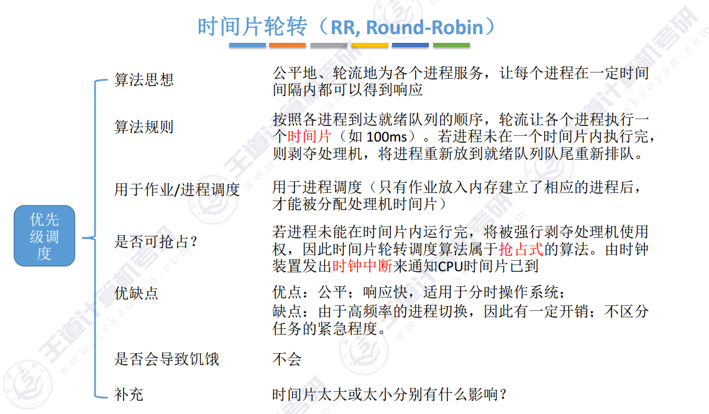

==优先级调度（Priority Scheduling）==

+ **思想**：为每个进程分配一个优先级，调度时选择 `优先级最高` 的进程。
+ **方式**：
  + **非抢占式**：当前进程主动放弃 CPU 时，才进行调度。
  + **抢占式**：当有更高优先级的进程进入就绪队列时，立即抢占当前进程的 CPU。
+ **优先级类型**：
  + **静态优先级**：创建进程时确定，在整个运行期间不变。
  + **动态优先级**：进程的优先级可以随时间改变（如等待时间越长，优先级越高）。
+ **缺点**：会导致饥饿。

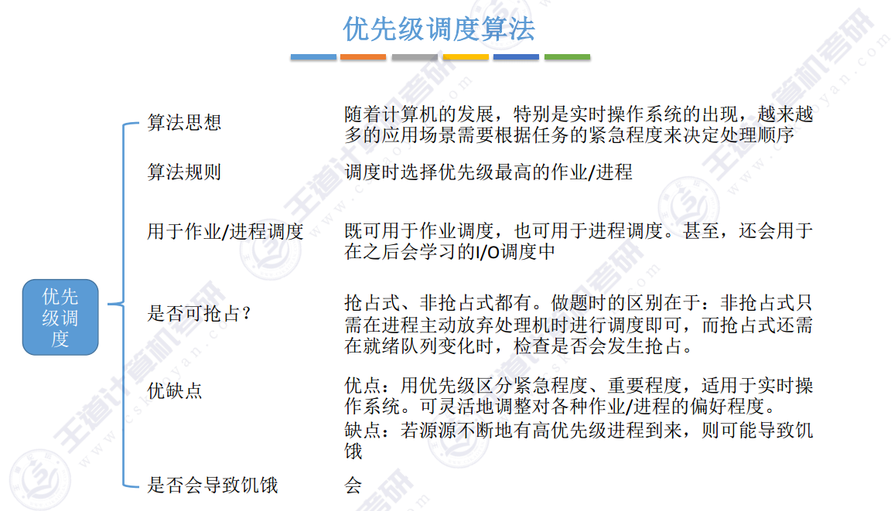

==多级队列调度（Multilevel Queue Scheduling）==

+ **思想**：将就绪队列拆分成多个独立的队列。每个队列有自己的优先级和调度算法。
+ **规则**：
  + 进程根据其属性（如内存大小、进程类型等）被永久分配到某个队列中。
  + 队列之间采用固定优先级调度。只有在高优先级队列为空时，低优先级队列中的进程才能获得 CPU。
  + 默认为抢占式的
+ **缺点**：缺乏灵活性，如果一个进程被分配到低优先级队列，它可能长时间得不到执行。

多级反馈队列调度（Multilevel Feedback Queue Scheduling）

+ **思想**：是多级队列的改进，允许进程在不同队列之间移动。
+ **规则**：
  1. 设置多个就绪队列，各队列优先级从高到低，时间片从小到大。
  2. 新进程首先进入最高优先级队列（Q1）。按 FCFS 等待，按 RR 方式执行。若在一个时间片内完成，则撤离；否则，移至第二级队列（Q2）的末尾。
  3. 以此类推，对于低优先级队列中的进程，只有在高优先级队列为空时才能被调度。
  4. 在最低优先级队列中，通常采用 FCFS 或更长的时间片 RR。
+ **优点**：
  + 兼顾了长短作业，对短作业友好。
  + 响应时间较快。
  + 通过进程降级，避免了用户伪造短作业来获取更高优先级。
  + 可以防止“饥饿”（可以将等待时间过长的低优先级进程移回高优先级队列）。
+ **是目前公认的较好的一种进程调度算法。**

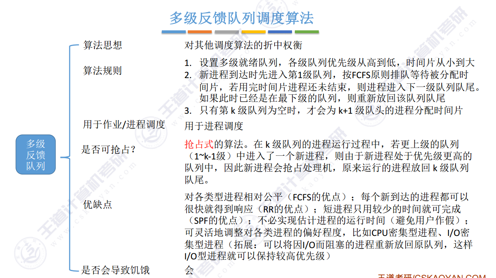

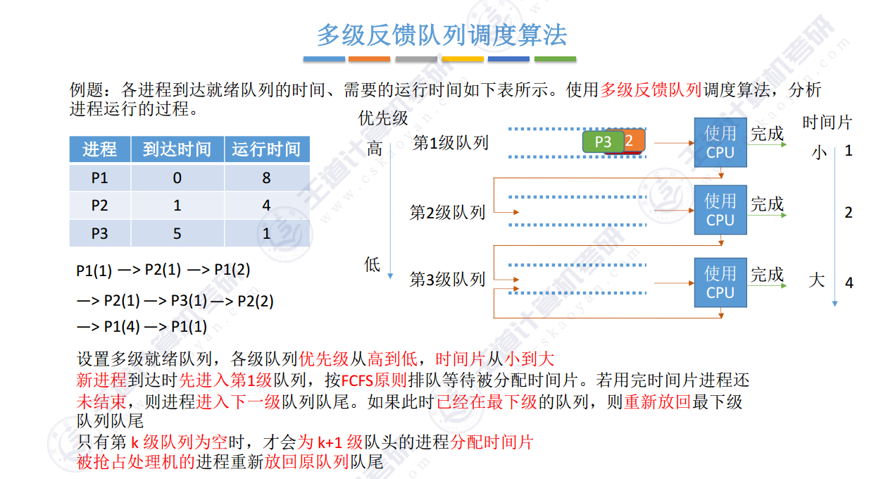

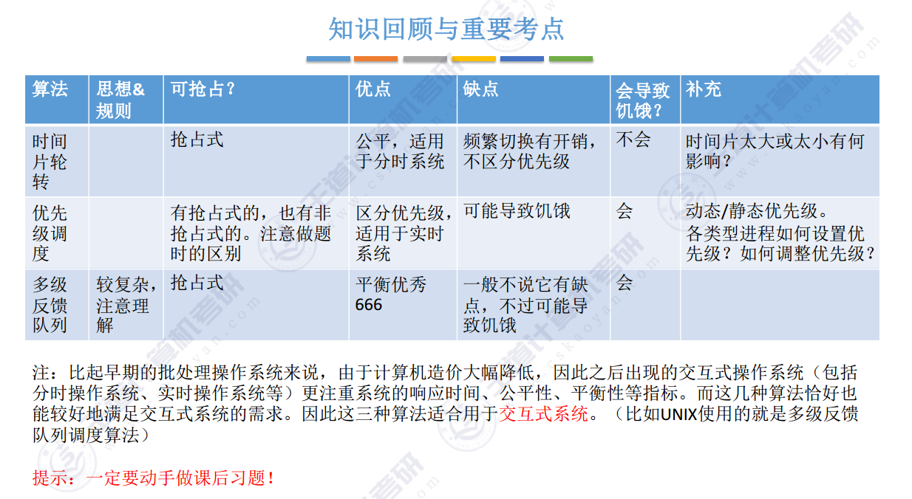

==多处理机调度==

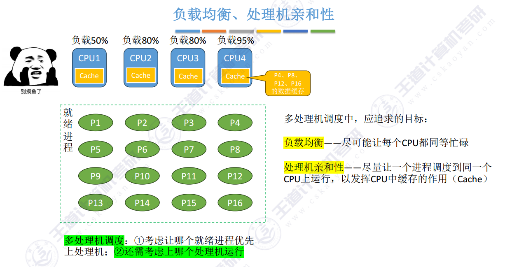

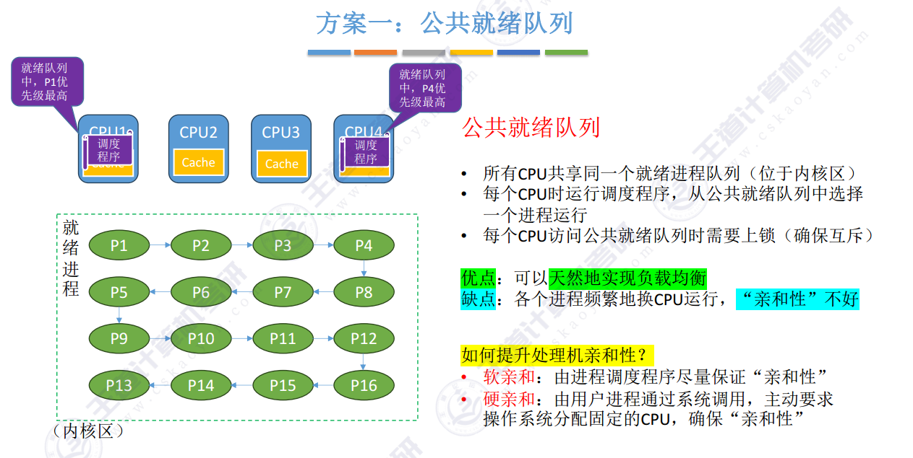

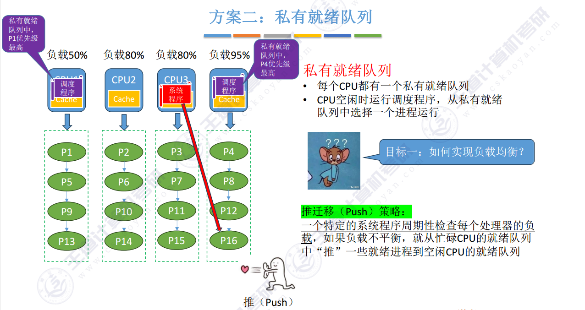


推迁移：有一个包工头专门负责派活

拉迁移：一群互帮互助的同事（看到其他同事很忙，主动揽活过来，分担任务)

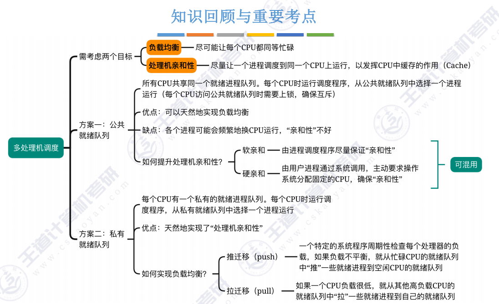

### 2.3 同步与互斥

#### 基本概念

**同步**：指多个进程在执行过程中，为了完成共同的任务，需要按照一定的顺序来协调它们的执行。即一个进程的执行依赖于另一个进程的消息或信号，当一个进程到达某一执行阶段时，若另一个进程尚未完成某些操作，则该进程需要等待，直至另一个进程完成后才能继续执行。例如，在数据处理中，输入进程需要将数据准备好后，处理进程才能对数据进行处理，这就是一种同步关系。

**互斥**：指多个进程不能同时访问某个共享资源（临界资源），只能轮流地对该资源进行访问。临界资源是指一次仅允许一个进程使用的资源，如打印机、共享变量等。互斥的目的是保证对临界资源的正确使用，避免因多个进程同时访问而导致的数据不一致、结果错误等问题。

**区别与联系**：同步强调进程间的协作和顺序性，互斥强调进程间对临界资源的竞争和排他性。同步中可能包含互斥，例如多个进程在协作完成任务时，可能会涉及到对临界资源的访问，此时就需要互斥来保证资源的正确使用；互斥是同步的一种特殊情况，即多个进程在对临界资源进行访问时的一种协调关系。

#### 实现临界区的基本方法

临界资源：是指一次只能被一个进程/线程安全访问的共享资源

临界区：是指每个进程中访问临界资源的那段代码

分为软件实现和硬件实现两种方法，首先介绍的是软件实现方法。

==单标志==：

思想：两个进程通过一个公共整型变量 turn 来交替访问临界区，即规定进程 0 先进入临界区，当进程 0 退出后，才能允许进程 1 进入，反之亦然。

优点：简单直观，保证了互斥性，同一时刻只有一个进程能进入临界区。

缺点：过于严格的交替访问方式，存在 “空闲让进” 问题。若进程 0 进入临界区后执行时间过长，即使进程 1 此时需要进入临界区，也只能等待，导致资源利用率低 。

==双标志先检查==：

思想：设置一个布尔型数组 flag []，数组元素个数与进程数相同，每个元素对应一个进程，用来表示该进程是否想进入临界区。每个进程在进入临界区前先检查其他进程的标志位，若其他进程不想进入临界区，则将自己的标志位置为想进入，然后进入临界区。

优点：实现了多个进程都能主动申请进入临界区，相较于单标志法，提高了资源利用率。

缺点：存在 “忙等” 和不能保证互斥的问题。当多个进程同时检查其他进程的标志位时，都发现其他进程不想进入临界区，然后同时将自己的标志位置为想进入，从而导致多个进程同时进入临界区，违反互斥条件。

==双标志后检查==：

思想：也是基于布尔型数组 flag []，但与双标志先检查不同的是，先将自己的标志位置为想进入临界区，然后再检查其他进程的标志位。如果其他进程也想进入临界区，则当前进程等待，直到其他进程退出临界区。

优点：一定程度上避免了双标志先检查法中多个进程同时进入临界区的问题。

缺点：可能出现 “饥饿” 现象。例如，进程 0 和进程 1 都想进入临界区，进程 0 先将自己的 flag [0] 置为 true，然后检查 flag [1]；此时进程 1 也将 flag [1] 置为 true，然后检查 flag [0]。由于进程 0 已经先设置了自己的标志位，进程 1 发现进程 0 想进入，于是进程 1 等待；而进程 0 检查到进程 1 也想进入，也开始等待，这样两个进程就会无限期地等待下去，造成 “饥饿” 。

==Peterson 算法==

原理：通过两个进程共享的变量 `flag` 和 `turn` 来实现互斥。`flag[i]` 表示进程 `i` 是否想要进入临界区，`turn` 表示当前允许进入临界区的进程编号。

步骤：

+ 进程 i 想要进入临界区时，将 flag [i] 设为 true，表示自己想要进入。

+ 然后将 turn 设为对方进程的编号 j，表示愿意让对方先进入。

+ 之后进程 i 检查 flag [j] 是否为 true 且 turn 是否为 j，如果是，则进程 i 等待；否则，进程 i 进入临界区。

+ 进程 i 离开临界区时，将 flag [i] 设为 false。

优点：实现了互斥，且能保证不会出现饥饿现象。

缺点：只适用于两个进程的情况，扩展性较差。

硬件相关的屏蔽方法

==中断屏蔽==

原理：在进程进入临界区之前，关中断，使进程在执行临界区代码的过程中不会被中断，从而避免其他进程进入临界区。在离开临界区后，再开中断。

优点：实现简单。

缺点：只适用于单处理器系统，且关闭中断时间过长会影响系统的并发性能，还可能导致系统对外部事件的响应延迟。

==Test-and-Set 指令（TS 指令）==

原理：TS 指令是一条原子操作指令，其功能是读出指定内存单元的值，然后将该内存单元的值设置为 1。可以利用 TS 指令实现互斥锁，当进程想要进入临界区时，执行 TS 指令检查锁变量，如果锁变量为 0，表示可以进入，同时将锁变量设为 1；如果锁变量为 1，则表示已有进程在临界区，进程需要等待。

优点：适用于多处理器系统，实现简单。

缺点：会导致忙等现象，浪费 CPU 资源。

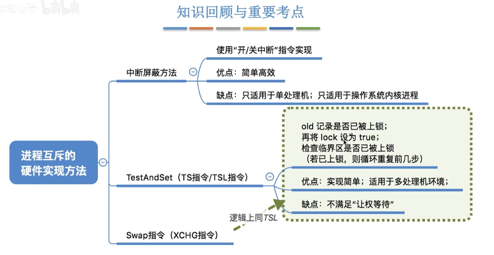

#### 互斥锁

**定义**：互斥锁是一种用于实现互斥的机制，它是一个变量，可以处于锁定（locked）或解锁（unlocked）状态。

**操作**：

lock 操作：当进程想要进入临界区时，执行 lock 操作。如果锁处于解锁状态，则将锁设置为锁定状态，进程进入临界区；如果锁处于锁定状态，则进程等待，直到锁被解锁。

unlock 操作：当进程离开临界区时，执行 unlock 操作，将锁设置为解锁状态，唤醒等待该锁的进程。

**应用场景**：适用于对临界资源访问时间较短的情况，因为如果进程在临界区停留时间过长，等待的进程会一直处于忙等或阻塞状态，影响系统性能。

#### 信号量

信号量是一种变量，表示系统中某种资源的数量

一对原语：wait（S）原语和 signal（S）原语，分别简称 P（S）、V（S）

==1、整形信号量==

用一个整数表示系统资源的变量，用来表示系统中某种资源的数量

```c
int S=1;
void wait(int S){ //wait 原语，相当于：进入区
    while(S<=0); //如果资源数不够，就一直循环等待
    S=S-1;  //如果资源数够，则占用一个资源
}
void signal(int S){//signal 原语，相当于“退出区”
    S=S+1;  //使用完资源后，在退出区释放资源
}
```

可能会出现盲等

==2、记录型信号量==

记录型数据结构表示的信号量

```c
//记录型信号量的定义
typedef struct{
    int value;
    struct process *L;
} semaphore;
//某进程需要使用资源时，通过 wait 原语申请
void wait (semaphore S){
    S.value--;
    if(S.value<0){
        block (S.L);//将该进程加入到消息队列中
    }
}
//进程使用完资源后，通过 signal 原语释放
void signal (semaphore S){
    S.value++;
    if(S.valie<=0){
        wakeup(S.L);
    }
}
```

除非特别说明，否则默认 S 为记录型信号量，不会出现忙等现象。

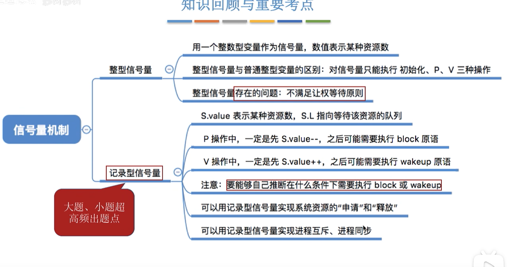

==用信号量机制实现进程互斥、同步、前驱关系==

1、实现进程互斥

+ 设置互斥信号量 mutex，初值为 1
+ 对不同的临界资源需要设置不同的互斥信号量
+ PV 必须成对出现

2、实现进程同步

+ 保证一前一后的操作顺序
+ 设置同步信号量 S，初始为 0
+ 在“前操作”之后执行 V（S）
+ 在“后操作”之后执行 P（V）

3、实现进程的前驱关系

+ 要为每一对前驱关系各设置一个同步变量
+ 在“前操作”之后对相应的同步变量执行 V 操作
+ 在“后操作”之前对相应的同步变量执行 P 操作

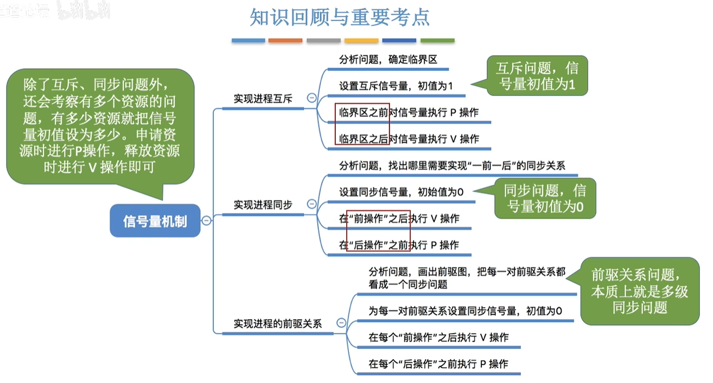

#### 经典互斥问题

==生产者与消费者问题==

1. **问题特点**：生产者进程生产产品并放入缓冲区，消费者进程从缓冲区中取出产品并消费。缓冲区是临界资源，生产者和消费者之间存在同步关系，即生产者不能向满缓冲区中放入产品，消费者不能从空缓冲区中取出产品；同时，多个生产者之间、多个消费者之间以及生产者和消费者之间存在互斥关系，即不能同时对缓冲区进行操作。

1. **同步与互斥关系**：

+ 同步：生产者等待缓冲区不满，消费者等待缓冲区不空。

+ 互斥：生产者和消费者对缓冲区的访问需要互斥。

**解决方案**：

+ 设置信号量 empty 表示空缓冲区的数量，初始值为缓冲区大小 n；full 表示满缓冲区的数量，初始值为 0；mutex 为互斥信号量，初始值为 1。

+ 生产者进程：

```c
while (true) {
    生产一个产品;
    P(empty); //若缓冲区满（empty = 0），则阻塞等待。
    P(mutex); //获取缓冲区的独占访问权。
    将产品放入缓冲区;
    V(mutex); //允许其他线程操作缓冲区。 
    V(full); //通知消费者“有新数据”。  
}
```

+ 消费者进程：

```c
while (true) {
    P(full);//若缓冲区空（full = 0），则阻塞等待。
    P(mutex);//获取缓冲区的独占访问权。  
    从缓冲区取出一个产品;
    V(mutex);//允许其他线程操作缓冲区。
    V(empty);//通知生产者“有新空间”。
    消费该产品;
}
```

==读者与写者问题==

1. **问题特点**：多个读者可以同时读取共享数据，而写者只能独占共享数据进行写入操作。即读者之间不互斥，读者与写者互斥，写者与写者互斥。

1. **同步与互斥关系**：

+ 读者与写者互斥，写者与写者互斥。

+ 多个读者可以同时访问共享数据。

**解决方案**：

设置信号量 `rw` 用于实现写者之间以及读者与写者之间的互斥，初始值为 1；`mutex` 用于对读者数量进行互斥访问，初始值为 0；`count` 表示当前正在读取的读者数量，初始值为 0。

这里的是读进程优先的

写者进程：

```c
int count=0;
mutex=1;
rw=1;
writer(){
    while(1){
        p(rw);//上锁-文件
        写文件;
        v(rw);//解锁-文件
    }
}
```

读者进程：

```c
reader(){
    while(1){
        p(mutex);//上锁-count
        if(count==0){
            p(rw);//上锁-文件
        }
        v(mutex);//解锁-count
        读文件;
        p(mutex);//上锁-count
        count--;
        if(count==0){
            v(rw);//解锁-文件
        } 
        v(mutex);//解锁 count
    }
}
```

还有一种是写进程优先的，也有叫读写公平算法的，他增加了一个 `w` 变量用于保证写进程。

写者进程：

```c
int count=0;
mutex=1;
rw=1;
w=1;
writer(){
    while(1){
        p(w);//获取 w 锁，阻止新读者和新写者进入
        p(rw);//上锁-文件
        
        写文件;
        
        v(rw);//解锁-文件
        v(w);//释放 w 锁
    }
}
```

读者进程：

```c
reader(){
    while(1){
        p(w);//尝试获取 w 锁
        p(mutex);//上锁-count
        if(count==0){
            p(rw);//上锁-文件
        }
        v(mutex);//解锁-count
        v(w);//释放 w 锁
        
        读文件;
        
        p(mutex);//上锁-count
        count--;
        if(count==0){
            v(rw);//解锁-文件
        } 
        v(mutex);//解锁 count
    }
}
```

==哲学家进餐问题==

**问题特点**：五个哲学家围坐在一张圆桌旁，每人面前有一碗面条，每两人之间有一把筷子。哲学家的行为是思考或进餐，进餐时需要同时拿起左右两把筷子。避免哲学家出现死锁（每个哲学家都拿起左边的筷子，等待右边的筷子）和饥饿现象。

**同步与互斥关系**：哲学家对筷子的访问需要互斥，即同一时间只能有一个哲学家使用某一把筷子。

**解决方案**：

方法一：最多允许四个哲学家同时拿起左边的筷子，这样至少有一个哲学家可以拿到两把筷子进餐，避免死锁。

方法二：哲学家在拿筷子时，先检查左右两把筷子是否都可用，如果是，则同时拿起；否则，等待。

#### 管程

**定义**：管程是一种将共享资源和对共享资源的操作封装在一起的数据结构，它可以保证对共享资源的互斥访问。管程内部的操作只能由一个进程执行，其他进程需要等待。

**组成**：

1. 局部于管程的共享变量。
2. 对这些共享变量进行操作的一组过程。
3. 对局部于管程的共享变量进行初始化的语句。

**特点**：

+ 互斥性：管程中的过程只能由一个进程执行，其他进程试图进入管程时会被阻塞。
+ 同步性：管程中可以设置条件变量，用于实现进程之间的同步。当进程在管程中执行时，如果某一条件不满足，可以在条件变量上等待；当条件满足时，其他进程可以唤醒等待该条件变量的进程。

>[!NOTE]
>
>`x.wait()` 是阻塞，没有条件的
>
>`x.signal()` 是唤醒，有条件的

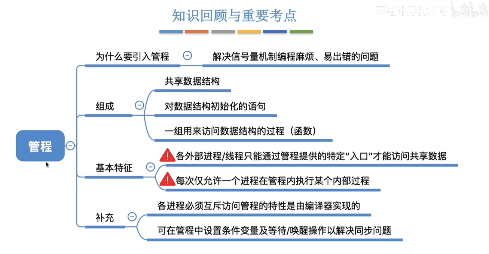

### 2.4 死锁

#### 概念

==什么是死锁==

各进程互相等待对方手里的资源，导致各进程都阻塞，无法向前推进的现象。

==进程死锁、饥饿、死循环的区别==

|      | 死锁                                                         | 饥饿                                                 | 死循环                                     |
| ---- | ------------------------------------------------------------ | ---------------------------------------------------- | ------------------------------------------ |
| 定义 | 各进程互相等待对方手里的资源，导致各进程都阻塞，无法向前推进的现象。 | 由于长期得不到想要的资源，某进程无法向前推进的现象。 | 某进程执行过程中一直跳不出某个循环的现象。 |
| 区别 | 至少两个或两个的进程同时发生死锁                             | 可能只有一个进程发生饥饿                             | 死循环是程序员的问题                       |

==死锁产生的必要条件==

1. 互斥条件：多个进程争夺资源发生死锁（资源是互斥访问的）
2. 不剥夺条件：进程获得的资源不能由其它进程强行抢夺
3. 请求和保持条件：某个进程有了资源，还在请求资源
4. 循环等待条件：存在资源的循环等待链

==什么时候会发生死锁==

1. 对系统资源的竞争
2. 进程推进顺序非法
3. 信号量的使用不当也会造成死锁

==死锁的处理策略==

1. 预防死锁
2. 避免死锁
3. 死锁的检测和解除

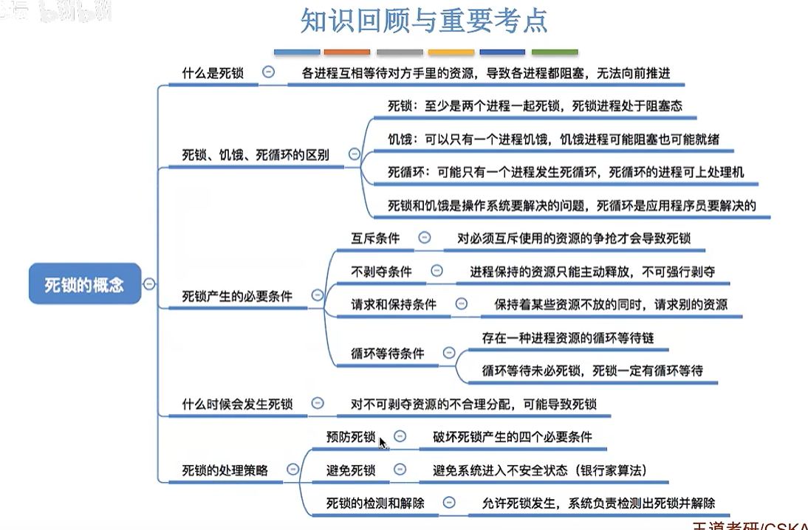

#### 死锁预防

==破坏互斥条件==

把互斥的资源改造为共享资源，不是所有资源都可以改成共享资源

如果把只能互斥使用的资源改造为允许共享使用，则系统不会进入死锁状态。比如：SPOOLing 技术。操作系统可以采用 SPOOLing 技术把独占设备在逻辑上改造成共享设备。比如，用 sPOOLing 技术将打印机改造为共享设备...

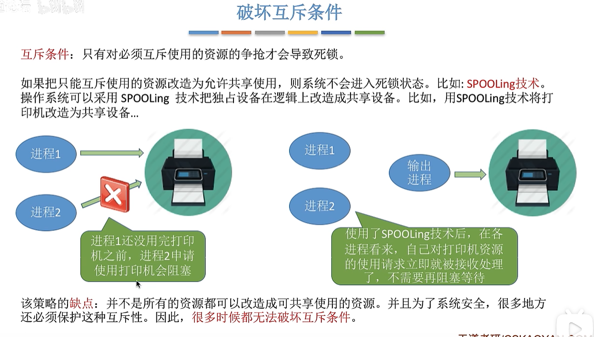

==破坏不剥夺条件==

方案 1：当请求得不到满足的时候，立即释放手里的资源

方案 2：由系统介入，强行帮助剥夺

缺点：复杂，造成之前工作失效，降低系统开销，会全部放弃、导致饥饿

==破坏请求和保持条件==

静态分配方法

即进程在运行前一次申请完它所需要的全部资源，在它的资源未满足前，不让它投入运行。一旦投入运行后，这些资源就一直归它所有，该进程就不会再请求别的任何资源了。

缺点：资源利用率极低，可能会导致某些进程饥饿

还有一个种方法，允许程序只获得运行初期所需要的资源，便可以开始运行。进程在运行过程中在逐步释放已分配给自己且自己已经使用完毕的全部资源后，才能请求新的资源

==破坏循环等待条件==

顺序资源分配法：对资源编号，进程按编号递增顺序请求资源。

原理分析：一个进程只有已占有小编号的资源时，才有资格申请更大编号的资源。按此规则，已持有大编号资源的进程不可能逆向地回来申请小编号的资源，从而就不会产生循环等待的现象。

缺点：

1. 不方便增加新的设备，因为可能需要重新分配所有的编号；
2. 进程实际使用资源的顺序可能和编号递增顺序不一致，会导致资源浪费；
3. 必须按规定次序申请资源，用户编程麻烦。

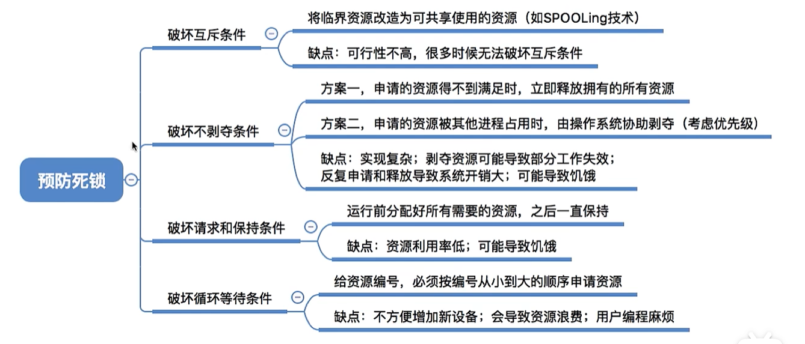

#### 死锁避免

==安全序列==

是指在操作系统中，对于一组进程和它们的资源需求，存在一个序列，使得按照这个序列分配资源，可以保证每个进程都能顺利完成。那么这个排列就是一个 `安全序列`。

>[!NOTE]
>
>安全序列并不唯一

==系统的不安全状态==

是指系统当前的状态虽然还没有发生死锁，但是存在潜在的风险，即有可能在未来某个时刻进入死锁状态，或者说找不到一个安全序列。在不安全状态下，系统中存在一个或多个进程集合，这些进程之间的资源分配和需求可能导致死锁。

==与死锁的联系==

死锁是不安全状态的一种极端表现。也就是说，所有的死锁状态都是不安全状态，但并不是所有的不安全状态都会立即导致死锁。不安全状态是死锁的前兆，如果系统长期处于不安全状态，死锁发生的概率就会增加。

>[!NOTE]
>
>安全状态一定不会发生死锁。不安全状态可能会发生死锁。

==银行家算法==

银行家算法 是一种避免死锁的算法，由 `Dijkstra` 提出。该算法通过模拟银行家发放贷款的过程来管理资源分配，确保系统始终处于安全状态。

具体步骤：

1. 初始化：系统初始化时，确定系统中的总资源数和每个进程的最大资源需求。
2. 请求：当一个进程请求资源时，系统需要检查以下条件：
   + 条件 1：当前可用资源是否满足进程的请求。
   + 条件 2：假设给进程分配资源后，系统是否仍然处于安全状态（即是否存在安全序列）。
3. 分配：如果上述两个条件都满足，则分配资源；否则，进程需要等待。

 伪代码

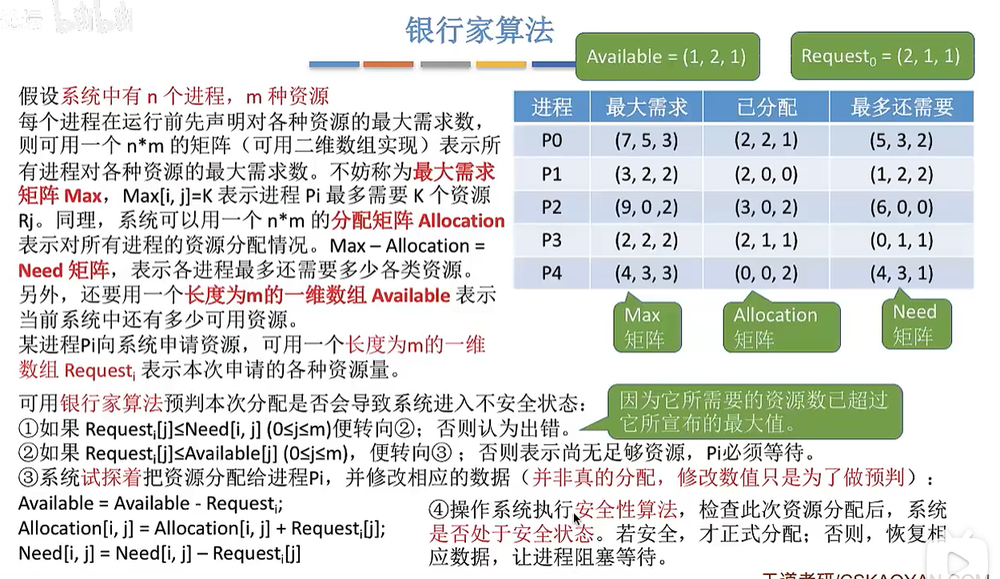

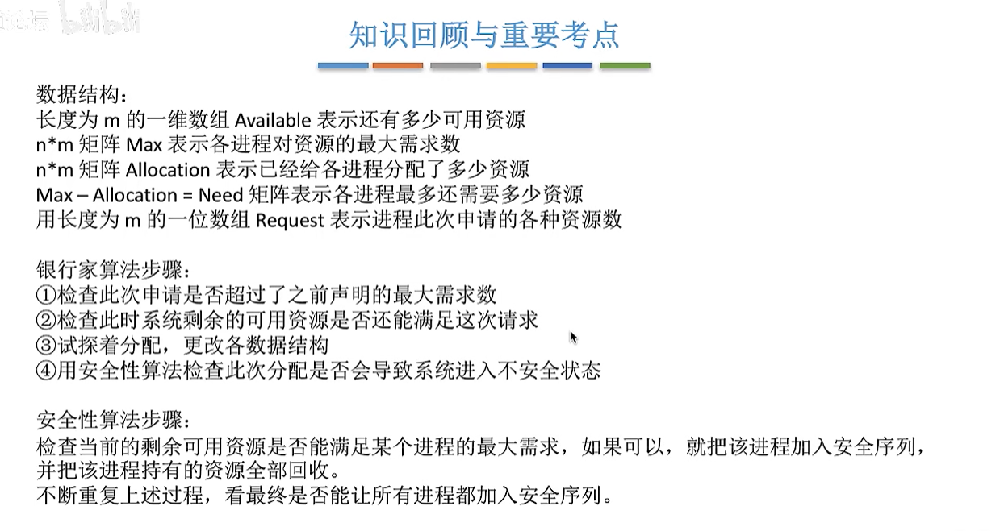

#### 死锁检测与解除

==死锁的检测==

用某种数据结构来保存资源的请求和分配信息

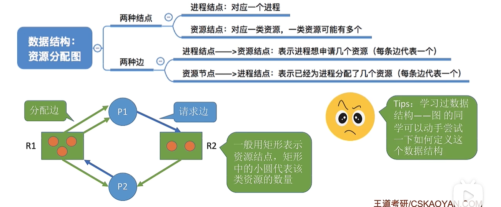

如果系统中剩余的可用资源数足够满足进程的需求，那么这个进程暂时是不会阻塞的，可以顺利地执行下去。如果这个进程执行结束了把资源归还系统，就可能使某些正在等待资源的进程被激活，并顺利地执行下去。相应的，这些被激活的进程执行完了之后又会归还一些资源，这样可能又会激活另外一些阻塞的进程。

如果按上述过程分析，最终能消除所有边，就称这个图是可完全简化的。此时一定没有发生死锁（相当于能找到一个安全序列)。

> 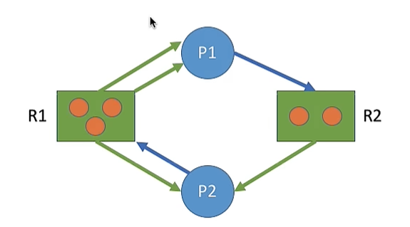
>
>上图就不会发生死锁

如果最终不能消除所有边，那么此时就是发生了死锁。最终还连着边的那些进程就是处于死锁状态的进程，

>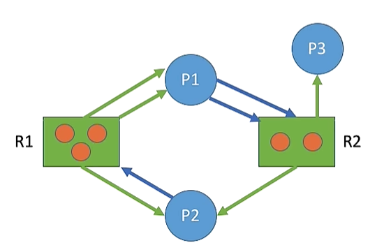
>
>上图就会发生死锁

检测死锁的算法：

在图中，找出一个既不阻塞又不是孤点的进程 p1，如果这 p1 的边可以消去，就先将他消去。在按照上述步骤，把所有的进程都变成孤点，这么这个图就是可完全简化的

==死锁的解除==

1. 资源剥夺法：挂起某些死锁进程，并抢占它的资源，将这些资源分配给其他的死锁进程。
2. 撤销进程法：强制撤销部分，甚至全部死锁进程，并剥夺这些进程的资源。代价很大，会功亏一篑（慎重考虑）
3. 进程回退法：让一个或多个死锁进程回退到足以避免死锁的地步。


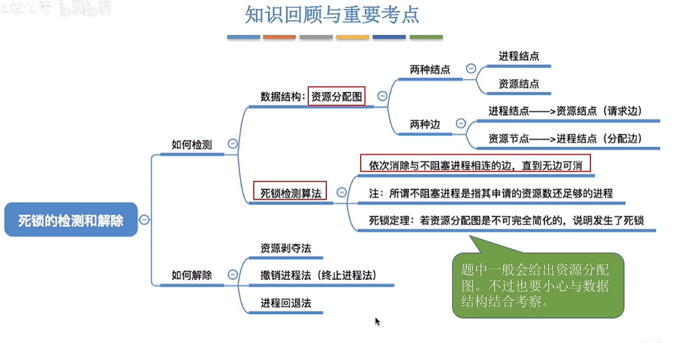
