# 计算机操作系统 3

## 第五章 IO 管理

### 5.1 IO 管理概述

#### 5.1.1 IO 设备

操作系统作为系统资源的管理者，主要负责处理机管理、存储器管理、文件管理、设备管理等功能，其目标是实现安全与高效。其中，设备管理针对的就是 I/O 设备，是操作系统管理的重要资源之一。

二、什么是 I/O 设备

- 定义：“I/O” 即 “输入 / 输出”（Input/Output），I/O 设备是能将数据输入到计算机，或接收计算机输出数据的外部硬件部件。
  - 举例：鼠标、键盘是典型的 **输入设备**；显示器是 **输出设备**；移动硬盘则是既可输入又可输出的设备。
- UNIX 系统的特殊处理：UNIX 系统将外部设备抽象为一种 “特殊文件”，用户可通过与文件操作相同的方式（如 `Write` 操作向设备输出数据、`Read` 操作从设备输入数据）对其进行操作。

三、I/O 设备的分类

根据不同标准，I/O 设备可分为以下几类：

1、按使用特性分类

- 人机交互类外设：用于人机交互，如鼠标、键盘、打印机等，数据传输速度慢。
- 存储设备：用于数据存储，如移动硬盘、光盘等，数据传输速度快。
- 网络通信设备：用于网络通信，如调制解调器等，数据传输速度介于前两者之间。

2、按传输速率分类

- 低速设备：如鼠标、键盘等，传输速率为每秒几个到几百字节。
- 中速设备：如激光打印机等，传输速率为每秒数千至上万个字节。
- 高速设备：如磁盘等，传输速率为每秒数千字节至千兆字节。

3、按信息交换的单位分类

- 块设备：以 “块” 为数据传输基本单位（如磁盘），特点是传输速率高、可寻址（可随机读写任意块）。
- 字符设备：以 “字符” 为数据传输基本单位（如鼠标、键盘），特点是传输速率慢、不可寻址，输入 / 输出时通常采用中断驱动方式。

总结

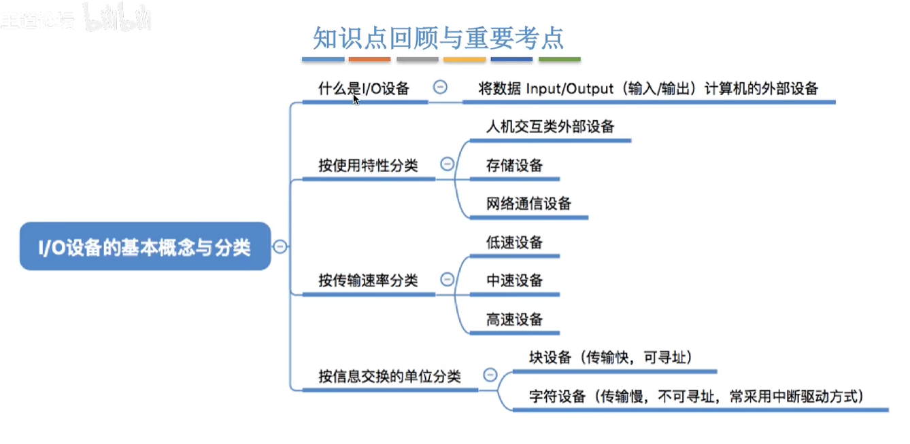

#### 5.1.2 IO 控制器

由于 CPU 无法直接操控 I/O 设备的机械部件，I/O 控制器的核心功能是充当 CPU 与机械部件之间的桥梁：CPU 通过控制 I/O 控制器，间接实现对机械部件的操作（如读写命令的执行）。

一、IO 控制器的四大功能

1、接受和识别 CPU 发出的命令
控制器中设有控制寄存器，用于存放 CPU 发来的命令（如 read/write）及参数，确保正确识别并执行命令。

2、向 CPU 报告设备的状态
控制器中设有状态寄存器，用于记录设备当前状态（如 “1” 表示空闲、“0” 表示忙碌），并将状态反馈给 CPU。

3、数据交换
控制器中设有数据寄存器，作为数据暂存区域：

- 输出时：暂存 CPU 发来的数据，再传送给设备；
- 输入时：暂存设备发来的数据，再供 CPU 取走。

4、地址识别
控制器中的寄存器需要唯一 “地址” 以区分（类似内存地址），通过 I/O 逻辑识别 CPU 提供的地址，判断要操作的寄存器。

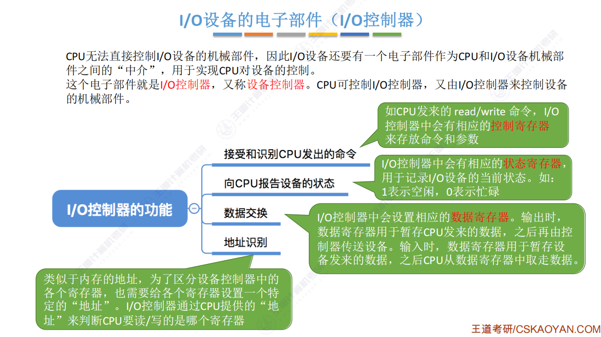

二、IO 控制器的组成

1、实现 CPU 与控制器的通信：

- 数据线：用于 CPU 与控制器之间的数据传输（输入 / 输出数据）；
- 地址线：CPU 通过地址指明要操作的寄存器；
- 控制线：CPU 通过控制线向控制器发送命令。

2、I/O 逻辑
负责接收和识别 CPU 的命令（如地址译码），并向设备的机械部件发出具体控制指令。

3、控制器与设备的接口
实现控制器与设备机械部件的通信，一个控制器可连接多个设备（对应多个接口）。

此外，控制器中包含数据寄存器、控制寄存器、状态寄存器（可能有多个，每个对应一个设备），且需通过地址区分（为后续编址方式铺垫）。

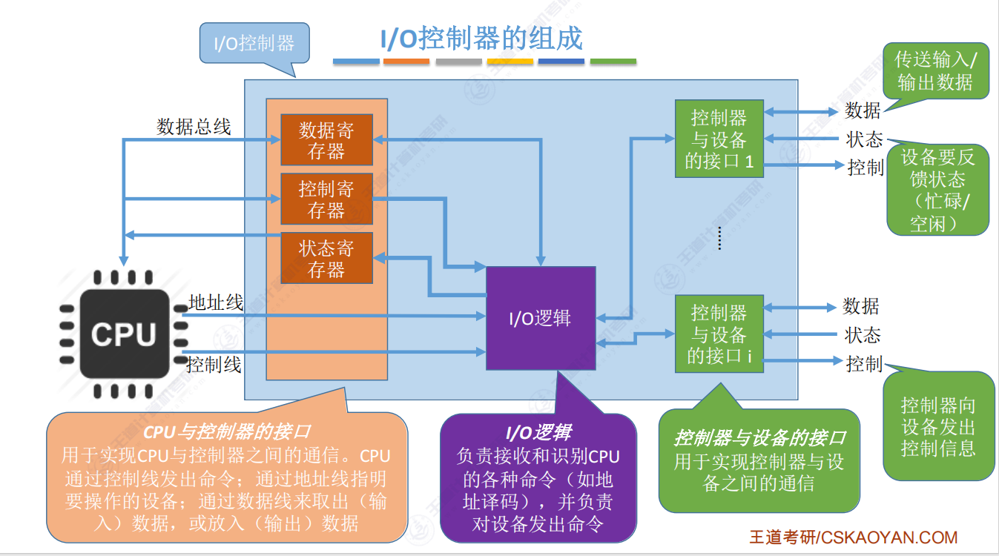

三、编址方式

I/O 控制器中的寄存器（如数据寄存器、控制寄存器、状态寄存器）需要唯一地址以便 CPU 操作。文档介绍了两种编址方式：

1. 内存映像 I/O（Memory-Mapped I/O）：
   - 寄存器地址与内存地址统一编址，占用内存空间的一部分。
   - 优点：CPU 可使用普通内存操作指令（如 `LOAD`、`STORE`）访问寄存器，简化编程。
   - 缺点：可能占用宝贵的内存地址空间。
2. 独立编址（I/O 专用地址）：
   - 寄存器使用独立的地址空间，不与内存地址重叠。
   - 优点：避免内存冲突，适合专用设备控制。
   - 缺点：需要专门的 I/O 指令（如 `IN`、`OUT`）来操作寄存器。

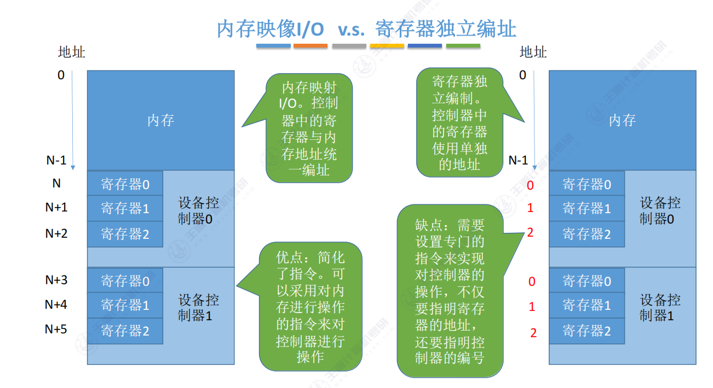

**对比总结**：

| 维度     | 内存映像 I/O           | 独立编址                       |
| :------- | :--------------------- | :----------------------------- |
| 地址空间 | 与内存统一编址         | 专用 I/O 地址空间              |
| 指令要求 | 使用内存操作指令       | 需要专用 I/O 指令              |
| 适用场景 | 简化访问，适合通用设备 | 避免冲突，适合高性能或专用设备 |

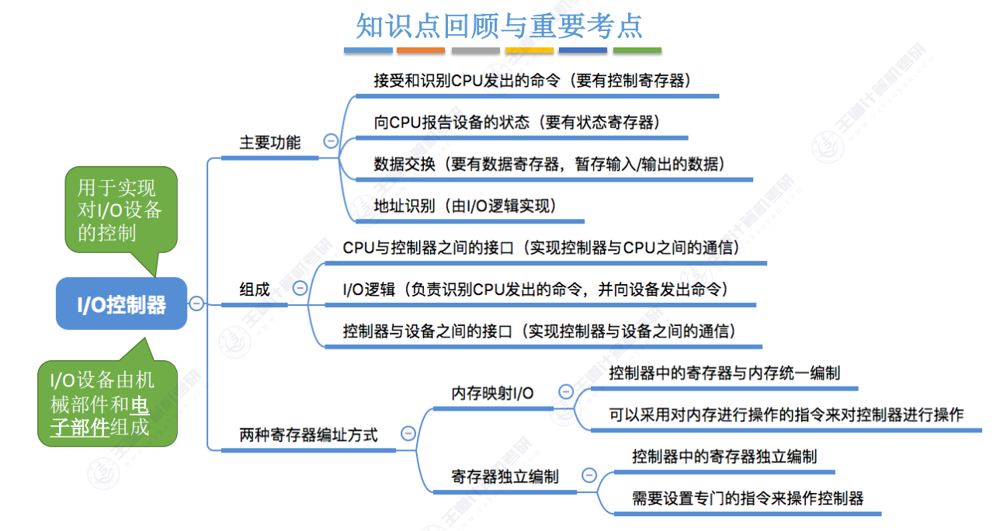

#### 5.1.3 IO 控制方式

文档里介绍了四种 I/O 控制方式，它们是一个不断进步、效率越来越高的发展过程 。

1、程序直接控制方式 (Programmed I/O)

这是最原始、最基本的方式。你可以想象你（作为 CPU）在跟一个反应很慢的朋友（I/O 设备）要东西。

工作方式：你问朋友要一个东西，然后就站在他旁边，一遍又一遍地问：“好了吗？好了吗？好了吗？” 。这种不断的检查，就叫做“轮询” 。

读取数据的流程 ：

1. CPU 向 I/O 设备的控制器发出“读”指令 。
2. CPU 不停地循环检查控制器的状态，看数据是否准备好了 。
3. 一旦设备准备好了，CPU 就一次读一个字（word）的数据到自己的临时存储空间（寄存器）里 。
4. 然后，CPU 再把这个字从自己的寄存器搬到内存里 。
5. 如果要读很多数据，这个过程就要一个字一个字地重复很多次。

CPU 的参与程度：非常高 。CPU 全程都在等待和检查，不能去做别的事情 。

数据流向：数据从 I/O 设备，必须先经过 CPU，然后再进入内存 。

优缺点：

- 优点：实现起来很简单 。
- 缺点：效率极低。CPU 大量的时间都浪费在“忙等”上了，导致 CPU 的利用率很低 。

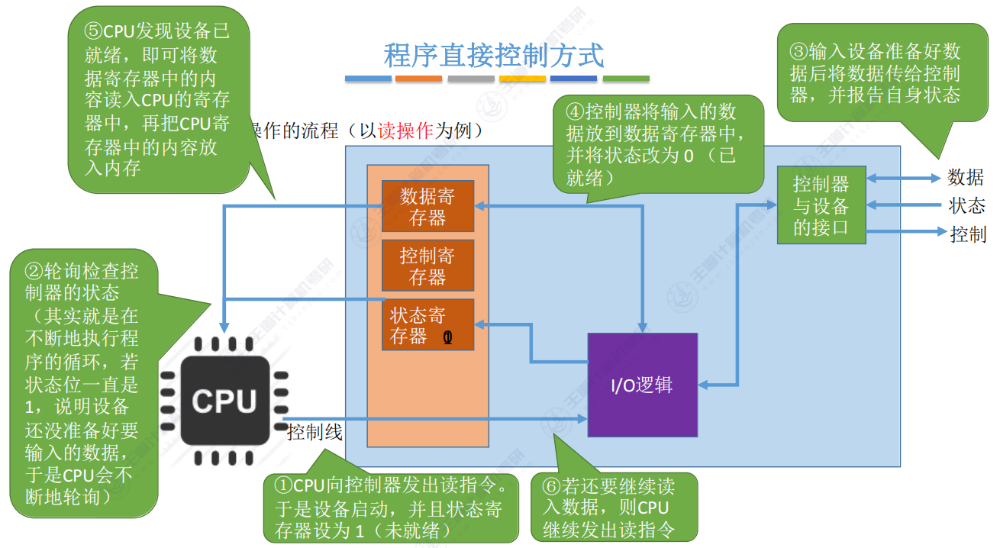

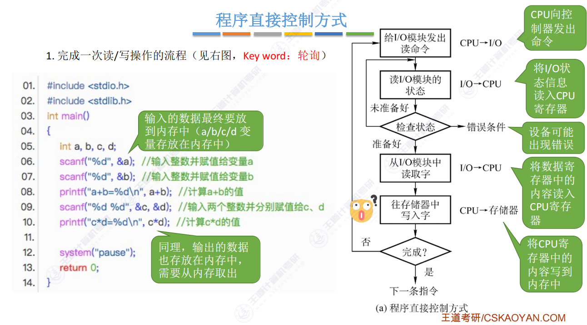

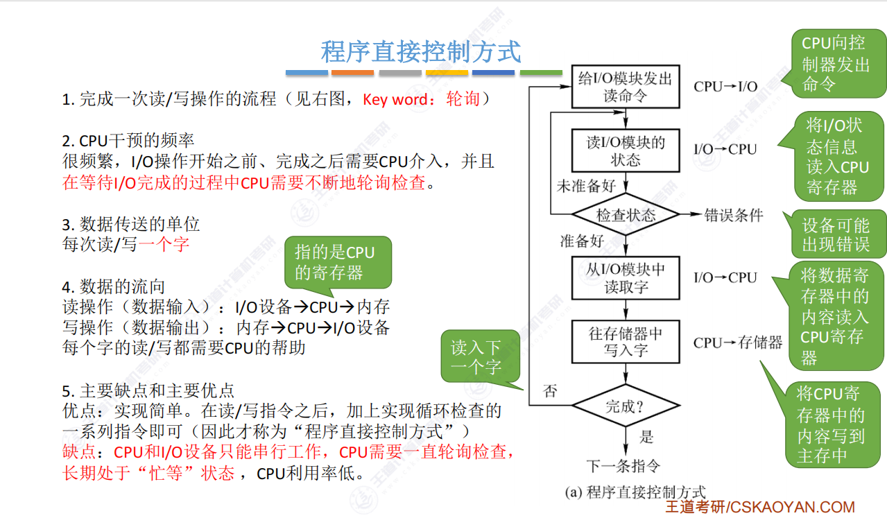

2、中断驱动方式 (Interrupt-Driven I/O)

这个方式有了很大的改进。现在，你（CPU）不再傻等那个慢朋友了，而是给了他一个“蜂鸣器”。

工作方式：你告诉朋友（I/O 设备）你需要什么，然后就转身去做别的重要工作了 。当你的朋友准备好东西后，他会按一下“蜂鸣器”（发送一个中断信号）来通知你 。

工作流程：

1. CPU 向 I/O 控制器发出指令后，就可以切换去执行其他任务了 。
2. 当 I/O 设备准备好数据后，控制器会向 CPU 发送一个中断信号 。
3. CPU 在执行完当前指令后，会检查到这个中断信号，然后保存好手头的工作，转去处理这个中断 。处理过程就是把数据从 I/O 控制器读到自己的寄存器，再写入内存 。
4. 处理完中断后，CPU 再回去接着做之前被打断的工作 。

CPU 的参与程度：只在 I/O 任务开始时和每个数据单位（字）完成时参与 。等待的过程中 CPU 可以做别的事，不再浪费时间 。

数据流向：数据流向没有变，仍然是：I/O 设备 -> CPU -> 内存 。

优缺点：

- 优点：CPU 的利用率明显提升了，因为 CPU 和 I/O 设备可以并行工作了 。
- 缺点：如果要传输大量数据，每个字都需要中断一次 CPU 。频繁地中断和处理，还是会消耗掉不少 CPU 的时间 。而且数据依然要经过 CPU 中转 。

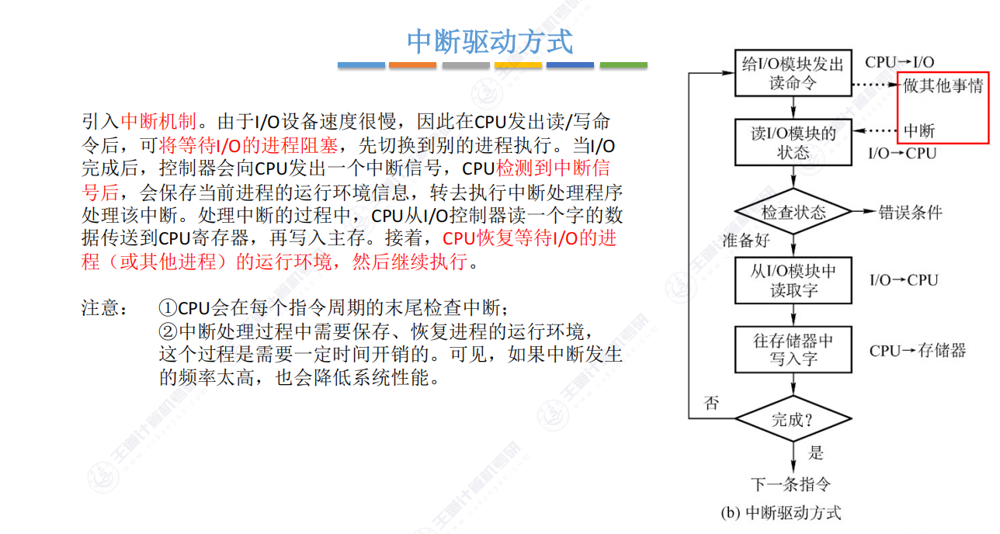

>[!note]
>
>1、CPU 会在每个指令周期的末尾检查中断;
>2、中断处理过程中需要保存、恢复进程的运行环境，这个过程是需要一定时间开销的。可见，如果中断发生的频率太高，也会降低系统性能。

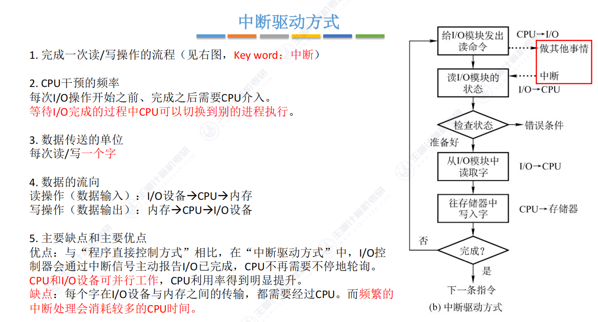

3、DMA 方式 (直接存储器存取)

这个方式让传输大块数据变得更高效。现在，你（CPU）可以把整个搬运任务，全权委托给一个“搬运工”（DMA 控制器）。

工作方式：你告诉“搬运工”（DMA 控制器），需要把一整箱货物（一个数据块）从仓库（I/O 设备）直接搬到办公室（内存） 。你把所有细节都告诉他：要搬什么、搬多少、从哪搬到哪 。然后“搬运工”会搞定一切，直到全部搬完，他才会来通知你 。

工作流程：

1. CPU 向 DMA 控制器下达指令，告诉它要进行的操作（如读操作）、要读写的数据量、数据在内存中的存放位置以及在外部设备上的地址 。
2. 之后 CPU 就可以去做别的事情了 。
3. DMA 控制器会全程负责，控制数据直接在 I/O 设备和内存之间传输，不需要 CPU 的插手
4. 当一整块数据都传输完毕后，DMA 控制器才会向 CPU 发送一次中断信号 。

CPU 的参与程度：非常低。只在传输任务的开始和结束时才需要 CPU 干预 。

数据流向：数据不再经过 CPU，而是直接在 I/O 设备和内存之间传送 。

优缺点：

- 优点：数据传输效率大大增加，CPU 的介入频率进一步降低，CPU 和 I/O 设备的并行性也得到了提升 。
- 缺点：CPU 每发一条指令，通常只能读/写一个或多个连续的数据块 。如果你想把几个不连续的数据块搬到内存里不同的区域，CPU 就需要发出多次指令，进行多次中断处理才能完成 。

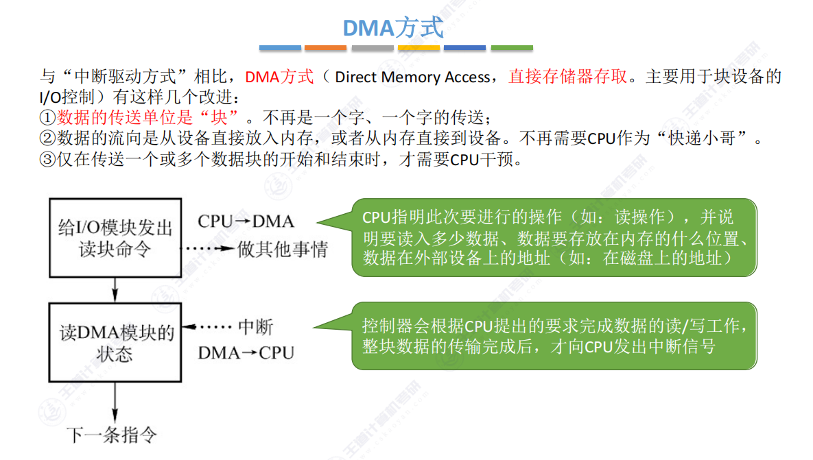

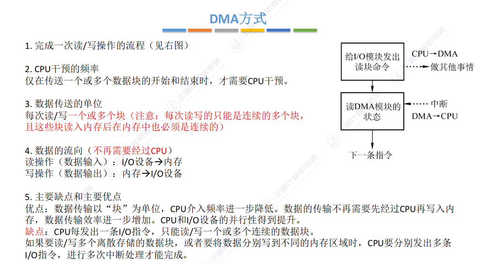

4、通道控制方式 (Channel Control)

这是最先进的方式。它相当于把你的“搬运工”（DMA）升级成了一个能力更强的“项目管家”（通道）。文档里把“通道”比作一个“弱鸡版的 CPU” ，因为它是一个能识别并执行一系列简单指令的专用硬件 。

工作方式：现在你（CPU）不用只给“管家”（通道）一个任务了，你可以直接给他一张“任务清单”（通道程序） 。这张清单上可以写着很多个不同的 I/O 任务。“管家”会自己按清单顺序完成所有任务，直到所有工作都做完了，才来向你汇报一次 。

工作流程：

1. CPU 在内存中准备好一个“任务清单”（通道程序） 。
2. CPU 告诉通道这个清单在哪，并要操作哪个 I/O 设备，然后就可以完全放手去做自己的事了 。
3. 通道会自己去读取并执行内存中的任务清单，控制 I/O 设备和内存之间进行一系列的数据块传输 。
4. 只有当通道完成了清单上所有的任务后，它才会向 CPU 发出一次中断信号 。

CPU 的参与程度：极低 。CPU 只需要启动任务和在所有任务完成后进行一次中断处理

数据流向：数据在通道的控制下，直接在 I/O 设备和内存之间流动 。

优缺点：

- 优点：效率最高。CPU、通道、I/O 设备三者可以同时并行工作，资源利用率很高 。它把 CPU 从繁杂的 I/O 事务中彻底解放了出来 。
- 缺点：实现非常复杂，需要专门的通道硬件支持，成本高 。

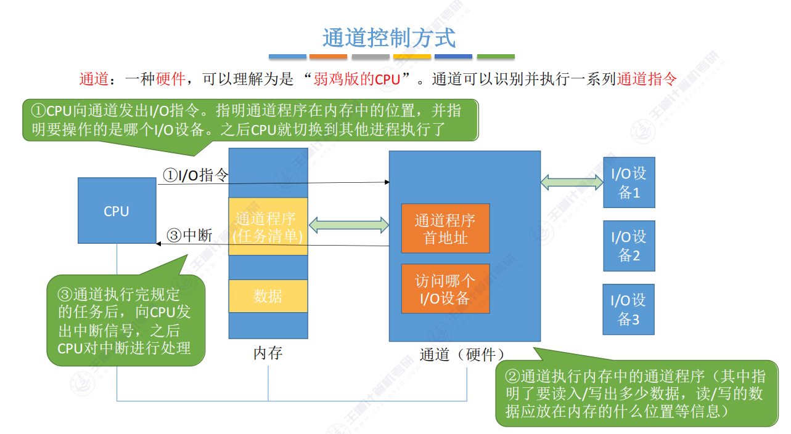

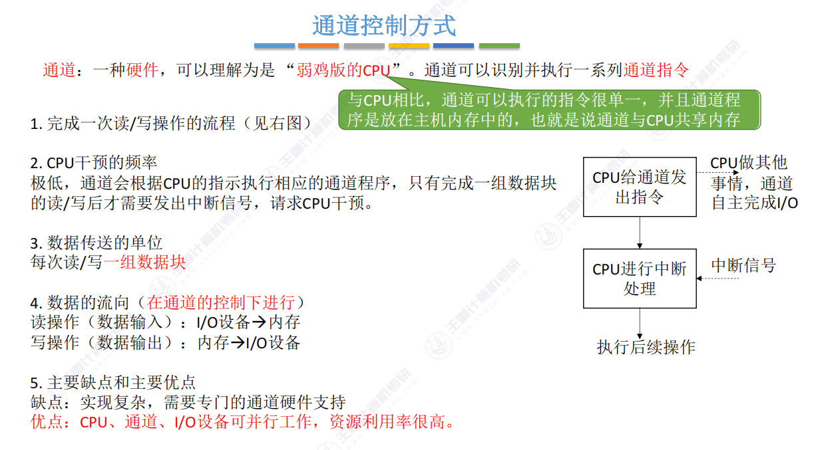

总的来说，这四种方式的发展过程，核心思想就是

想尽办法减少 CPU 对 I/O 过程的干预，把 CPU 解放出来，让它能专心去做更重要的计算和处理任务 。

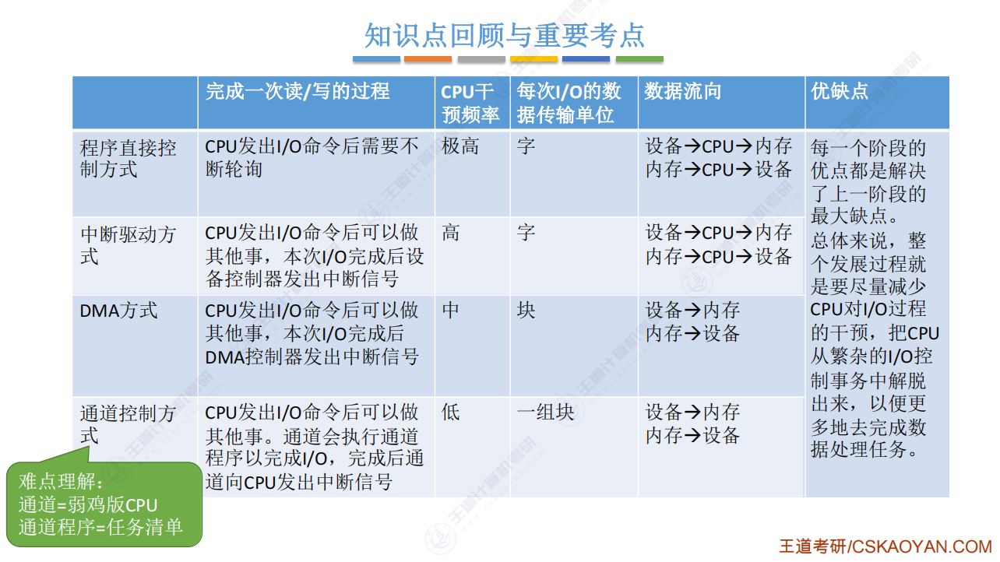

#### 5.1.4 IO 软件层次结构

一、层次结构总览

- 核心思想：上层利用下层服务，屏蔽实现细节，体现 “封装思想”
- 层次顺序（从上到下，从用户到硬件）：
  用户层软件 → 设备独立性软件 → 设备驱动程序 → 中断处理程序 → 硬件

二、各层次功能详解

1、用户层软件

定位：最接近用户，提供交互接口

核心功能：

- 提供 I/O 相关库函数（如 printf("hello, world!")），供用户直接调用；
- 将用户请求翻译为格式化 I/O 请求，通过 “系统调用” 请求内核服务（如 printf 翻译为 write 系统调用）。

补充：操作系统（如 Windows）会封装系统调用为更易用的库函数接口（如 Windows API），降低使用难度。

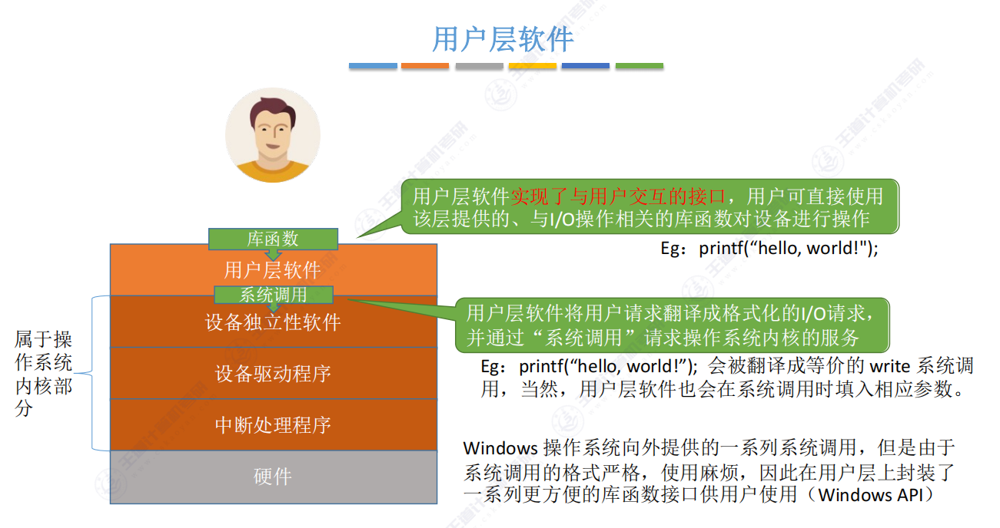

2、设备独立性软件（设备无关性软件）

定位：操作系统内核部分，与设备硬件特性无关，实现通用管理功能

核心功能：

1. 向上提供统一调用接口（如 read/write 系统调用）；
2. 设备保护：类似文件保护，限制不同用户对设备的访问权限；
3. 差错处理：处理设备的部分错误；
4. 设备的分配与回收；
5. 数据缓冲区管理：通过缓冲技术屏蔽设备间数据交换单位和速度差异；
6. 建立逻辑设备名到物理设备名的映射（通过逻辑设备表 LUT），并根据设备类型选择驱动程序。

关键：逻辑设备表（LUT）

- 结构：记录逻辑设备名、物理设备名、驱动程序入口地址（如下表）：

  | 逻辑设备名     | 物理设备名 | 驱动程序入口地址 |
  | -------------- | ---------- | ---------------- |
  | /dev/ 打印机 1 | 3          | 1024             |
  | /dev/ 打印机 2 | 5          | 2046             |

- 管理方式：

  - 单用户系统：全系统 1 张 LUT（不允许逻辑设备名重复）；
  - 多用户系统：每个用户 1 张 LUT（存于用户进程 PCB，允许逻辑设备名重复）。

3、设备驱动程序

定位：操作系统内核部分，直接与硬件交互

核心功能：

- 将上层命令（如 read/write）转化为设备可理解的操作（如设置设备寄存器、检查设备状态）；
- 由设备厂家提供（因不同设备硬件特性不同，如佳能与惠普打印机的状态寄存器定义相反）。

特点：通常以独立进程形式存在。

>[!note]
>
>不同厂商的设备都会有所不同，因此驱动程序必须要厂商自己来提供

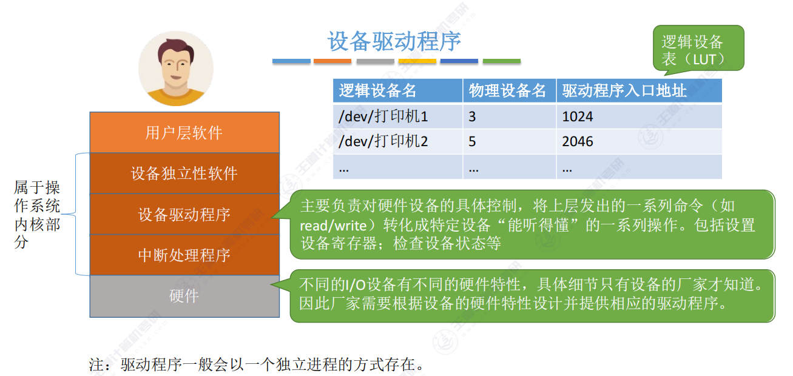

4、中断处理程序

定位：操作系统内核部分，响应 I/O 完成信号

触发场景：I/O 任务完成时，I/O 控制器发送中断信号

处理流程：

1. 从控制器读出设备状态；
2. 若 I/O 正常：从设备读数据到内存缓冲区；
3. 若异常：根据原因做相应处理；
4. 结束处理。

>[!note]
>
>中断处理程序也会和硬件直接打交道

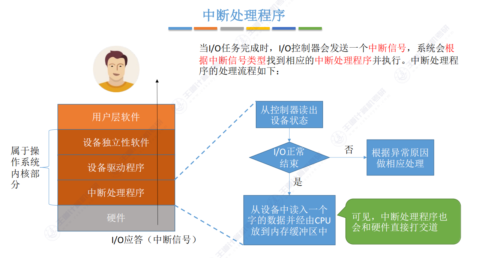

5、硬件

组成：由机械部件（如磁盘电机）和电子部件（如 I/O 控制器）组成

功能：执行具体的 I/O 操作。

三、I/O 请求流程

用户通过库函数发出 I/O 请求 → 用户层软件通过系统调用请求设备独立性软件 → 设备独立性软件通过 LUT 调用对应驱动程序 → 驱动程序向 I/O 控制器发具体命令 → I/O 完成后，中断处理程序响应处理。

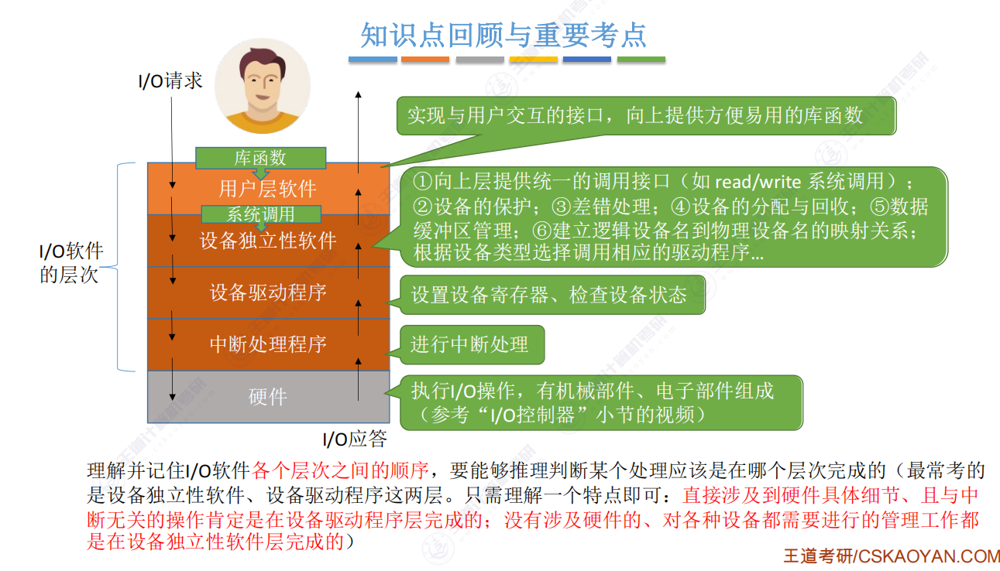

#### 5.1.5 IO 应用程序 IO 接口

操作系统需要管理各种各样的设备（键盘、鼠标、磁盘、网卡等），但它们的工作方式完全不同。为了让应用程序能方便地使用这些设备，操作系统提供了：

1. 应用程序接口（API）：给程序员用的“操作手册”
2. 驱动程序接口：给硬件厂商用的“标准插座”

一、输入/输出应用程序接口

1、字符设备接口

特点：不可“寻址”，每次读 1 个字符（如键盘、打印机）。

系统调用：get/put（向字符设备读写一个字符）。

2、块设备接口

特点：可“寻址”，每次读/写 1 个块（如磁盘）。

>[!note]
>
>这里的“可寻址”指的是可以进行随机读取

系统调用：

- read/write：从块设备的读写指针位置读写多个字符；
- seek：修改读写指针位置。

3、网络设备接口（网络套接字 socket 接口）

适用设备：网络控制器（网卡），需解决“数据该给谁”的问题。

核心系统调用：

- socket：创建网络套接字，需指明网络协议（如 TCP、UDP）；
- bind：将套接字绑定到本地“端口”；
- connect：将套接字连接到远程地址；
- read/write：从套接字读/写数据。

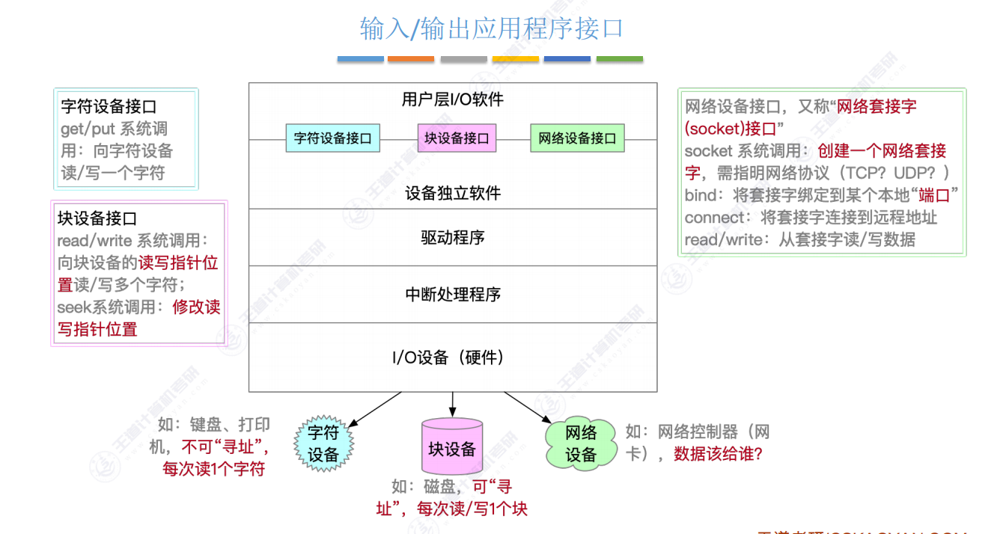

网络设备接口（Socket）的工作过程（通俗版）

想象两个电脑（主机 1 和主机 2）要通过网络通信：

1. 建立连接：
   - 主机 1 上的程序 P1 调用 `socket()` 创建一个“插座”
   - 调用 `connect()` 连接到主机 2 的某个端口（比如 6666）
2. 发送数据：
   - P1 调用 `write()` 发送数据
   - 数据经过操作系统层层处理，最终由网卡发出
3. 接收数据：
   - 主机 2 的网卡收到数据，发出中断
   - 中断处理程序唤醒等待数据的程序 P3
   - P3 调用 `read()` 读取数据

> 就像寄快递：写地址、打包、发出；对方收到、拆包、读信。

二、阻塞/非阻塞 I/O

1、阻塞 I/O

定义：应用程序发出 I/O 系统调用后，进程转为阻塞态等待。

特点：程序会停下来等，直到拿到数据才继续

示例：字符设备接口中，从键盘读字符（get）。

2、非阻塞 I/O

定义：应用程序发出 I/O 系统调用后，系统调用迅速返回，进程无需阻塞等待。

特点：程序发出命令后就继续执行，不用等完成

示例：块设备接口中，往磁盘写数据（write）。

三、设备驱动程序接口

1、核心问题

若各厂商设备驱动程序接口不统一，操作系统难以调用设备驱动程序。

2、解决方案

操作系统规定统一的设备驱动程序接口标准，各厂商需按标准开发驱动程序，确保兼容性。

3、特点

不同操作系统接口标准不同，厂商需针对不同系统开发对应驱动（如 macOS、Windows 不同版本的驱动）。

### 5.2 设备独立软件

#### 5.2.1 SPOOLing 技术

假脱机技术概述

- 定义：假脱机技术（又称 SPOOLing 技术）是一种软件模拟的脱机技术，用于解决 I/O 设备与 CPU 的速度矛盾。
- 目的：通过虚拟化设备，实现预输入和缓输出，提高系统效率。
- 背景：源自批处理阶段，针对人机速度矛盾（主机速度快，设备速度慢）。

脱机技术背景

- 问题：在手工操作阶段，主机直接从 I/O 设备获取数据，导致 CPU 大量时间等待慢速设备（如打印机或输入设备）。
- 解决方式：引入脱机输入/输出技术：
  - 使用磁带作为中介：数据先输入到磁带，主机从磁带读取；输出时数据先到磁带，再从磁带输出到设备。
  - 优点：缓解 CPU 与 I/O 设备的速度矛盾，允许 CPU 忙碌时进行数据输入/输出。
  - 名称由来：“脱机”指脱离主机控制进行输入/输出操作（如使用外围控制机）。

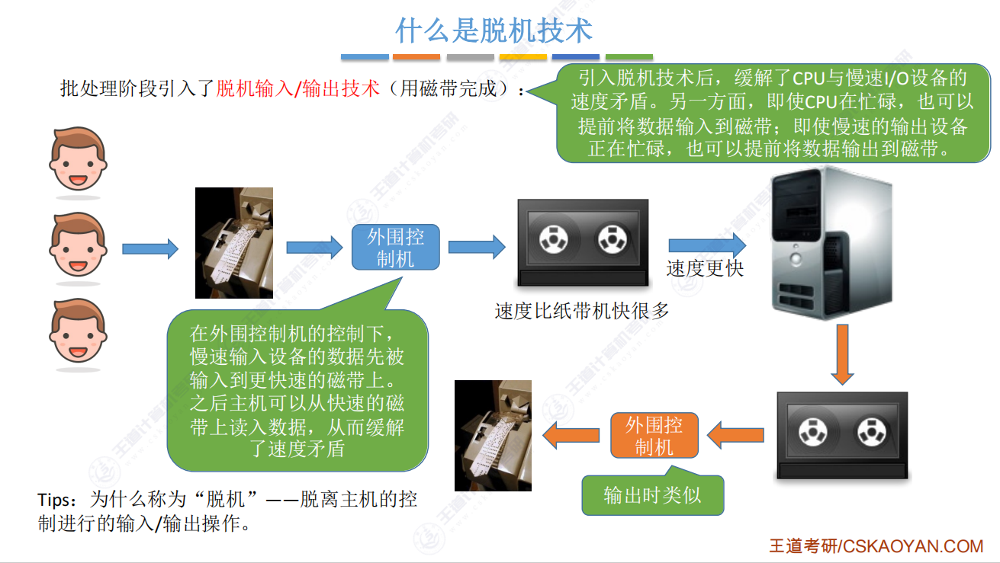

假脱机技术实现原理

SPOOLing 系统用软件模拟脱机技术，核心组件包括：

- 输入井和输出井：
  - 输入井：模拟脱机输入的磁带，用于暂存从输入设备传入的数据。
  - 输出井：模拟脱机输出的磁带，用于暂存待输出到设备的数据。
- 输入进程和输出进程：
  - 输入进程：控制数据从输入设备到输入井的传输（模拟外围控制机）。
  - 输出进程：控制数据从输出井到输出设备的传输（模拟外围控制机）。
- 输入缓冲区和输出缓冲区：
  - 输入缓冲区：内存中的暂存区，用于临时存放从输入设备读取的数据，再转存到输入井。
  - 输出缓冲区：内存中的暂存区，用于临时存放从输出井读取的数据，再传送到输出设备。

共享打印机原理分析

- 设备分类：
  - 独占式设备：只能串行使用，一次满足一个进程请求（如打印机）。
  - 共享设备：允许多个进程“同时”使用（宏观上并行，微观上交替）。
- SPOOLing 技术应用：将独占式打印机虚拟化为共享设备：
  - 当进程请求打印时：
    - 输出进程在磁盘输出井中申请空闲缓冲区，存储打印数据。
    - 为用户进程创建打印请求表，填入数据位置信息，并挂到假脱机文件队列。
  - 打印机空闲时：
    - 输出进程从队列取出打印请求表，将数据从输出井传输到输出缓冲区。
    - 数据再从输出缓冲区输出到打印机。
- 虚拟化效果：
  - 每个进程都感觉自己在独占打印机（输出井分配逻辑存储区）。
  - 将物理打印机虚拟为多台逻辑设备，实现共享。

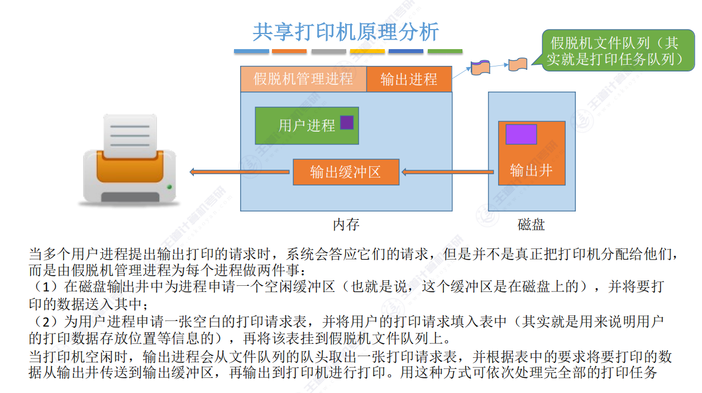

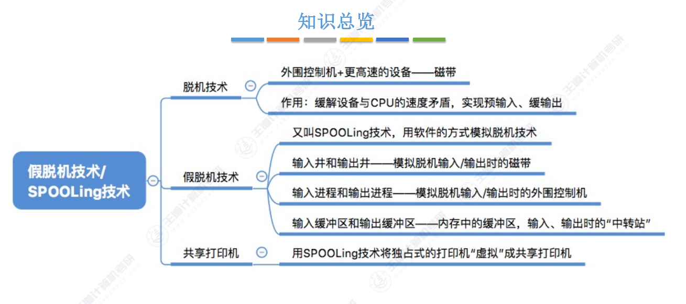

#### 5.2.2 设备的分配与回收

设备分配时应考虑的因素

1. 设备的固有属性：
   - 设备类型（如独占式设备、共享设备）
   - 物理特性（速度、连接方式等）
2. 设备分配算法：
   - 先来先服务（FCFS）
   - 优先级高者优先
   - 短任务优先
   - 其他调度策略
3. 设备分配中的安全性：
   - 安全分配方式：
     - 操作：分配设备后立即阻塞进程，I/O 完成才唤醒
     - 特点：进程一次只能使用一个设备，CPU 与 I/O 串行工作
     - 优点：避免死锁（破坏 "请求和保持" 条件）
     - 缺点：效率较低（如打印机分配场景）
   - 不安全分配方式：
     - 操作：分配设备后进程继续执行，可发起新 I/O 请求
     - 特点：进程可同时使用多个设备
     - 优点：CPU 与 I/O 并行，效率高
     - 缺点：可能死锁（需配合死锁避免/检测机制）

静态分配与动态分配

| 类型   | 操作方式              | 特点                   | 死锁风险 |
| ---- | ----------------- | -------------------- | ---- |
| 静态分配 | 进程运行前分配全部资源，结束后归还 | 资源利用率低；破坏 "请求和保持" 条件 | 无死锁  |
| 动态分配 | 进程运行中动态申请资源       | 灵活性高；需处理并发冲突         | 可能死锁 |

设备分配管理中的数据结构

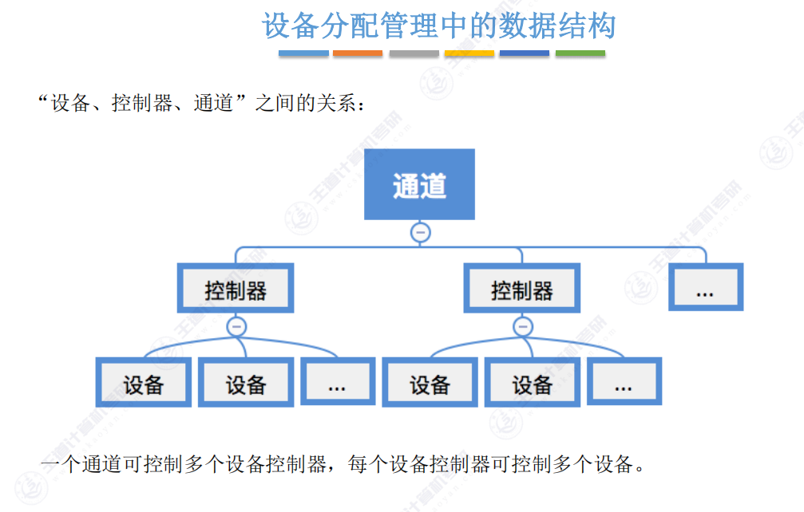

设备控制表（DCT）：

- 系统为每个设备配置一张 DCT，用于记录设备的详细情况，是设备管理的核心表。
- 关键字段：设备类型、标识符、状态、等待队列指针

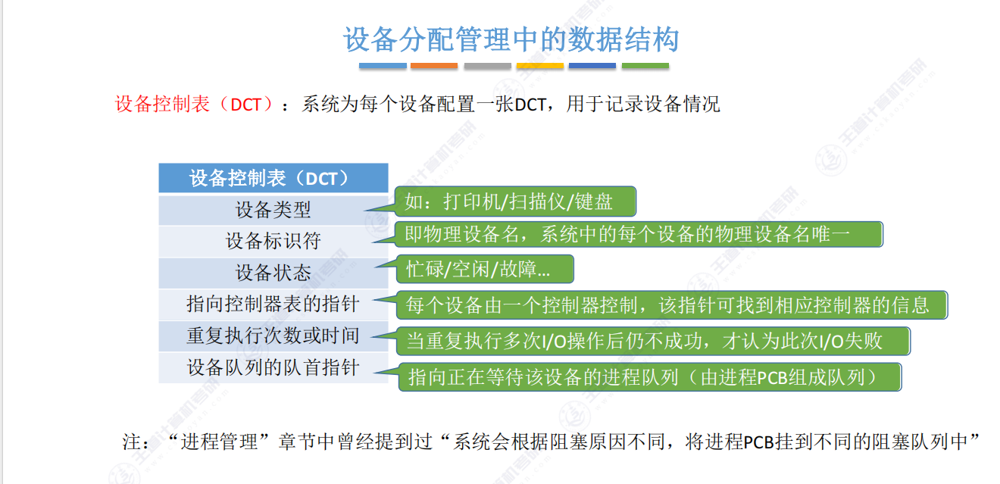

控制器控制表（COCT）：

- 每个设备控制器对应一张 COCT，操作系统通过 COCT 对控制器进行操作和管理。
- 关键字段：控制器状态、关联通道指针、等待队列指针

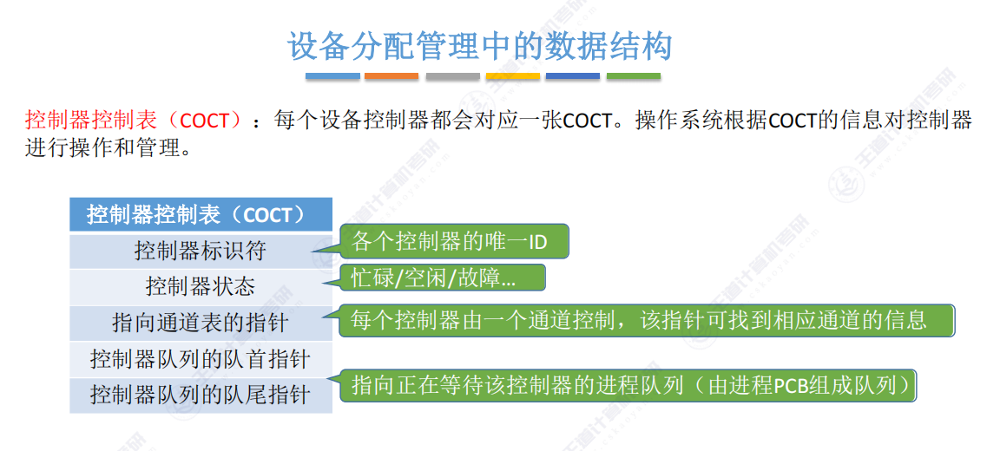

通道控制表（CHCT）：

- 每个通道对应一张 CHCT，操作系统通过 CHCT 对通道进行操作和管理。
- 关键字段：通道状态、等待队列指针

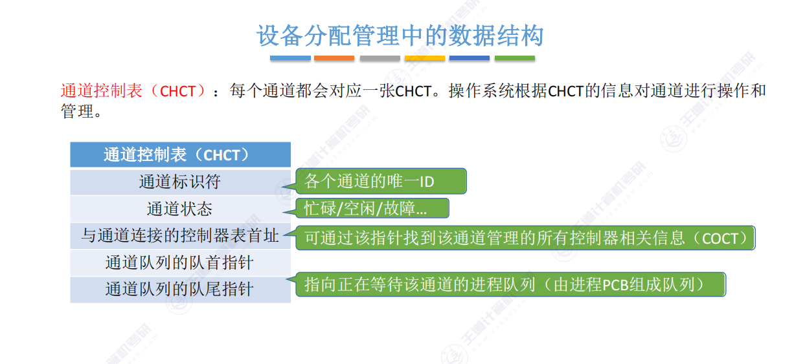

系统设备表（SDT）：

- 记录系统中全部设备的概况，每个设备对应 SDT 中的一个表目。
- 关键字段：设备类型、标识符、DCT 指针、驱动程序入口

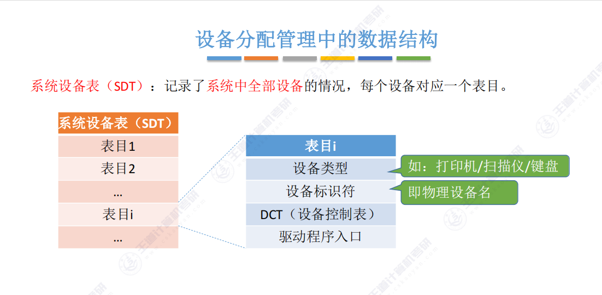

设备分配的原始步骤

设备分配需依次完成设备、控制器、通道的分配，三者均分配成功才算分配完成，具体步骤如下：

1. 根据进程请求的物理设备名查找系统设备表（SDT）：物理设备名是进程申请设备时必须提供的参数，通过该参数定位 SDT 中对应的设备表目。
2. 根据 SDT 找到对应的设备控制表（DCT）：
   - 若 DCT 中显示设备状态为 “忙碌”，则将进程 PCB 挂到该设备的等待队列中，进程进入阻塞状态。
   - 若设备状态为 “空闲”，则将设备分配给该进程，并更新设备状态为 “忙碌”。
3. 根据 DCT 中的 “指向控制器表的指针” 找到对应的控制器控制表（COCT）：
   - 若 COCT 中显示控制器状态为 “忙碌”，则将进程 PCB 挂到该控制器的等待队列中。
   - 若控制器状态为“空闲”，则将控制器分配给该进程，并更新控制器状态为 “忙碌”。
4. 根据 COCT 中的 “指向通道表的指针” 找到对应的通道控制表（CHCT）：
   - 若 CHCT 中显示通道状态为 “忙碌”，则将进程 PCB 挂到该通道的等待队列中。
   - 若通道状态为 “空闲”，则将通道分配给该进程，并更新通道状态为 “忙碌”。

>[!note]
>
>仅当设备、控制器、通道三者均分配成功后，才能启动 I/O 设备进行数据传送。
>
>通道是用来进行数据传输送的，在内存和 IO 设备之间。

缺点：

1. 用户编程时必须使用“物理设备名”，底层细节对用户不透明，不方便编程
2. 若换了一个物理设备，则程序无法运行
3. 若进程请求的物理设备正在忙碌，则即使系统中还有同类型的设备，进程也必须阻塞等待

设备分配步骤的改进

1. 核心改进：引入逻辑设备名（LUT 机制）

   - 用户提供逻辑设备名（即设备类型）
   - 操作系统自动映射到物理设备

2. 改进后步骤：

   - 根据逻辑设备名查找 SDT，分配同类型空闲设备
   - 在逻辑设备表（LUT）中新增映射条目
   - 后续步骤同原始方法（分配控制器和通道）

3. LUT 映射机制：

   - 功能：建立逻辑设备名 → 物理设备名 → 驱动程序的映射

   - 示例：

     | 逻辑设备名   | 物理设备名 | 驱动程序入口 |
     | ------------ | ---------- | ------------ |
     | /dev/printer | 3          | 1024         |
     | /dev/tty     | 5          | 2046         |

   - LUT 设置方式：

     - 全局单 LUT：逻辑设备名需唯一（适用单用户系统）
     - 每用户独立 LUT：逻辑设备名可重复（适用多用户系统）

#### 5.2.3 缓冲区管理

一、缓冲区的概念

定义：

- 缓冲区是用于临时存储数据的区域，可由硬件寄存器或内存实现
- 内存缓冲区是操作系统管理的重点（成本低、容量大）

核心作用：

- 缓解 CPU 与 I/O 设备的速度矛盾
- 减少 CPU 中断频率（尤其字符设备）
- 解决数据粒度不匹配（如进程输出块数据 vs 设备逐字符输出）
- 提升 CPU 与 I/O 设备的并行性

二、单缓冲机制：

单缓冲是指操作系统在主存中为用户进程分配一个缓冲区（默认大小为 “一个数据块”），同时用户进程的内存空间会划分出一块 “工作区”（默认大小与缓冲区相同，用于接收 / 输出数据）。

核心规则

- 缓冲区数据非空时：不能向缓冲区写入新数据，只能从缓冲区读取数据到工作区。
- 缓冲区为空时：可向缓冲区写入数据，但必须填满缓冲区后，才能读取数据到工作区。

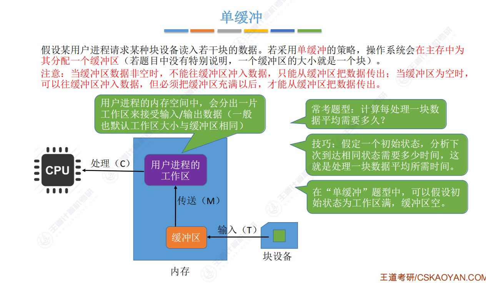

计算处理一块数据的平均时间

- 分析技巧：假设初始状态，追踪 “回到该初始状态” 所需的时间，即为处理一块数据的平均耗时。
- 初始状态：工作区满（已存放待处理数据），缓冲区空（未存放新数据）。
- 符号定义：T（I/O 设备将一块数据写入缓冲区的时间）、C（CPU 在工作区处理一块数据的时间）、M（缓冲区与工作区之间传送一块数据的时间）。

单缓冲策略下，处理一块数据的平均耗时 = Max (C, T) + M（取 CPU 处理时间与 I/O 输入时间的最大值，再加上缓冲区与工作区的传送时间）。

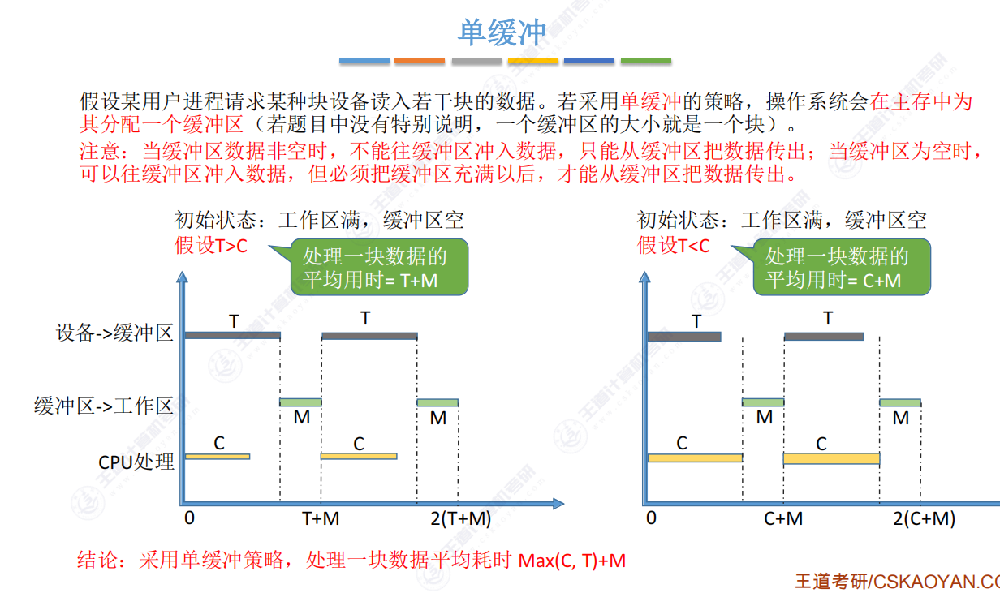

三、双缓冲区

双缓冲是指操作系统在主存中为用户进程分配两个缓冲区（默认每个缓冲区大小为一个数据块），通过两个缓冲区交替使用，进一步提升 CPU 与 I/O 设备的并行性。

两个缓冲区交替承担 “接收 I/O 数据” 和 “向工作区传送数据” 的角色，避免单缓冲中 “等待 I/O 或等待 CPU” 的矛盾。

双缓冲策略下，处理一块数据的平均耗时 = Max (T, C + M)（取 I/O 输入时间与 “CPU 处理 + 数据传送” 总时间的最大值）。

优势：设备输入与 CPU 处理可并行

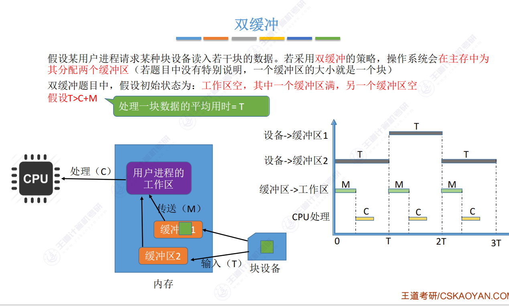

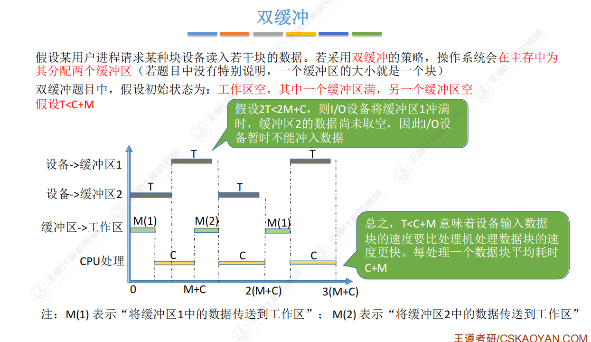

两台机器之间通过缓冲区进行数据通信时，单缓冲与双缓冲的传输能力存在显著差异

单缓冲区：只能实现一个人收一个人发，单向数据传输，半双工通信

双缓冲区：能实现即收又发，双向数据传输，全双工通信

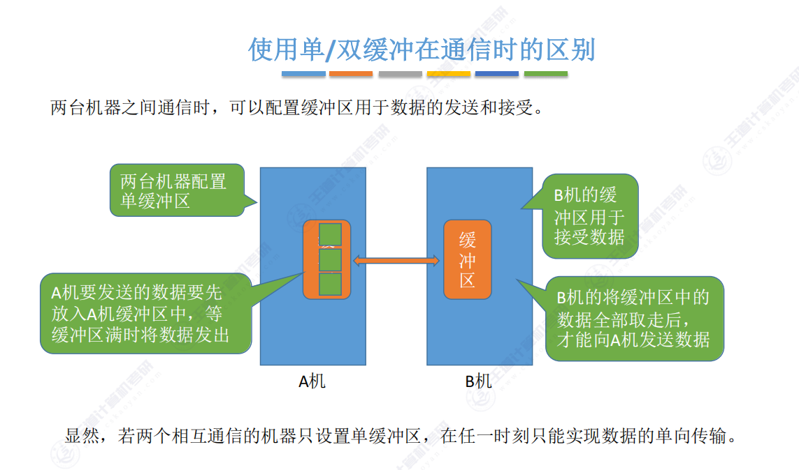

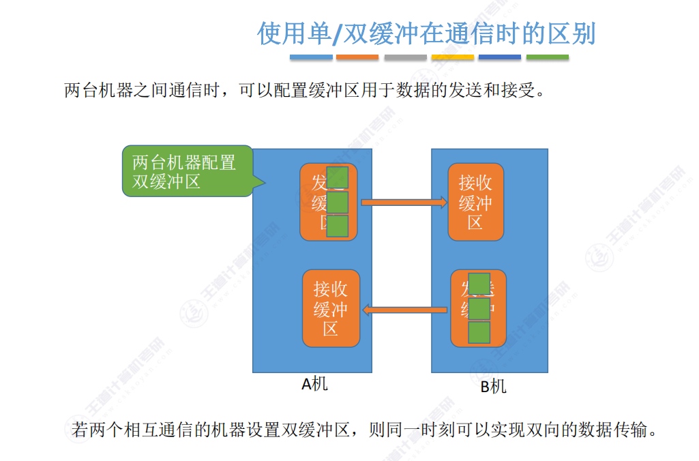

四、循环缓冲

结构设计：

- 多个大小相等缓冲区构成循环队列
- 指针管理：
  - in 指针：指向首个空缓冲区
  - out 指针：指向首个满缓冲区

状态标识：

- 橙色：已填充数据的缓冲区
- 绿色：空缓冲区

优势：避免缓冲区浪费，适应持续数据流

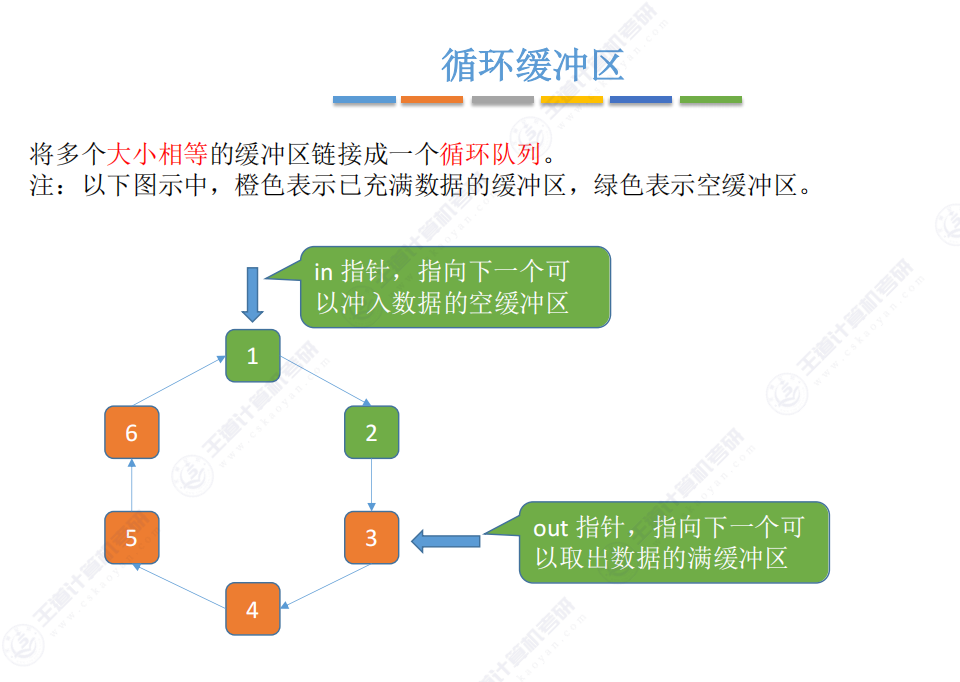

五、缓冲池

缓冲池是系统级的共享缓冲区集合，由多个缓冲区组成，供所有进程共用，是操作系统中最常用的缓冲区管理方式，能大幅提高缓冲区的利用率。

缓冲池的组成

（1）按使用状况划分的三个队列

- 空缓冲队列：存放所有未使用的空缓冲区，是缓冲池的 “资源池”。
- 输入队列：存放装满 “输入数据” 的缓冲区（由 I/O 设备写入数据后形成）。
- 输出队列：存放装满 “输出数据” 的缓冲区（由 CPU 写入数据后形成）。

（2）按功能划分的四种工作缓冲区

缓冲池中的缓冲区可根据实际需求，动态扮演以下四种角色（同一缓冲区在不同阶段可切换角色）：

- hin（收容输入数据的工作缓冲区）：用于接收 I/O 设备输入的数据。
- sin（提取输入数据的工作缓冲区）：用于向 CPU（或用户进程）提供输入数据。
- hout（收容输出数据的工作缓冲区）：用于接收 CPU（或用户进程）输出的数据。
- sout（提取输出数据的工作缓冲区）：用于向 I/O 设备提供输出数据。

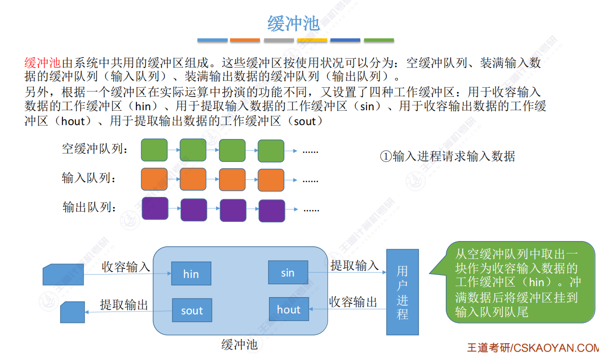

缓冲池的工作流程

缓冲池通过 “队列操作 + 角色切换” 实现数据的输入与输出，核心流程分为四步：

步骤 1：输入进程请求输入数据（I/O→ 缓冲池）

- 输入进程从 “空缓冲队列” 中取出一个空缓冲区，将其标记为 hin（收容输入缓冲区）。
- I/O 设备将数据写入 hin，填满后将 hin 从空缓冲队列移除，挂到 “输入队列” 的队尾。

步骤 2：计算进程（或用户进程）获取输入数据（缓冲池 →CPU）

- 计算进程从 “输入队列” 中取出一个装满数据的缓冲区，将其标记为 sin（提取输入缓冲区）。
- CPU 从 sin 中读取数据，读取完成后（sin 变为空），将 sin 挂回 “空缓冲队列” 的队尾。

步骤 3：计算进程输出数据（CPU→ 缓冲池）

- 计算进程从 “空缓冲队列” 中取出一个空缓冲区，将其标记为 hout（收容输出缓冲区）。
- CPU 将输出数据写入 hout，填满后将 hout 从空缓冲队列移除，挂到 “输出队列” 的队尾。

步骤 4：输出进程请求输出数据（缓冲池 →I/O）

- 输出进程从 “输出队列” 中取出一个装满数据的缓冲区，将其标记为 sout（提取输出缓冲区）。
- I/O 设备从 sout 中读取数据，读取完成后（sout 变为空），将 sout 挂回 “空缓冲队列” 的队尾。

优势

- 共享性：所有进程共用缓冲池，避免单个进程独占缓冲区导致的资源浪费，提高缓冲区利用率。
- 灵活性：缓冲区可动态切换工作角色（hin/sin/hout/sout），适应输入、输出等不同场景。
- 高效性：通过队列管理缓冲区，减少缓冲区的分配与释放开销，同时实现 CPU 与 I/O 设备的并行工作。

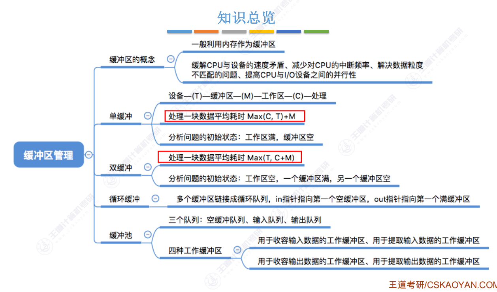

### 5.3 磁盘

#### 5.3.1 磁盘的结构

一、磁盘的基本结构

1. 物理组成
   - 磁盘由多个涂有磁性物质的圆形盘片叠加而成，每个盘片有两个盘面（上下两面）。
   - 所有盘面中，相对位置相同的磁道组成柱面（例如：第 1 盘面的第 1 磁道与第 2 盘面的第 1 磁道构成同一柱面）。
2. 磁道与扇区
   - 磁道：每个盘面被划分为多个同心圆环，称为磁道（类似树的年轮）。
   - 扇区：每个磁道被等分为若干扇区（最小存储单位，通常 512B 或 4KB），数据以扇区为单位读写。

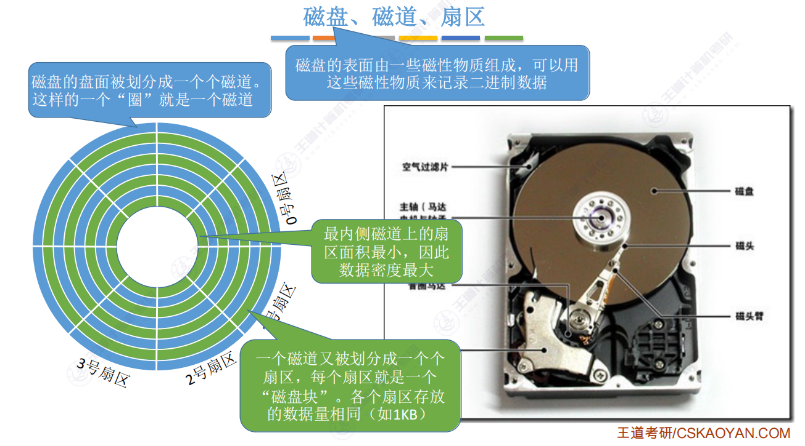

>[!note]
>
>由于各个扇区存放的数据量是相同的，因此越靠近内部的磁道上的扇区其数据密度越大

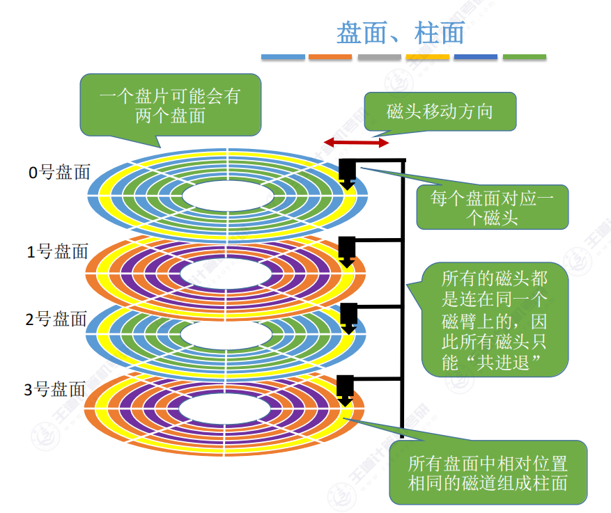

二、磁盘读写数据的过程

1. 寻址三步骤

   - 步骤 1：移动磁头

     根据目标扇区所在的柱面号，移动磁臂使磁头对准指定柱面。

   - 步骤 2：激活盘面

     选择目标扇区所在盘面对应的磁头（如柱面号 C、盘面号 P）。

   - 步骤 3：等待旋转

     磁盘旋转，使目标扇区从磁头下划过，完成读/写操作。

2. 物理地址格式

   - 唯一标识一个扇区的地址为 （柱面号，盘面号，扇区号），用于文件系统中数据块的定位。（盘面号也是磁头号）

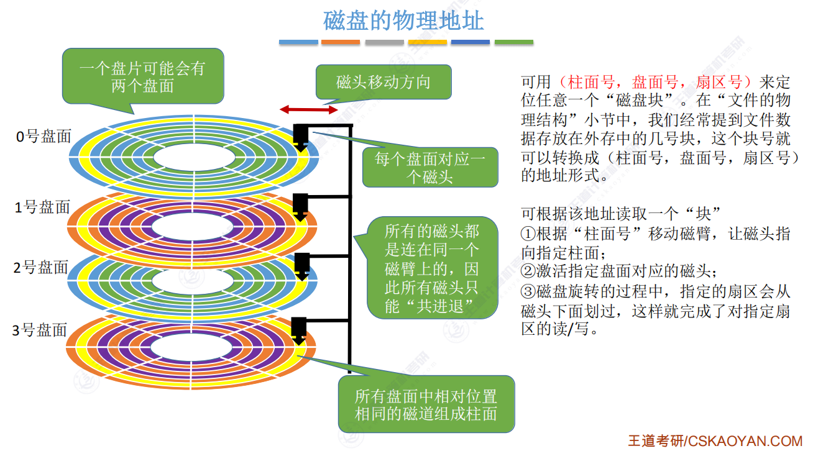

三、磁盘分类

1. 按磁头是否可移动
   - 固定头磁盘：每个磁道配备独立磁头（高端设备，成本高）。
   - 移动头磁盘：所有盘面共用一组磁头（常见于普通硬盘）。
2. 按盘片是否可更换
   - 固定盘磁盘：盘片与驱动器集成，不可拆卸（如机械硬盘 HDD）。
   - 可换盘磁盘：支持更换盘片（如早期软盘、某些专用存储设备）。

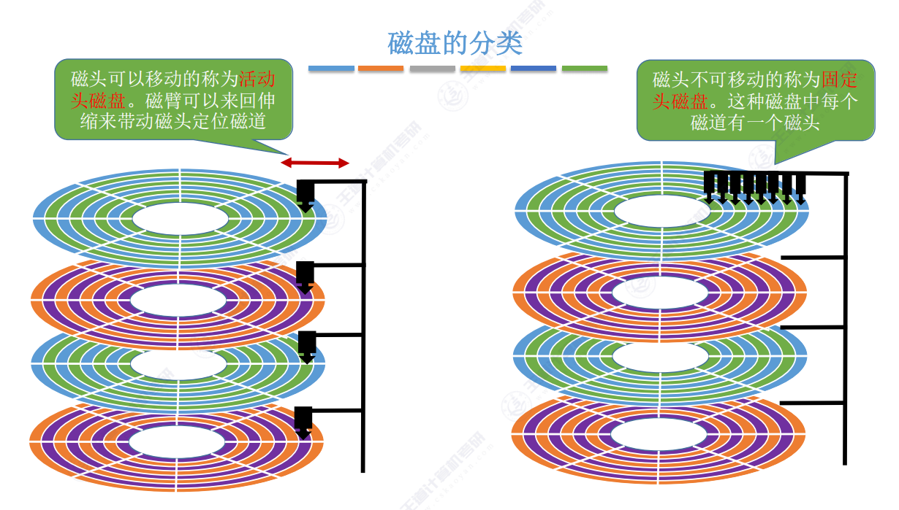

#### 5.3.2 磁盘调度算法

==一次磁盘读 / 写操作的时间构成==

磁盘读写的总时间由寻找时间（寻道时间）、延迟时间、传输时间三部分组成，其中寻找时间是操作系统可通过调度算法优化的关键部分，后两者由硬件（磁盘转速、磁道容量）固有属性决定，无法通过软件优化。

1、寻找时间（寻道时间）

定义：读写数据前，将磁头从当前磁道移动到目标磁道所消耗的时间，包括 “磁头臂启动时间” 和 “磁头移动时间”。

计算公式：$T_S = s + m \times n$

各参数含义：

- s：磁头臂启动时间（硬件固有，典型值约 2ms）；
- m：磁头每跨越 1 个磁道的耗时（典型值约 0.2ms / 磁道）；
- n：磁头需跨越的磁道数（即当前磁道与目标磁道的编号差绝对值）。

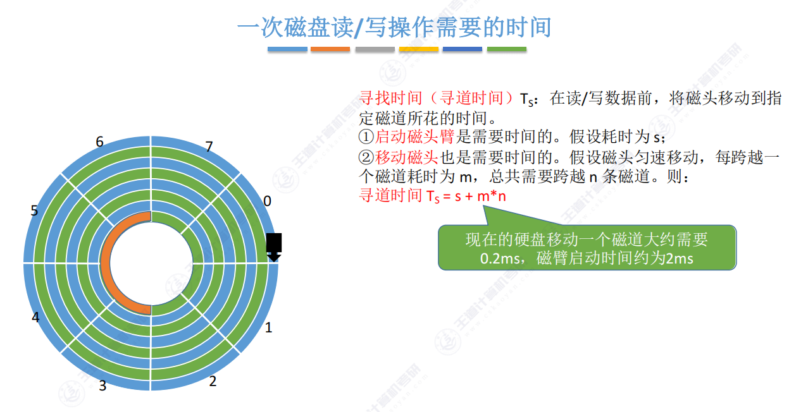

2、延迟时间

定义：磁头到达目标磁道后，通过磁盘旋转使 “目标扇区” 转到磁头正下方所需的时间（等待扇区定位的时间）。

核心逻辑：磁盘旋转为匀速运动，扇区均匀分布在磁道上，因此平均延迟时间为磁盘旋转半圈的时间（最坏情况需转一圈，最好情况无需旋转，平均取半圈）。

计算公式：$T_R = \frac{1}{2r}$

各参数含义：

- r：磁盘转速（单位：转 / 秒，或转 / 分，需统一单位计算）；
- $\frac{1}{r}$：磁盘旋转一圈的时间（如转速 7200 转 / 分 = 120 转 / 秒，则转一圈时间为 $\frac{1}{120}≈8.33ms$。

典型转速示例：

- 5400 转 / 分 = 90 转 / 秒，平均延迟时间 $T_R=\frac{1}{2×90}≈5.56ms$；
- 7200 转 / 分 = 120 转 / 秒，平均延迟时间 $T_R=\frac{1}{2×120}≈4.17ms$。

3、延迟时间

定义：磁头定位到目标扇区后，实际读取或写入数据所消耗的时间。

核心逻辑：传输时间与 “数据量” 和 “磁道存储密度” 相关 —— 每个磁道存储容量固定，需先计算数据占多少个磁道，再乘以旋转一圈的时间（传输一个磁道数据需转一圈）。

计算公式：$T_t = \frac{b}{rN}$

各参数含义：

- b：本次读写的数据字节数；
- r：磁盘转速（转 / 秒）；
- N：每个磁道的最大存储字节数（磁道容量，硬件固有）。

示例：若磁盘转速(r = 120)转 / 秒，磁道容量(N = 100KB)，需读取(b = 50KB)数据，则 $T_t=\frac{50×1024}{120×100×1024}≈0.0042s=4.2ms$。

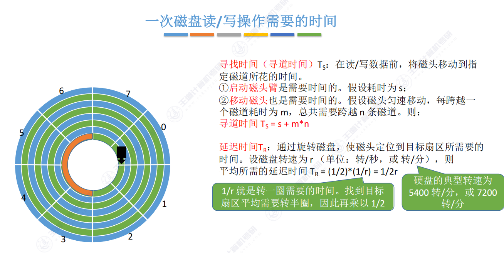

总平均存取时间

计算公式：$T_a = T_S + T_R + T_t = (s + m×n) + \frac{1}{2r} + \frac{b}{rN}$

关键结论：操作系统的磁盘调度算法仅影响寻找时间($T_S$)（通过优化磁头移动顺序减少跨越磁道数 n），而 $T_R$ 和 $T_t$ 由磁盘硬件决定，无法优化。‘’

==磁盘调度算法==

磁盘调度算法的核心目标是减少总寻找时间（或平均寻找长度）

1、先来先服务算法（FCFS）

算法思想：严格按照 “请求到达的先后顺序” 调度，不考虑磁头当前位置与目标磁道的距离。

优点：

- 公平性强，无饥饿现象（每个请求都会按顺序被处理）；
- 若请求磁道集中，性能尚可。

缺点：

- 若请求磁道分散，磁头会频繁来回移动，总寻道时间长，性能差。

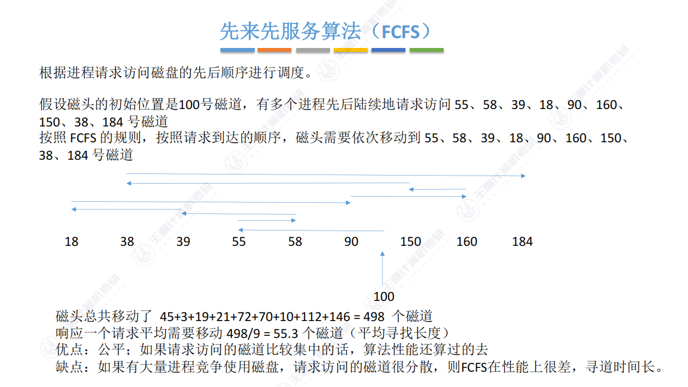

2、最短寻找时间优先算法（SSTF）

算法思想：采用 “贪心策略”，每次优先处理 “与当前磁头位置距离最近” 的请求（无论请求到达顺序），保证单次寻道时间最短，但无法保证总寻道时间最优。

优点：平均寻道时间短，性能优于 FCFS。

缺点：可能产生 “饥饿现象”—— 若短距离请求源源不断，长距离请求会被无限延迟。

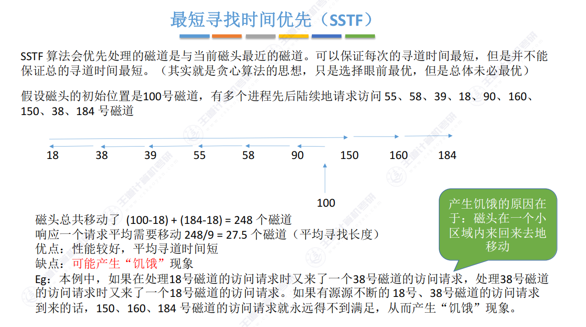

3、扫描算法（SCAN / 电梯算法）

算法思想：模拟电梯运行逻辑 —— 磁头沿一个方向（如磁道号增大）移动，途中处理所有经过的请求；直到到达 “最边缘磁道”，才反向移动（磁道号减小），途中继续处理请求。

调度前提：磁头初始方向 = 往磁道号增大的方向移动

优点：

- 平均寻道时间较短，性能优于 FCFS；
- 无饥饿现象（磁头会周期性覆盖所有磁道，长距离请求最终会被处理）。

缺点：

- 磁头必须到达最边缘磁道才反向，存在 “无效移动”；
- 对不同位置磁道的响应频率不平均。

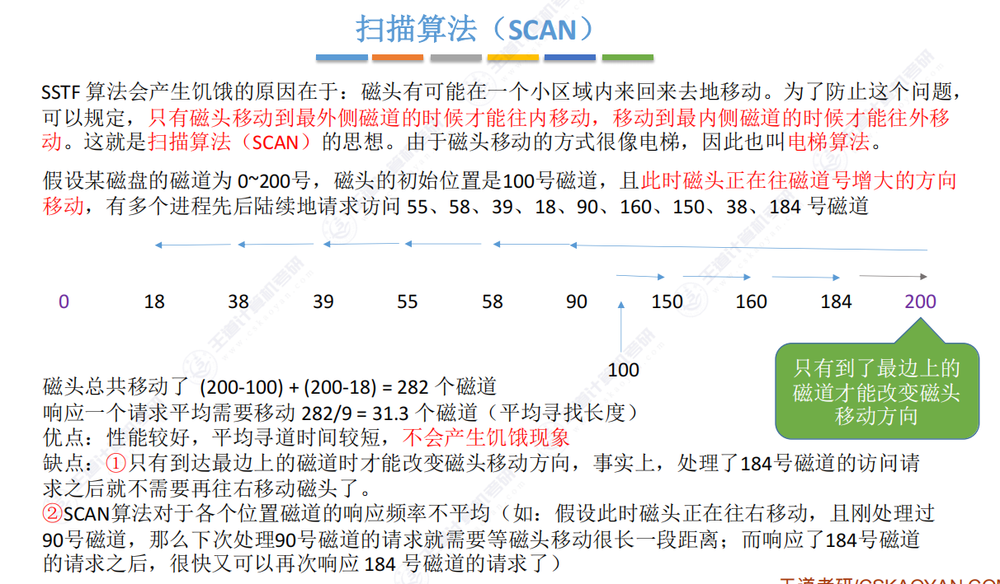

4、LOOK 算法（SCAN 的改进版）

算法思想：解决 SCAN 的 “无效移动” 问题 —— 磁头沿当前方向移动时，若 “移动方向上已无未处理请求”，立即反向（无需到达最边缘磁道），即 “边移动边观察”。

调度前提：磁头初始方向 = 往磁道号增大的方向移动。

优点：相比 SCAN 减少无效移动，寻道时间进一步缩短，无饥饿现象。

**考点说明：若题目无特别说明，SCAN 算法默认等同于 LOOK 算法（即不强制要求到达边缘）。**

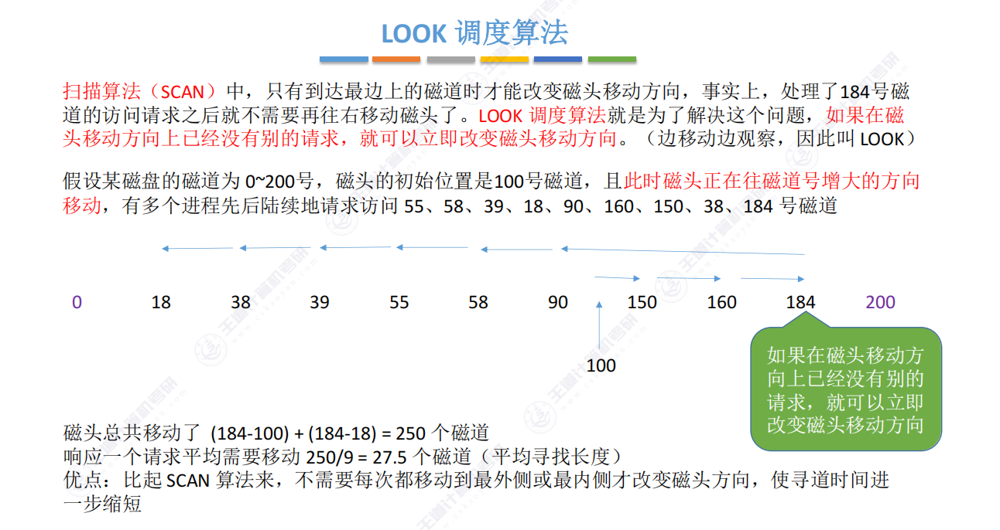

5、循环扫描算法（C-SCAN）

算法思想：解决 SCAN “响应频率不平均” 的问题 —— 规定磁头仅在 “一个固定方向”（如磁道号增大）移动时处理请求；到达最边缘磁道后，快速返回起点磁道（0 号），返回途中不处理任何请求，形成 “循环”。

调度前提：磁头仅在 “磁道号增大” 方向处理请求；磁道范围 。

优点：对所有磁道的响应频率平均（每个请求都需等待磁头完成一次循环，延迟一致）。

缺点：

- 仍需到达最边缘磁道，存在无效移动；
- 返回途中不处理请求，平均寻道时间比 SCAN 长。

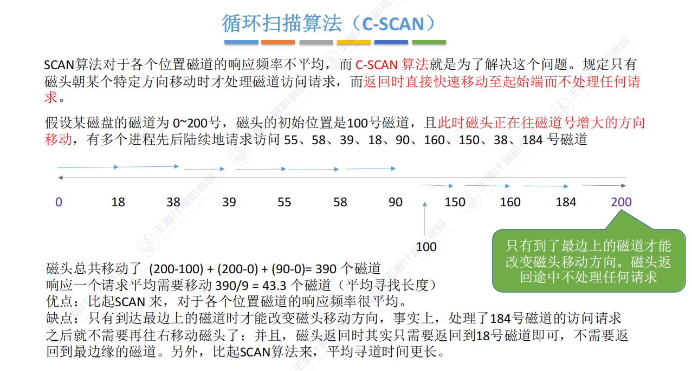

C-LOOK 算法（C-SCAN 的改进版）

算法思想：解决 C-SCAN 的 “无效移动” 问题 —— 磁头沿处理方向（如增大）移动时，若 “方向上已无未处理请求”，立即返回 “当前存在未处理请求的最边缘磁道”（无需返回 0 号），返回途中不处理请求。

调度前提：磁头初始方向 = 往磁道号增大的方向移动；未处理请求的最边缘磁道 。

优点：相比 C-SCAN 减少无效返回距离，寻道时间更短，响应频率仍保持平均。

**考点说明：若题目无特别说明，C-SCAN 算法默认等同于 C-LOOK 算法。**

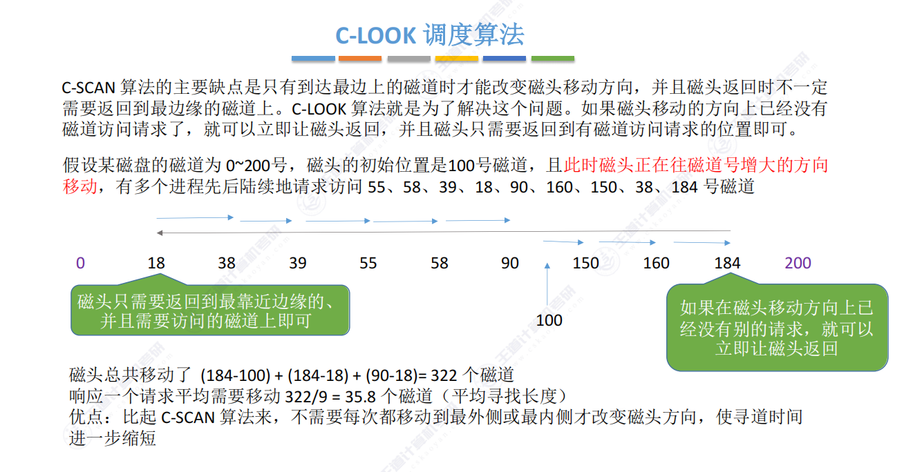

==算法对比与性能总结==

| 算法             | 核心逻辑                 | 平均寻找长度（示例值）        | 优点             | 缺点                   | 是否饥饿 |
| ---------------- | ------------------------ | ----------------------------- | ---------------- | ---------------------- | -------- |
| FCFS             | 按请求顺序调度           | 55.3                          | 公平，无饥饿     | 分散请求时性能差       | 否       |
| SSTF             | 优先最近请求（贪心）     | 27.5                          | 平均寻道时间短   | 可能饥饿               | 是       |
| SCAN（LOOK）     | 沿方向处理，无请求则反向 | 31.3（SCAN）/27.5（LOOK）     | 无饥饿，性能较好 | 响应频率不平均（SCAN） | 否       |
| C-SCAN（C-LOOK） | 单方向处理，返回不处理   | 43.3（C-SCAN）/35.8（C-LOOK） | 响应频率平均     | 平均寻道时间较长       | 否       |

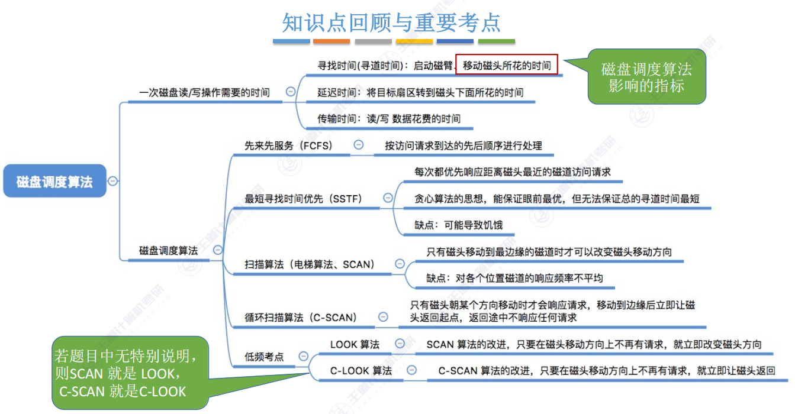

>[!tip]
>
>若题目中无特别说明，则 SCAN 就是 LOOK，C-SCAN 就是 C-LOOK

#### 5.3.3 减少磁盘的延迟时间

一、减少延迟时间的背景和原理

当磁头读取一个扇区数据后，需要一小段时间处理数据，而盘片在持续旋转。如果逻辑上相邻的扇区在物理上也相邻（例如连续读取 2、3、4 扇区），磁头无法立即读取下一个扇区，必须等待盘片旋转一周，导致显著的延迟时间。这增加了整体操作时间，影响磁盘性能。

- **关键原理**：延迟时间主要由磁头处理时间和盘片旋转间隙引起。逻辑相邻扇区物理相邻时，读取连续扇区可能需要多次旋转等待。
- **结论**：优化物理扇区布局可以减少这种延迟。

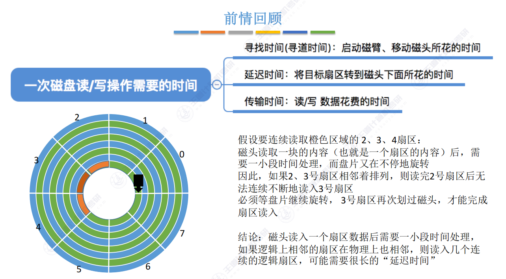

二、减少延迟时间的方法：交替编号

通过改变扇区的物理布局来减少延迟。具体做法是让逻辑上相邻的扇区在物理上保持一定间隔（例如，逻辑扇区 2 和 3 不物理相邻），从而在磁头处理数据时，盘片旋转到下一个扇区的时间更短。

- **原理**：通过物理间隔，磁头处理完一个扇区后，下一个逻辑扇区能更快划过磁头下方，减少等待时间。
- **具体做法**：例如，如果逻辑扇区序列为 1、2、3，物理布局可能为 1、3、2（或其他间隔模式），确保读取连续逻辑扇区时延迟最小。
- **优势**：显著降低读取连续逻辑扇区所需的延迟时间，提升磁盘效率。

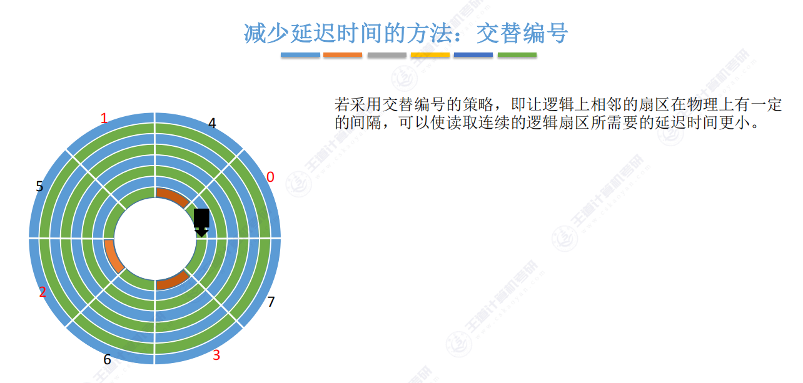

三、磁盘地址结构的设计

为什么采用（柱面号，盘面号，扇区号）的顺序，而不是（盘面号，柱面号，扇区号）。这基于减少磁头移动的优化目标。

- **原理**：磁盘地址结构影响磁头移动频率。读取地址连续的磁盘块时，（柱面号，盘面号，扇区号）结构优先保持柱面号（磁道）不变，减少磁头臂移动（磁头臂移动消耗时间）。
- **示例分析**：假设磁盘有 8 个柱面（柱面号 0-7，用 3 位二进制表示）、4 个盘面（盘面号 00-11，用 2 位表示）、8 个扇区（扇区号 000-111，用 3 位表示）。
  - 如果地址结构为（盘面号，柱面号，扇区号），读取连续地址（如 00,000,000 到 00,001,111）需要移动磁头臂到新磁道，增加时间开销。
  - 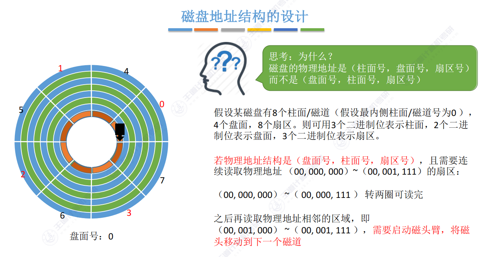
  - 如果地址结构为（柱面号，盘面号，扇区号），读取连续地址（如 000,00,000 到 000,01,111）时，柱面号相同，只需激活相邻盘面磁头，无需移动磁头臂，显著减少延迟。
  - 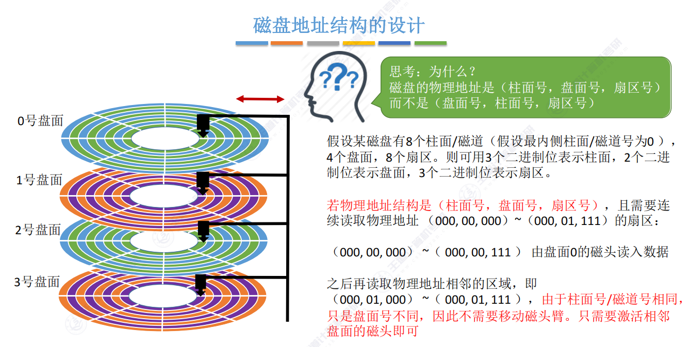
- **结论**：（柱面号，盘面号，扇区号）结构在读取连续磁盘块时更高效，因为它最小化了磁头臂的移动（寻道时间），仅需切换盘面。

>[!important]
>
>当然你可能会问，两种编址格式都不同，有可比性吗？
>
>其实是这样的，不管编址方式如何，计算机在读取数据的时候往往都是连续读取的，即要读取的地址是连续的，那么在地址连续的情况下，采用（柱面号，盘面号，扇区号）的地址结构可以减少磁头移动消耗的时间。

四、减少延迟时间的方法：错位命名

通过调整相邻盘面扇区编号的偏移来减少延迟。这类似于交替编号，但应用于多个盘面之间。

- **原理**：所有盘面连轴旋转，但磁头读取后需处理时间。如果相邻盘面相同位置的扇区编号相同），读取完一个扇区后，**计算机读取完数据之后需时间来处理数据（这也是需要花时间的）**，下一个盘面的对应扇区可能已错过磁头，需等待旋转一周。错位命名让扇区编号“错位”，使下一个扇区在磁头处理完后及时划过。
- **方案对比**：
  - 方案一（无错位）：延迟较高，因为扇区编号对齐导致等待。
  - 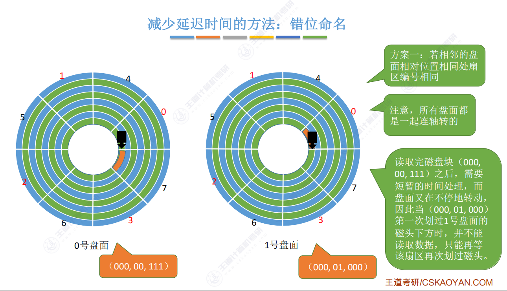
  - 方案二（错位命名）：延迟较低，扇区错位匹配处理时间。
  - 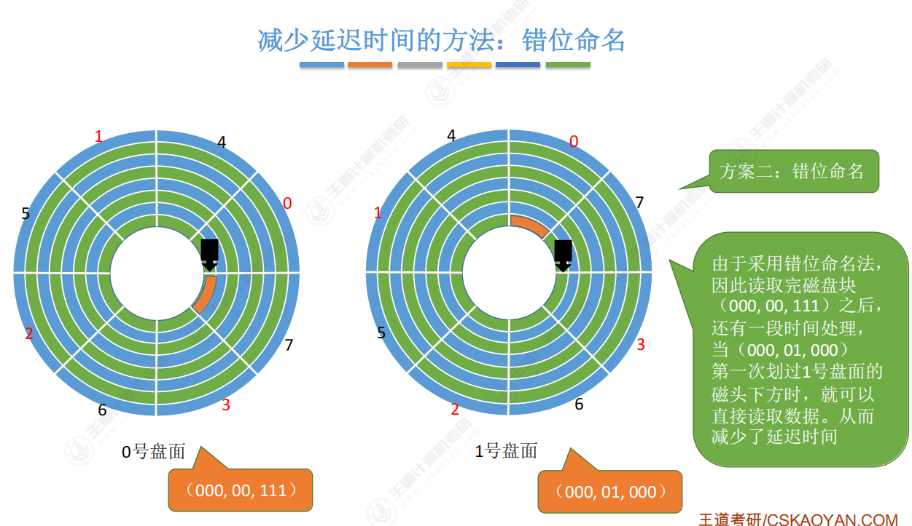

- **具体做法**：例如，读取磁盘块（000,00,111）后，错位命名确保（000,01,000）在第一次划过 1 号盘面磁头时即可读取，无需等待。
- **优势**：与交替编号原理相同，降低延迟时间，尤其适用于多盘面系统。

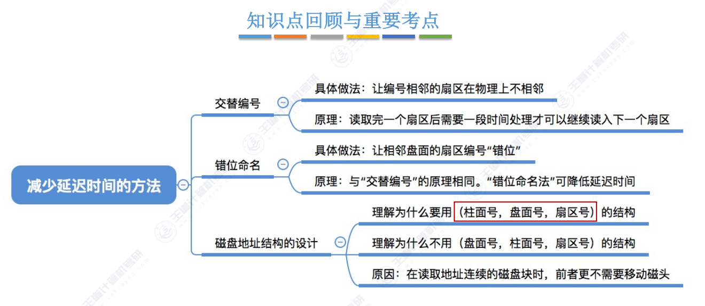

#### 5.3.4 磁盘的管理

**1、磁盘初始化**

磁盘初始化是磁盘管理的基础过程，确保磁盘能够被操作系统识别和使用。它分为三个步骤，每个步骤都至关重要：

- **Step 1: 低级格式化（物理格式化）**
  - 目的：将磁盘的各个磁道划分为扇区。
  - 细节：每个扇区由头、数据区域（如 512B 大小）和尾三部分组成。头和尾存储管理扇区所需的数据结构，包括扇区校验码（如奇偶校验或 CRC 循环冗余校验码），用于检测数据错误。
- **Step 2: 磁盘分区**
  - 目的：将磁盘划分为多个逻辑区域，便于存储管理。
  - 细节：每个分区由若干柱面组成，形成我们熟悉的盘符（如 C 盘、D 盘、E 盘）。这一步在低级格式化后进行，为后续文件系统创建做准备。
- **Step 3: 逻辑格式化**
  - 目的：创建文件系统，使磁盘可用于存储文件。
  - 细节：包括初始化文件系统的根目录和存储空间管理数据结构（如位示图或空闲分区表）。这一步确保操作系统能高效管理磁盘空间。

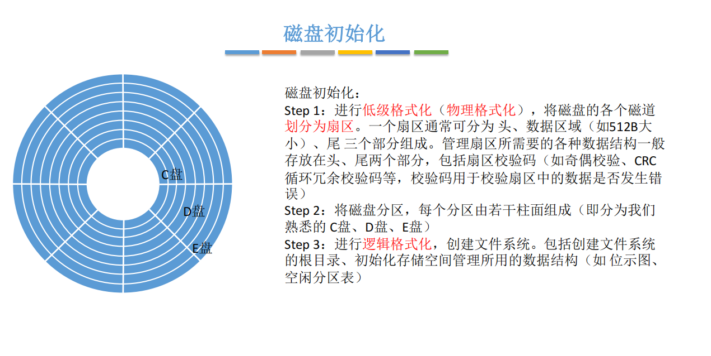

磁盘初始化的整体过程确保了磁盘从物理层面到逻辑层面的完整设置，是文件系统操作的前提。

**2、引导块**

引导块涉及计算机启动时的初始化过程，核心是自举程序（初始化程序）的管理。其机制解决了 ROM 存储限制的问题：

- **背景和问题**
  - 计算机开机时需执行自举程序来完成初始化工作。传统方式是将自举程序存储在 ROM（只读存储器）中，但 ROM 数据出厂后无法修改，导致更新程序困难。
- **解决方案**
  - ROM 中只存放一个小的“自举装入程序”。开机时，计算机先运行此程序。
  - 完整的自举程序存储在磁盘的引导块（或启动块）上，引导块位于磁盘固定位置（如启动分区）。拥有引导块的磁盘称为启动磁盘或系统磁盘（通常对应 C 盘）。
  - 过程：自举装入程序加载引导块中的完整自举程序到内存，完成初始化。这样，更新自举程序只需修改磁盘上的引导块，而无需改动 ROM。

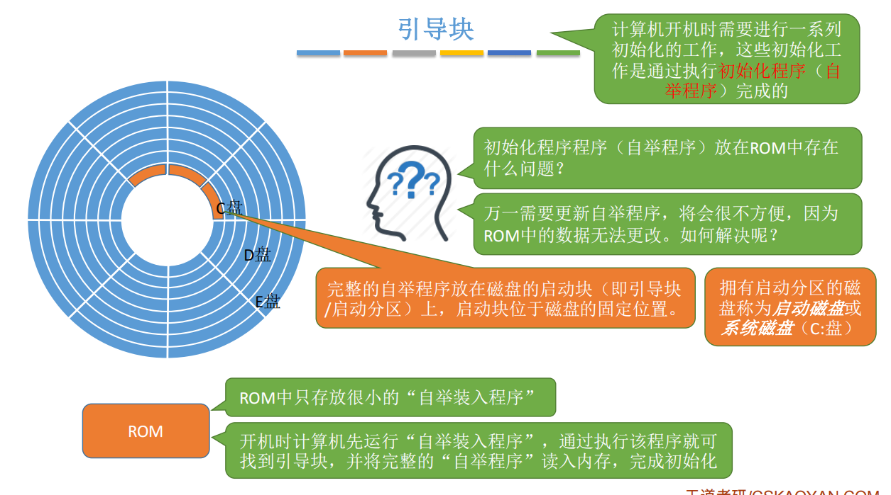

此机制提高了灵活性，确保系统启动可靠且易于维护。

**3、坏块的管理**

坏块指磁盘中损坏无法使用的扇区，属于硬件故障。操作系统无法修复，但可通过管理策略避免错误使用。管理方式因磁盘复杂度而异：

- **简单磁盘的管理**
  - 方法：在逻辑格式化（建立文件系统时）检查整个磁盘，标记坏扇区。
  - 细节：使用文件系统数据结构（如 FAT 表）标明坏块位置。这种方式中，坏块对操作系统不透明（即操作系统直接可见）。
- **复杂磁盘的管理**
  - 方法：磁盘控制器（硬件部件）维护一个坏块链表，并管理备用扇区。
  - 细节：
    - 出厂前低级格式化时初始化坏块链表。
    - 保留备用扇区用于替换坏块（称为扇区备用策略）。
    - 坏块对操作系统透明（即操作系统不直接处理坏块，由磁盘控制器自动处理）。

坏块管理确保了磁盘可靠性和数据完整性，复杂磁盘的方案更高效，减少了操作系统负担。

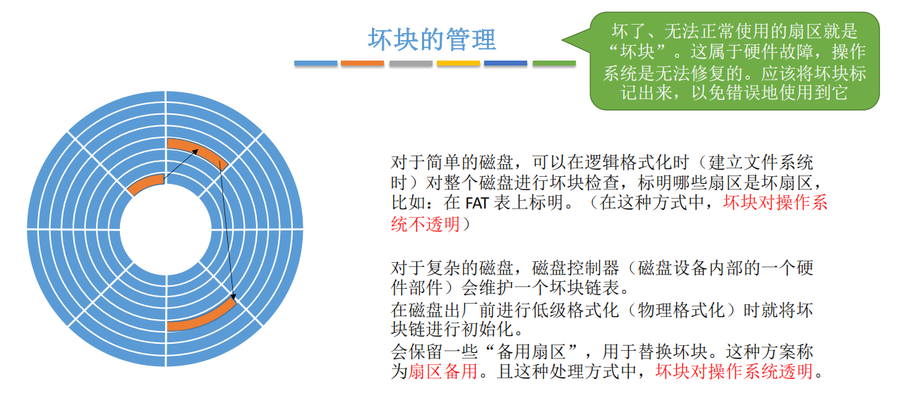

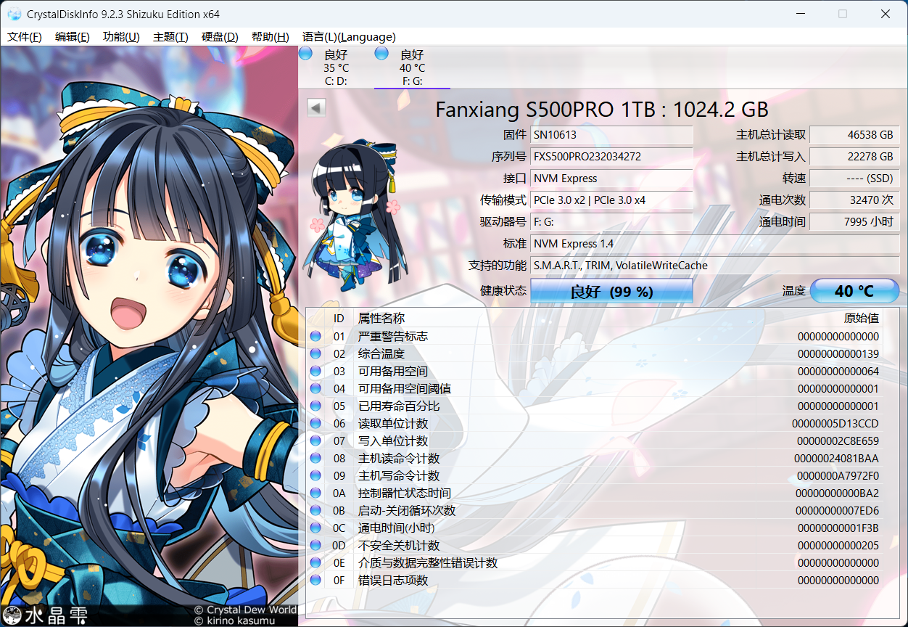

#### 5.3.5 固态硬盘 SSD

SSD（固态硬盘）就是一种 **用芯片存数据** 的硬盘，没有机械零件，就像一个大号、高速的 U 盘。它基于 **Flash 闪存技术**（也叫电可擦除 ROM），断电后数据也不会丢失。

1、**固态硬盘（SSD）的基本组成**

- **闪存翻译层**：这是 SSD 的核心组件，负责将系统提供的逻辑块号（类似于逻辑地址）翻译并映射到物理地址。它通过电路快速定位对应的物理位置，支持随机访问，大大减少了访问延迟。
- **存储介质**：由多个闪存芯片（Flash Chip）组成。每个闪存芯片进一步划分为多个块（Block），每个块又包含多个页（Page）。页是读写的基本单位（相当于磁盘的“扇区”），而块是擦除的基本单位。擦除操作会将整个块清空，之后每个页可以写入一次数据，但可以无限次读取。
- **操作特性**：
  - 以页（Page）为单位进行读写操作。
  - 以块（Block）为单位进行擦除操作。如果某个页已有数据，不能直接写入新数据；必须先擦除整个块（这需要将块内其他页的数据复制到一个新的、已擦除的块中），然后再写入新页。
  - 读写性能：读操作速度快（因为支持随机访问），但写操作较慢（涉及擦除和复制过程）。

>[!important]
>
>页是读写的基本单位（相当于磁盘的“扇区”），而块是擦除的基本单位。

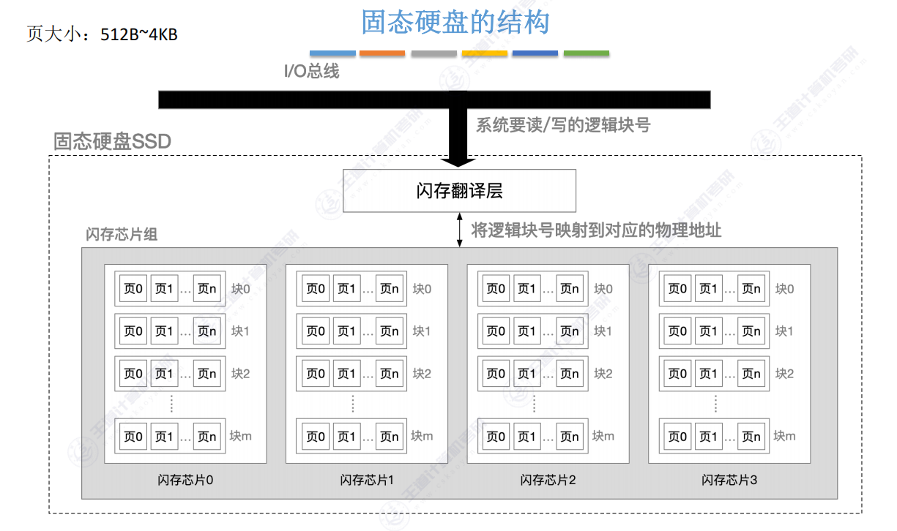

2、**固态硬盘的特点**

- **优势**：
  - 安静无噪音：没有机械部件，运行时不会产生噪音。
  - 耐摔抗震：结构坚固，不易因物理冲击损坏。
  - 能耗低：功耗低于机械硬盘，适合移动设备。
  - 随机访问快：闪存翻译层能迅速定位地址，减少寻道时间。
- **劣势**：
  - 造价更贵：相比机械硬盘，SSD 的成本较高。
  - 寿命限制：SSD 的块（Block）在多次擦除后可能损坏（擦除次数过多会导致“坏块”），而机械硬盘的扇区不会因写入次数过多而损坏。
  - 写操作慢：由于擦除机制，写入新数据时可能涉及数据迁移，导致延迟。

**3、磨损均衡技术**

- **目的**：为了解决 SSD 块擦除次数不均的问题，延长使用寿命。通过将擦除操作平均分配到各个块上，避免某些块过早损坏。
- **类型**：
  - **动态磨损均衡**：在写入数据时，优先选择累计擦除次数较少的块（即“新”块），以平衡磨损。
  - **静态磨损均衡**：SSD 自动监测数据访问模式，将频繁读取的数据迁移到老旧块（承担以读为主的任务），而将写入任务分配给较新的块，实现全局均衡。
- **重要性**：这项技术是 SSD 寿命管理的关键，确保在理想情况下，所有块的擦除次数趋于一致。

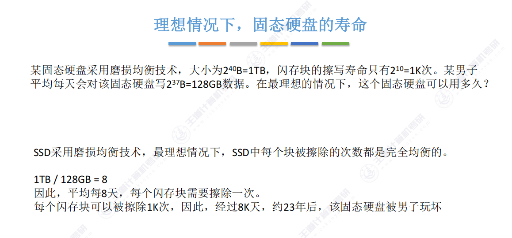

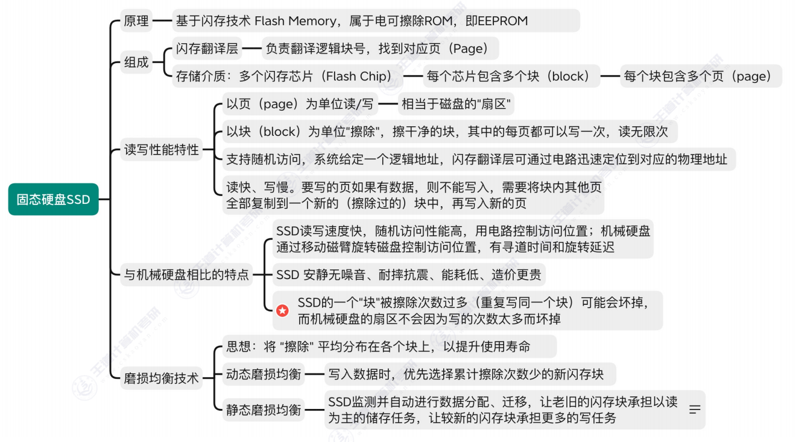

>[!note]
>
>重点内容为：读写性能特性和磨损均衡技术
